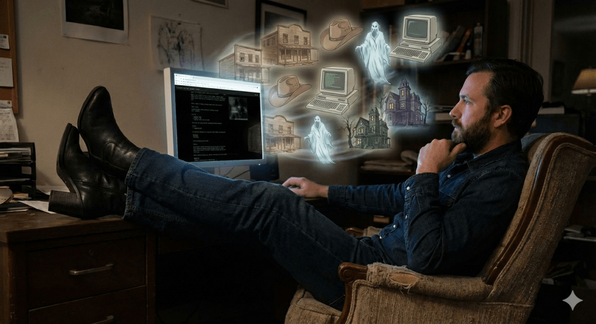
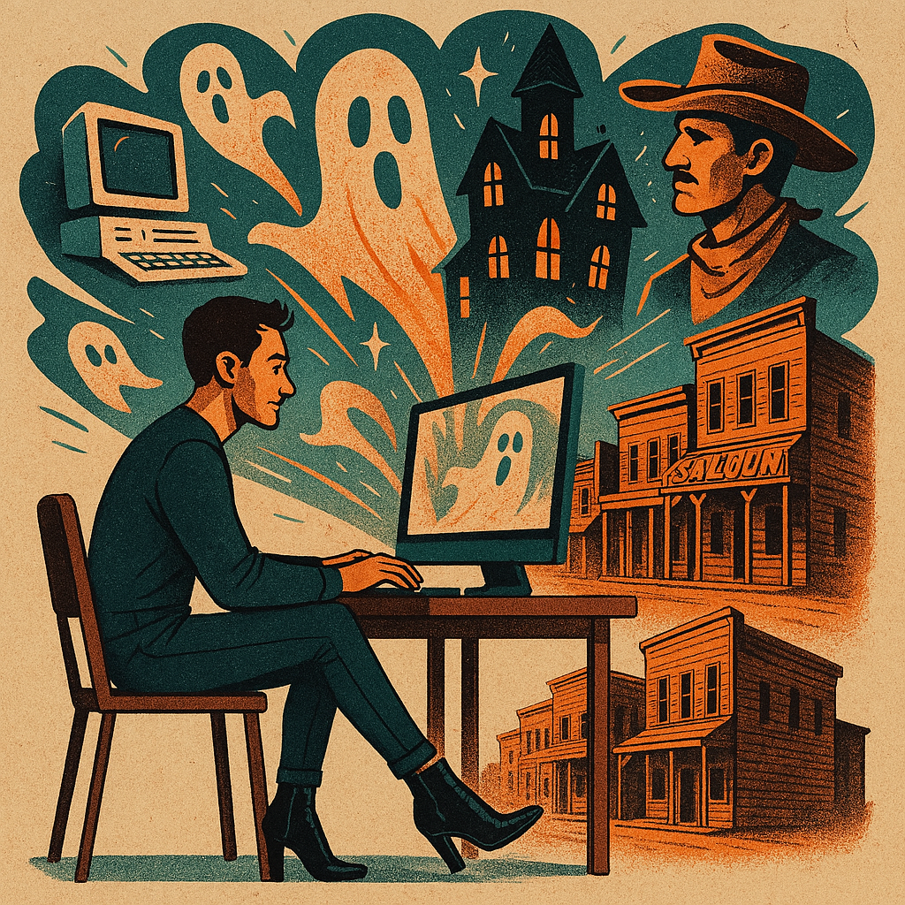

<figure><figcaption>AI-generated image of a ghosts, computers and cowboys coming out of a computer</figcaption></figure>

Between all the other things I’ve had to do in real life, I’ve been making a few changes to this blog and [its German equivalent](https://blog.alexseifert.de). As such, I thought it would be good to write about them.

The first of which is a (somewhat) new focus for posts. For the most part, I’ve stuck to [technology](https://blog.alexseifert.com/category/technology/) topics such as [development](https://blog.alexseifert.com/category/technology/development/), [retro software](https://blog.alexseifert.com/category/technology/retro-software/), [hardware projects](https://blog.alexseifert.com/category/technology/hardware/), etc. In between all of that, I’ve occasionally written about a few other topics such as [books](https://blog.alexseifert.com/category/books/) and [cars](https://blog.alexseifert.com/category/cars-trucks/). However, I’ve decided to add a little bit more emphasis to the non-technology topics, particularly to [horror](https://blog.alexseifert.com/category/horror/) and [history](https://blog.alexseifert.com/category/history/). I don’t plan to write less about technology, but rather to write more posts in general — many of which will include horror and history topics. Hopefully, I can achieve that.

As such, the new focus will primarily be on [technology](https://blog.alexseifert.com/category/technology/), [horror](https://blog.alexseifert.com/category/horror/) and [history](https://blog.alexseifert.com/category/history/) as reflected in the new subtitle visible in your browser tab as well as in the main menu above.

Those of you who have followed me for a while may be thinking, “What about your [horror](https://haunting.alexseifert.com) and [history](https://www.historyrhymes.info) blogs?” Well, that’s a very good question because I’m not sure what I’m going to do with them yet either. I’m learning towards importing the existing posts into this blog and shutting the others down since it’s tedious having so many different blogs and I would like to consolidate.

However, leaving them separate also has its benefits. [History Rhymes](https://www.historyrhymes.info) has been around almost as long as this blog (since 2008) and has its own following, including email subscribers. I haven’t posted there in years and yet it still receives quite a bit of traffic every day. [Haunting Alex](https://haunting.alexseifert.com) has a [stories section](https://haunting.alexseifert.com/stories/) where I’ve started adding horror books and stories I’ve read including book and author information. If I were to consolidate, I don’t know if it would make sense to add such a specific feature to this blog. Also, I would lose the email and feed subscribers for History Rhymes. It’s a tough decision.

Either way, I’ve made a couple of changes to this blog in preparation in case I decide to import the others. First off, I’ve enabled hierarchical categories which you can see in the sidebar. That way, I can have more categories and still keep them well-organized and easy to navigate.

Otherwise, I’ve created a new [Feeds page](https://blog.alexseifert.com/feeds/) which lists all of the RSS feeds this blog has to offer. WordPress automatically generates a feed per category which means you can subscribe per category. I decided to list them on a separate page because I know some people may be more interested in technology while others would only come for the history or horror. That way, they can subscribe specifically to whatever interests them the most. Even if I don’t end up consolidating my blogs, those changes are still useful and I thought they made sense.

And speaking of RSS feeds, I’ve now enabled full text in the feeds so you no longer have to click on the link and visit the website to read what I post. Instead, you can read it directly in your preferred RSS feed reader. As a side note, mine is the free, open source [NetNewsWire](https://netnewswire.com) which I have on my Macs, iPhone and iPad. I set it up to sync everything through iCloud. I’m not sponsored, I just *really* like it.

The last two changes I wanted to mention are the new [about page](https://blog.alexseifert.com/about/) and [author page](https://blog.alexseifert.com/author/admin/). I cleaned up the author page and redesigned the about page with its own sidebar. The reason for this is because [I’ve been debating](https://blog.alexseifert.com/2025/08/12/rethinking-how-i-create-personal-websites/) about what to do with [my personal website](https://www.alexseifert.com) and one of the options is to just use this blog instead of having a separate website. As such, I needed a much better about page to better showcase who I am. If I decided to go that route, I would move this blog from its subdomain to the main domain. Like with moving my other blogs into this one, it’d be in the name of project consolidation.

In any case, that is about it for now. Quite a lot going on even though it feels like I haven’t had a whole lot of time with a large number of personal and work-related things happening in the real world.

As an aside, I had AI generate two different images for this post and couldn’t decide which one I liked better, so here we are. Two images for a simple update post. This is the other one:

<figure><figcaption>AI-generated image of a ghosts, computers and cowboys coming out of a computer</figcaption></figure>