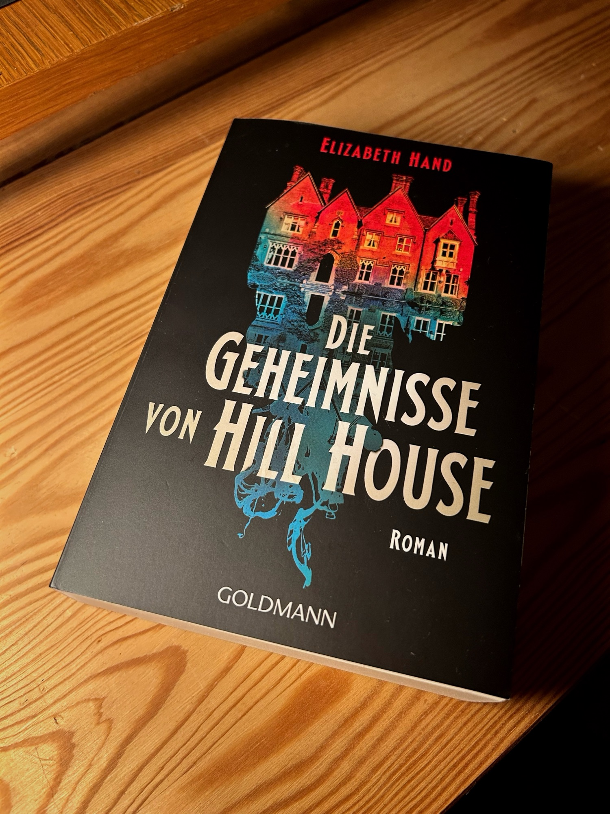

<figure><figcaption>German translation of A Haunting on the Hill by Elizabeth Hand</figcaption></figure>

*A Haunting on the Hill* by Elizabeth Hand is an interesting modern dive into the world originally created by Shirley Jackson in *[The Haunting of Hill House](https://www.goodreads.com/book/show/89717.The_Haunting_of_Hill_House)*. It is a spooky tale that engages the reader and keeps them on the edge of their seat throughout the entire story.

This is the description of the book from [Goodreads](https://www.goodreads.com/book/show/102188677-a-haunting-on-the-hill):

> From three-time Shirley Jackson, World Fantasy, and Nebula Award-winning author Elizabeth Hand comes the first-ever authorized novel to return to the world of Shirley Jackson’s  The Haunting of Hill House:  a suspenseful, contemporary, and terrifying story of longing and isolation all its own.  
>    
> Holly Sherwin has been a struggling playwright for years, but now, after receiving a grant to develop her play, The Witch of Edmonton, she may finally be close to her big break. All she needs is time and space to bring her vision to life. When she stumbles across Hill House on a weekend getaway upstate, she is immediately taken in by the ornate, if crumbling, gothic mansion, nearly hidden outside a remote village. It’s enormous, old, and ever-so eerie—the perfect place to develop and rehearse her play.  
>    
> Despite her own hesitations, Holly’s girlfriend, Nisa, agrees to join Holly in renting the house out for a month, and soon a troupe of actors, each with ghosts of their own, arrive. Yet as they settle in, the house’s peculiarities are made known: strange creatures stalk the grounds,  disturbing sounds echo throughout the halls, and time itself seems to shift.  All too soon, Holly and her friends find themselves at odds not just with one another, but with the house itself. It seems something has been waiting in Hill House all these years, and it no longer intends to walk alone… 
> 
> [Goodreads](https://www.goodreads.com/book/show/102188677-a-haunting-on-the-hill)

A word of advice to those who haven’t read it yet: stop here. ***There are spoilers below.***

As the title implies, the story takes place in Jackson’s Hill House. Elizabeth Hand describes the house and its atmosphere in some detail which should make it easy to understand even if you haven’t read *The Haunting of Hill House*. However, having read the original will certainly add a bit more depth to the setting.

The story itself was engaging and had an eclectic set of misfit characters that somehow fit together in the story. Most importantly though, they were relatable, even if they came from the eccentric world of New York artists which is about as far away from my own world in the Bavarian countryside as I can imagine.

The reader is kept on the edge of their seat throughout the novel and a lack of much foreshadowing means that he or she has no idea where this rollercoaster is taking them. However, once arriving at the end, it is weird, dark and definitely haunting — perfect for a haunted house story. It leaves the reader wanting more and with a lot of questions to engage with. My hope is that there will be a sequel that will address some of them.

This is where the spoilers begin, so please stop and turn back if you haven’t already read it. You’ve been warned.

The book ends when one of the protagonists, Nisa, squeezes herself into a strange little door hidden behind a dresser in one of the bedrooms. The door closes behind her and she is essentially consumed by the house, although the details are vague on how that happens or why. While this is going on, blood runs down the walls which is witnessed by the other characters in the house without knowing why. Eventually, they figure out that Nisa has somehow been killed as she appears as a ghost among the others, but they never find out how or why. While the reader has a vague idea of the former, the latter is left entirely open to speculation. I would have appreciated a bit more explanation in that regard.

Now, I’ll talk a little about what I didn’t like as much. As I just mentioned, I found the concept of Nisa being consumed by the house to be particularly interesting as it is not something you read very often. However, I found the climax to be much too short. The build-up was quite long-running taking up the vast majority of the book, but the entire climax took place in only a few pages at the very end of the novel. The conclusion also left wanting, as mentioned above. Frankly, it felt a bit rushed as though there was a fixed page limit that the author was rapidly approaching. I would have liked to see more detail with a longer conclusion.

Also, for being a book taking place in a haunted house, there was surprisingly little haunting. There is a strange jackrabbit that keeps appearing, but otherwise no ghosts, ghostly noises or anything you might otherwise expect from a haunted house book. I must admit, I found that rather disappointing.

Otherwise, the book was excellent. The build-up was engaging and held my interest even if it ended abruptly. Despite its shortcomings, I would still definitely recommend it to anyone who is a fan of horror or ghost stories.