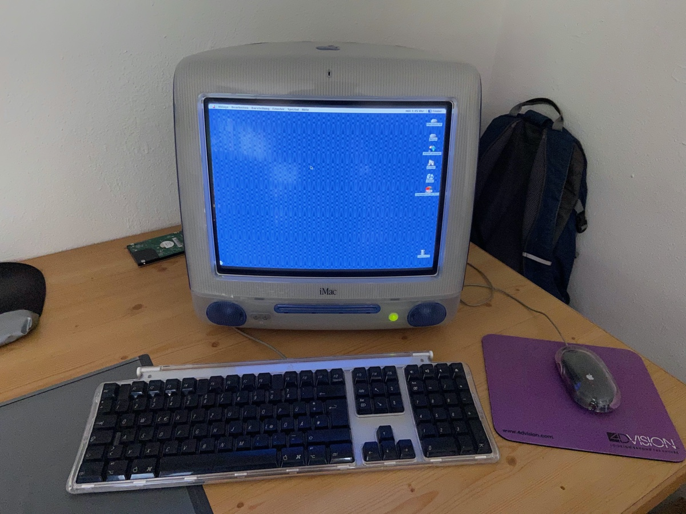

<figure><figcaption>My iMac Running Mac OS 9 – The iMac She Reacted To</figcaption></figure>

A little over a decade ago, I bought myself an old blue iMac G3 for €25. I even wrote [a post about it on this blog](https://blog.alexseifert.com/2015/05/01/old-imac-g3-and-mac-os-9/)! When these machines were new, I would have given just about anything to have one. Alas, I was still in school and had no job which meant they were way out of my price range and I had to satisfy myself with using them in my school’s computer lab. Eventually, they were replaced with [eMacs](https://en.wikipedia.org/wiki/EMac), but that’s a story for another post.

I was already a fan of Macs despite growing up with a father who was an MS-DOS, then later Windows developer. I wanted one because they were sleek, colorful, fresh and something new in an era of beige PCs. For me, they were everything a computer should be as they encapsulated a time of my life where I was starting to experiment with computers in earnest.

That was, however, almost 30 years ago and times have changed.

A couple of weeks ago, my cousin’s 17-year-old daughter visited us in Germany from the US. It was her first time in Europe and we did the usual sightseeing, but, being kind of nerdy like me, she was interested in the mysterious blue computer I had sitting on a desk in my office. So, naturally, I had to boot it up for her and let her play around with it.

The Booting Experience
----------------------

The first thing she commented on was the noises it makes. Like with any CRT, you can hear it become charged when it turns on. That noise is immediately followed by the spinning up and crunching sounds of the old hard drive. Believe it or not, the iMac still has its original spinning hard drive (I keep a full system backup for its inevitable failure). She had never heard a screen making noise nor a spinning hard drive before. The crunching sound of the hard drive in particular bothered her in that she thought it broken.

The startup chime Macs make wasn’t new to her, so she didn’t comment on that.

There was, however, a comment about how she could see actually see the pixels on the screen. As someone who grew up only using computers and devices with HDR screens, the 1:1 pixel ratio of the iMac’s 15″ CRT must have been pretty jarring. Not only that, but she commented on how dim the screen is. I hadn’t noticed that aspect to be entirely fair, but it makes sense since modern screens are indeed brighter than old CRTs.

Mac OS 9
--------

Once the computer had booted, she started trying to navigate Mac OS 9. She was surprised about how dull everything was in that the interface was mostly just gray. What really got her though was moving and resizing windows. Mac OS 9 doesn’t redraw windows until after you are finished moving or resizing them. Instead, it just shows a black outline of the window. I had to explain to her why that was because it genuinely confused her.

She was also baffled about how to switch between applications and windows. In Mac OS 9, you have to use the menu bar: applications on the far right and application windows in the “Windows” pull down menu. Having grown up with Windows at home and macOS at school, she was used to a form of dock/taskbar at the bottom that served that purpose.

And yes, you read that right “macOS”, not Mac OS X. Apple switched to the “macOS” brand in 2016 when she was only 9 and she wasn’t really using computers much yet at that point. I don’t know how I feel about how old that makes me feel.

In any case, she played around with a few more applications such as Microsoft Word 98, [AppleWorks](https://en.wikipedia.org/wiki/AppleWorks), and Netscape 4 before she moved onto games.

Games on the iMac
-----------------

She loves playing video games, so of course we had to try a few. I have several games on there that I either downloaded from [Macintosh Garden](https://macintoshgarden.org/) or still had original copies of. I showed her some of the classics that she hadn’t tried yet: Tomb Raider, Age of Empires, Civilization III, Decent II, Myst and Quake.

Most of those are long-running franchises and she had played some of the newer versions of Tomb Raider and Myst, but she had never played the originals. The first thing that confused her about them was the fact that you actually had to put the CDs in to play them. That absolutely baffled her.

Then, once they were loaded, she deemed some of them nearly unplayable. She really struggled with Tomb Raider, for instance, because the low resolution textures made it difficult for her to navigate the levels and tell things apart. I actually had a similar experience when trying to play Twisted Metal I on the original PlayStation not too long ago, so I could sympathize.

In the end, she didn’t play any of the games for very long since it was mostly just about the experience for her and not about actually playing the games. She found Age of Empires the most playable of them all.

Conclusion
----------

It’s really amazing how much has changed with computers since I was her age. What she experienced on my iMac was state-of-the-art when I was her age. I enjoyed showing it to her, but it really held a mirror up to me to show me my wrinkles.

When we were done, I had her try to shut it down properly. While she was trying to figure it out, I was reminded of the popular “How do I get out of vim?” memes that have been coursing through the internet for a while now. Eventually, I had to show her that you had to shut it down by selecting the option under the “Special” menu. To be fair, I found that odd even back when Mac OS 9 was new.

All around, it was an enjoyable experience for both of us. She got to experience a bit of computer history that she’d never had the opportunity to try and I got to watch a young’un try to figure out a computer that, to me, doesn’t feel nearly as old as it is.

Now get off my lawn, I gotta go take my nap!