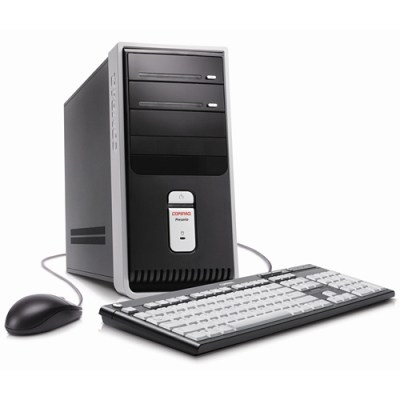

\[digg=http://www.digg.com/microsoft/An\_Adventure\_Re\_installing\_XP\]I’ve had a 1.8 ghz Compaq Presario desktop computer with 1 GB of RAM for quite some time now. It came with Windows XP Home Edition pre-installed as well as quite a lot of crap added by Compaq that took a good hour at least to clean out. This machine lasted a record length of time without a good ol’ format of the hard drive followed by a reinstalltion of Windows. I’d say that it lasted me at least three years.

I do a lot of music recording and creating. Traditionally, I have always used my PowerBook G4 to do what I need to do with my music, however, I decided that since I had an extra computer sitting around that I really didn’t use much, that I would set it up as a permanent music recording station. Since my PowerBook is a laptop, I have always had to take it down to the basement whenever I want to record anything. I decided I could easily solve that problem.

I haven’t consistantly used it as my primary computer for the past two years (which probably explains why it lasted so long without a fresh installation of Windows), but all the same, I went to use it just a few days ago and it had become rediculously bogged down and slow. I can’t really say I know why, but either way I figured that instead of investigating the problem, that it was probably time to wipe the C drive clean and start over with the recovery hard drive partition provided so greatfully by Compaq. Yes, they said it had an 80 GB hard drive, but 10 GB was used as an untouchable recovery partition…

Anyway, I backed up my files and formatted. No problems so far. Windows XP successfully installs and I boot my computer. I had forgotten how much crap the computer had come with, but that wasn’t a problem, I could just remove it. The problem was that the new installation of Windows didn’t last long enough for me to do even that. The first time I booted the computer with the new installation, the task bar showed up as well as the icons and the red “Compaq” wallpaper. A good start.

As I waited for the rest of Compaq’s crap to load, I was prompted. The prompt read that Windows Explorer had encountered a serious error. I could either send an error report or cancel. I cancelled and Windows Explorer restarted itself. Off to a great start.

The task bar showed up again and the icons showed back up in disarray. Then, I was prompted again. The same thing. This happened a few more times before I gave up and restarted the computer entirely. Didn’t help. So, in my annoyance (by this time, I was quite furious), I went about reformatting and reinstalling Windows. After that had finished, Windows Explorer no longer crashed and I could even successfully click on the Start menu without error.

Then I tried Control Panel.

What did I get? Windows Explorer crashed. I tried a few more times, but to no avail. I did what any experienced Windows installer would do: reformat and reinstalled….again.

Upon the third install, I could successfully get to the Control Panel and even uninstall all the crap that Compaq and included with the computer. My problems weren’t over, however. Nope. Not at all.

The next task was to find drivers. I’ve had to deal with reinstalling Windows enough to know that a list of drivers I will need when I reinstall the operating system is always good to have. Using my list, I found the necessary drivers, downloaded them, installed them, and to my absolute surprise no problems at all. I decided I had had enough for the day, turned off the Compaq, and went back to my Mac to do some real work.

The next day, I went back to my Compaq. I turned it on and all seemed well. The Windows XP screen with the green scrolling bar across the bottom showed up perfectly. Then all went blank. To make a long story short, I had to replace the graphics card because somewhere along the line, Windows decided that it would no longer support it despite the installation of the drivers and the multiple restarts I had to do while installing drivers the previous day.

The final task in setting up my new music workstation was to install the necessary software and the extra hardware drivers I needed for some of my equipment. This was a headache entirely unto itself. The primary software I use is DigiDesign’s ProTools 7 and Propellerhead’s Reason. When I installed the software and drivers on my Mac, it took nothing more than a quick restart and I was ready to go. When I installed the software and drivers on my PC, it took several restarts as well as some rediculously unnecessary troubleshooting, such as having to figure out which of the six USB ports on my PC I had to plug my hardware into in order for the software to commnicate properly with the hardware. This took several hours.

The result: after two greuling days of pulling the hair out of my head and bashing my face on the table, I have a music workstation that does exactly what my Mac did after only a few minutes.

But it was worth it, right?