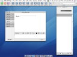

\[digg=http://digg.com/software/Review\_AOL\_Mac\_Beta\_2\]After years of neglect, AOL has finally decided to update its client software for Mac OS X. The last version of their software released for the Mac was so woefully out of date, that they decided it would be best to rewrite it from the ground up. Just to feed my curiosity, I decided to download it and play with it for a while and I found that I was actually pleasantly surprised. After signing in with my AIM screen name and password, the first thing I noticed was the use of a flat neutral gray main toolbar and the use of Apple’s white “unified” look in the toolbars in each of the different windows. Although going out of date with Apple’s release of Leopard, the unified look is common in programs such as Mail 2 (Tiger’s version; not Leopard’s) and several third-party applications. The icons on the toolbars are all updated as well and look far more professional and clean than the old ones. The updated look is a great improvement over the old blue pinstripped toolbar with the jelly toy-like icons of the last version.

*(Above: AOL’s old client software)*

*(Above: AOL’s new client software)*

The next thing I noticed was that the familiar “Welcome” screen is missing. It was replaced by a regular browser window directed to AOL’s homepage. As mentioned above, the browser itself sports the white “unified” look and includes some major enhancements over AOL’s last browser. Under the hood, it is now powered by the same engine that powers Apple’s Safari which is a major improvement over the outdated Gecko engine the old version was using. Another obvious improvement is AOL now comes with support for tabbed browsing. That means you can have multiple windows, which is typical AOL, and you can also tabs. The actual layout of the browser is familiar to anyone that uses Safari or Firefox with your standard browser buttons, address bar and search bar. Clicking on the small heart icon below the back button will open your favorites. Unfortunately, this appears to be the only way to access your favorites, as AOL has removed favorites from the menu bar.

*(Above: AOL’s browser now has multiple tabs and a sidebar for favorites)*

Aside from the missing “Welcome” screen, the rest is fairly familiar to those who have used AOL’s other software. The Buddy List list is still in tact, although seemingly not functional at the moment. It also sports the new white “unified” look and the chat windows themselves also now have tabs so you can have one window open with multiple conversations going at the same time.

*(Above: Chat windows now have tabs, but the Buddy List does not appear to be working yet)*

As I continued using the program, I was unfortunately constantly reminded that this program is still in a BETA version. There were several important things that just didn’t work and also several bugs that I ran into. When I tried to add a favorite, it only told me that it had an error communicating with the AOL’s server and the buddy list just flat out doesn’t work — just to name a few. Unless you really like BETA software and are willing to deal with the bugs, I wouldn’t rush out to download the new version of AOL just quite yet. It looks really promising, but I would wait until AOL has released a more stable version to adopt it as your primary web browser.

If you would like the take the BETA version for a spin, you can find it as a free download on AOL’s website here: [http://beta.aol.com/projects.php?project=desktop\_mac](http://beta.aol.com/projects.php?project=desktop_mac).