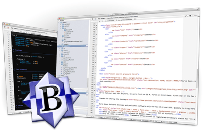

BBEdit by Bare Bones Software

With the recent release of BBEdit 10.5, I feel it appropriate to talk a bit about the editor that everyone seems to love for Mac OS. Before I begin, I will start by saying that I have only relatively recently started using it (about four months ago) and that it was a bit rough at first, but has slowly developed into a necessary tool which I enjoy using for my day-to-day programming needs.

At first glance, it is not the prettiest Mac app around. It is bulky and bit clunky with its always-visable scrollbars and lack of any fancy polish. Before version 10.5, the window behavior was sometimes a bit odd with such things as multiple-monitors and the fullscreen mode introduced in OS X Lion (10.7). Most of these quirks have been fixed in the new version, but some, such as the windows resizing strangely when going back to a single monitor after using two (read: MacBook Pro plugged into external monitor). These are my largest complaints, however, and when you can only complain about such relatively trivial things, it must be a good product.

That leads me into what I like about it so much. One of the things that sets BBEdit apart from its competition is its very useful integration with the command line. With such tools available as “bbedit” and “bbdiff” which allow you to open a document in BBEdit and trigger BBEdit’s file comparison feature, respectively, directly from the command line, this integration has become a very valuable part of my workflow.

One of my other favorite features is its approach to file comparison which can either be triggered in the command line or in the program itself. BBEdit will open a total of three windows which are sized to fit your screen. The two files are displayed side-by-side and there is a long, horizontal window which is positioned below the other two which displays the differences between the files. This multi-window approach is nice because you can resize them at will and move them about. BBEdit’s graphical representation is also much clearer than others I have seen and makes merging files extremely easy to do.

Another feature that has become invaluable to me is BBEdit’s extremely robust searching functionality. Searching through multiple files is made almost a pleasure with their system. Every search opens a new window which will display results in a list at the top and the file in the editor at the bottom. There are three major advantages to this system: 1. you can perform multiple searches at once; 2. you can leave your search results open or even minimize them at will to reference later; 3. when you click on a search result, it will not disturb your primary editor. Other editors with multi-file search capabilities will simply open the file in the main editor when you single-click a search result, but BBEdit just opens it in the search windows’s own editor so you can look at it without disturbing your primary workspace. If you want it to open in the main editor, it just takes a double-click. This system allows for incredible flexibility when it comes for searching.

Overall, BBEdit has become such an important part of my workflow that I don’t think I could really work as efficiently without it. As with every program, however, there is always a wishlist of features. For me, those would primarily be better visual integration into OS X Lion and Mountain Lion, support for vertical split panes within the editor rather than just horizontal and the ability to open multiple files at once in the panes (think Netbeans or Eclipse) which would allow you to see multiple files at once in a single window. Those would be nice, but are really trivialities compared to the features which it already packs. If you are looking for a robust editor for any sort of programming, I can only recommend [you give BBEdit a try](https://www.barebones.com/products/bbedit/).