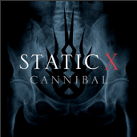
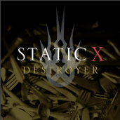

Has anyone heard the new singles from Static-X?

If you haven’t, they’re called Cannibal and Destroyer.

Honestly, I’d have to say they kick ass. It’s definitely Static-X, but at the same time, it’s a new style for them I think. If you haven’t heard them yet, click on the links below to listen to them in iTunes:

[Cannibal](http://click.linksynergy.com/fs-bin/stat?id=oiyVbGokg9Q&offerid=78941&type=3&subid=0&tmpid=1826&RD_PARM1=http%253A%252F%252Fphobos.apple.com%252FWebObjects%252FMZStore.woa%252Fwa%252FviewAlbum%253Fi%253D213643666%2526id%253D213643664%2526s%253D143441%2526partnerId%253D30)

[Destroyer](http://click.linksynergy.com/fs-bin/stat?id=oiyVbGokg9Q&offerid=78941&type=3&subid=0&tmpid=1826&RD_PARM1=http%253A%252F%252Fphobos.apple.com%252FWebObjects%252FMZStore.woa%252Fwa%252FviewAlbum%253Fi%253D214976377%2526id%253D214976344%2526s%253D143441%2526partnerId%253D30)

