A passion of mine that not a lot of people know about is cars. I’ve been fascinated by them since I can remember and for many years as a kid and young teenager, I thought I would end up with a career in the automotive industry. In fact, the very first thing I posted on my very first website was a picture of an old late 1960s/early 1970s Chevy C10 pickup with a caption to the effect of: “This is my current favorite car and it can change daily.”

That passion never went away even though it’s not something I talk about very much and certainly have never written about. There hasn’t been a particular reason for it, I’ve just had plenty of other topics to write about.

Now, I’ve decided to change that and am going to start writing more posts about whatever strikes my fancy with cars and trucks. I thought it was appropriate to kick that off with a post about the cars I’ve owned. In total, I’ve owned six cars in my life. The first three were in the United States while the second three were and are in Germany.

I have included images for each of them which are pictures of the actual vehicles I owned. None of them are stock images. As such, some are better quality than others since the car is sometimes not the main focus of the photo and the quality of the camera was, in some cases, questionable. I haven’t blurred out license plates because none of them are relevant any more. Even the plates on my current car have changed since the photos were taken.

My First Car: A 1987 Toyota LandCruiser
---------------------------------------

-   <figure>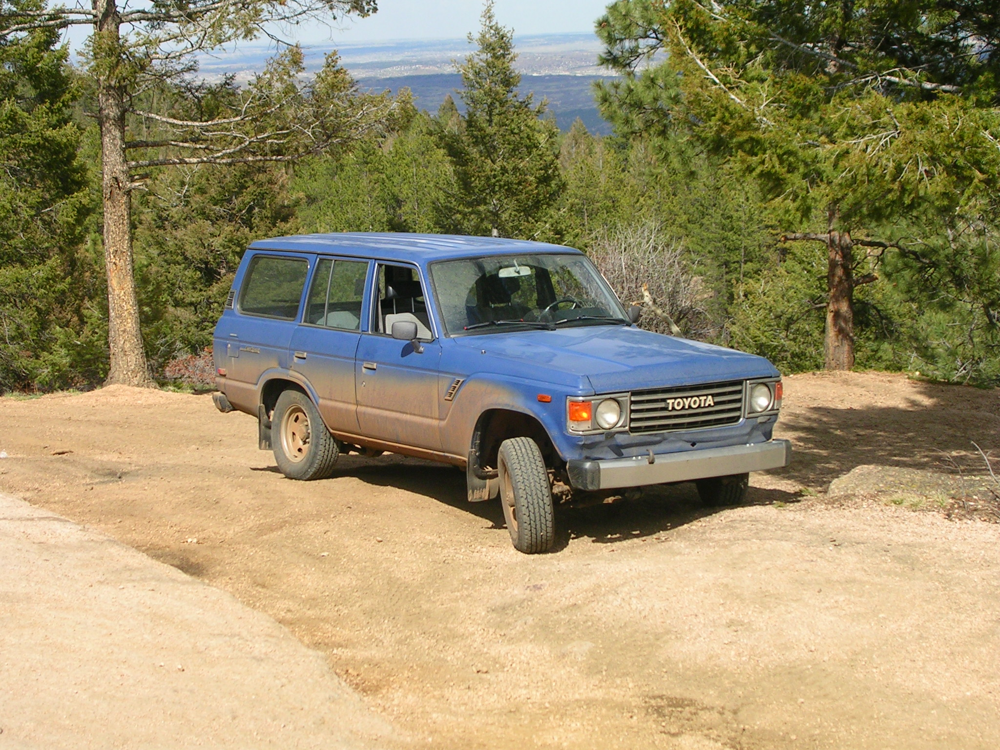<figcaption>My first car: a 1987 Toyota LandCruiser</figcaption></figure>
    
-   <figure>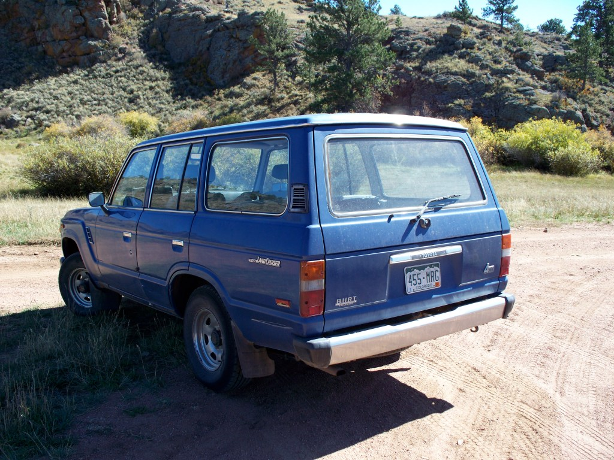<figcaption>My first car: a 1987 Toyota LandCruiser</figcaption></figure>
    
-   <figure>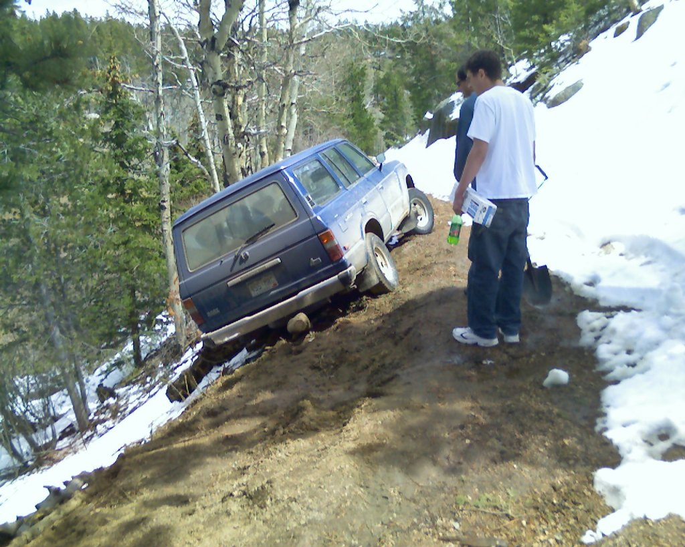<figcaption>Getting stuck off-roading with my first car: a 1987 Toyota LandCruiser</figcaption></figure>
    
-   <figure>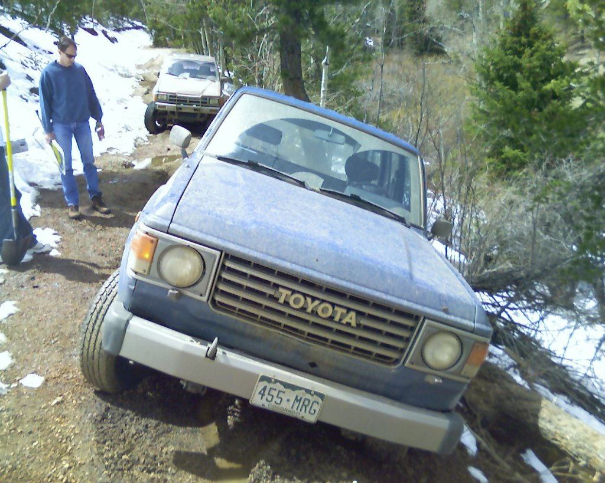<figcaption>Getting stuck off-roading with my first car: a 1987 Toyota LandCruiser</figcaption></figure>
    
-   <figure>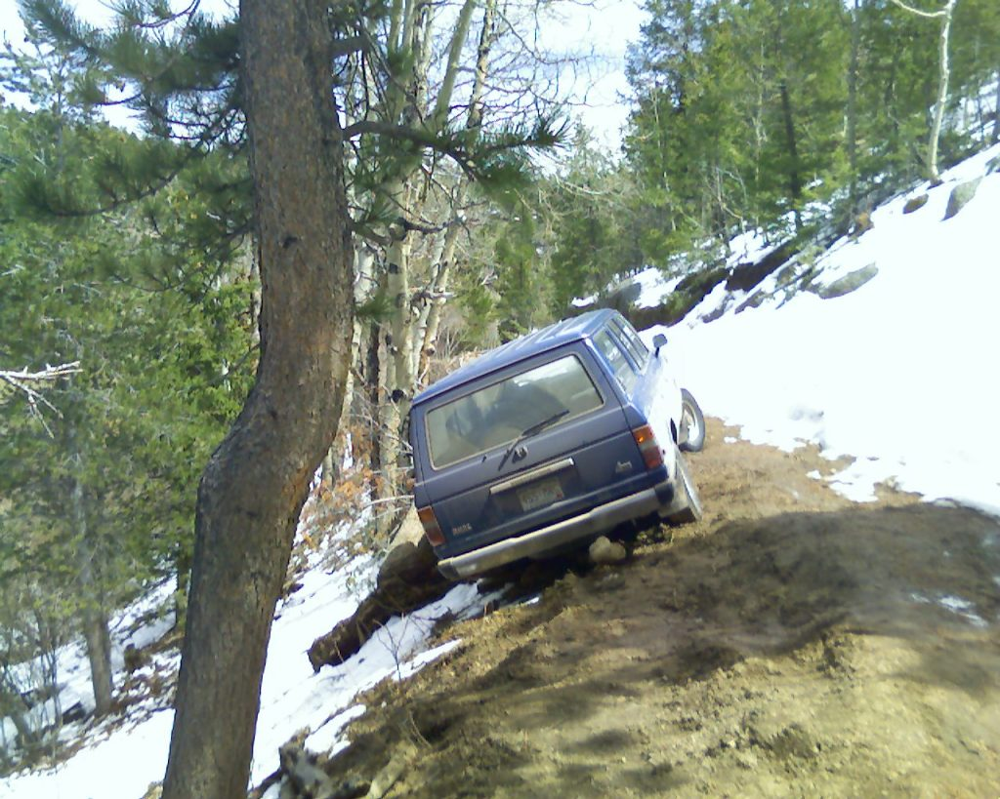<figcaption>Getting stuck off-roading with my first car: a 1987 Toyota LandCruiser</figcaption></figure>
    
-   <figure>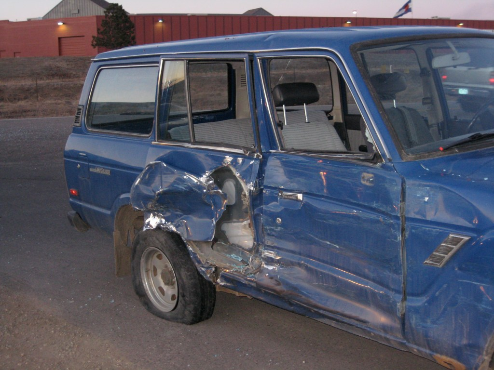<figcaption>The end of my first car: a 1987 Toyota LandCruiser</figcaption></figure>
    
-   <figure>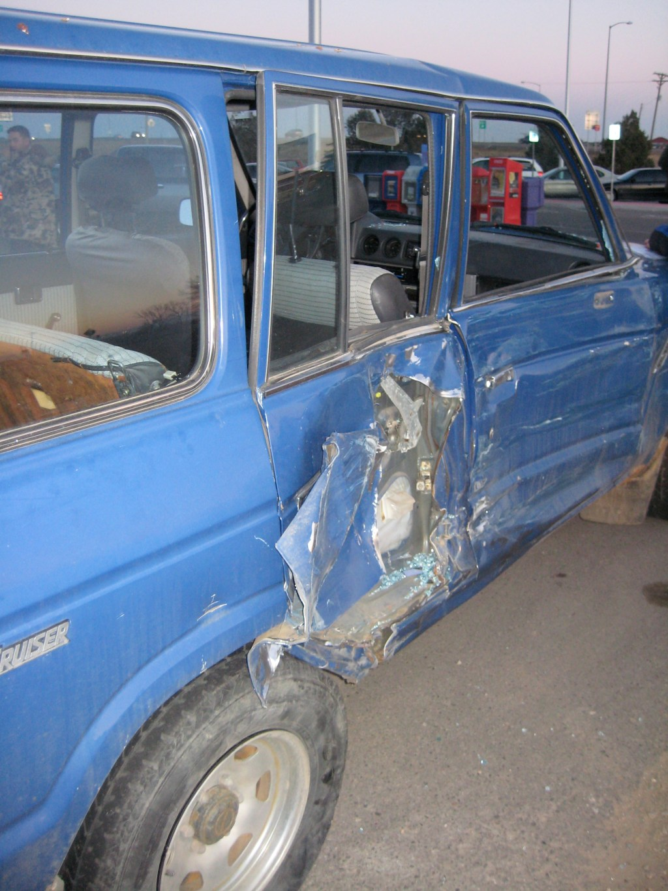<figcaption>The end of my first car: a 1987 Toyota LandCruiser</figcaption></figure>
    
-   <figure>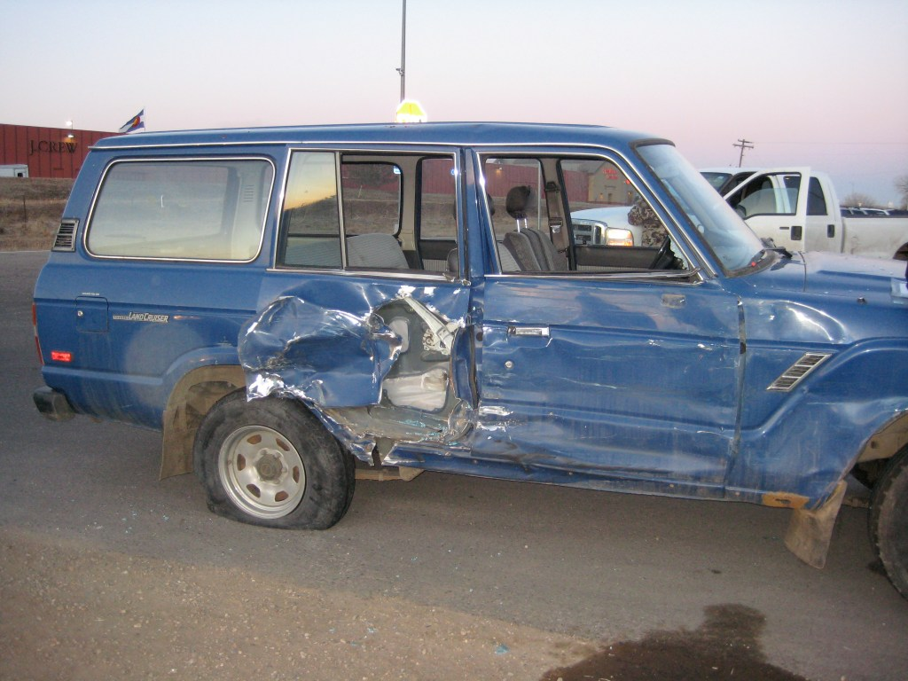<figcaption>The end of my first car: a 1987 Toyota LandCruiser</figcaption></figure>
    

My first car was a 1987 Toyota LandCruiser. It was powered by a straight six-cylinder gas engine that felt relatively weak for the weight of the vehicle — a fact that made my mom quite happy. 1987 was the last model year that used carburetors and manual chokes instead of fuel injection which frequently made starting the LandCruiser in the horribly cold Wyoming winters a challenge. I remember having to tweak the amount of choke and pump the gas feed trying to get it start all the while trying not to flood the carburetor. It was an artform I never even remotely mastered.

The transmission was a four-speed manual with enough low-end torque to climb any hill or mountain without batting an eye. That also made it incredibly slow on the highway, however. The tachometer hit red at 4000 rpm or around 65-70 mph in fourth gear.

At the time, we lived nextdoor to a Toyota mechanic who ran his own shop. He would often bring home random vehicles and this LandCruiser was one of them. At that time, I was 18 and had been driving my parents’ cars since I didn’t have my own, but I needed one because I was starting college and would be off on my own in the boonies of Wyoming.

My dad and I walked over and talked to him about potentially buying it and he said he would not only save it for me, but also fix it up and give me a good deal on it. I don’t remember exactly what I paid for it (with the help of my parents), but I do remember that the price was well under the market value for that sort of vehicle. Even then, they were highly sought after by the off-roading community. Plus, he personally performed an inspection of it at his shop and fixed a number of things that could potentially become problems later on.

That car was my pride and joy for years to come. Every summer, I came back down to my parents’ house in Colorado and my best friend and I would go off roading in the mountains with it. He had a lifted 1987 Toyota Pickup that he would drive. At some point, we ended up in a bit of a rut in that we found ourselves very much stuck in the mud on a narrow, muddy road on the side of a mountain (see the pictures above).

That was the worst situation I think I’ve ever found myself in. Since it was getting dark when we got stuck, we ended up having to walk several miles towards the nearest town until someone with a pickup came along and gave us a ride. We were able to call my dad at the local McDonald’s and he came and got us. The next day, my dad, my best friend and I all went back up the hill to try to get the truck unstuck. It took all day and we ended up getting help from a local with an off-roading buggy and a wench. It was quite the adventure. I think there was a record set for the number of times my dad said “shit” that day.

Unfortunately, all good things must come to an end. My LandCruiser met its end when a Ford F-250 ran a stop sign and t-boned it at an intersection. Fortunately, no one was injured. I walked away with only a few cuts from the shattered glass of the windows. The damage was so severe though that the insurance totaled it. There are also images of the accident above.

My Second Car: a 1995 Toyota Camry
----------------------------------

-   <figure>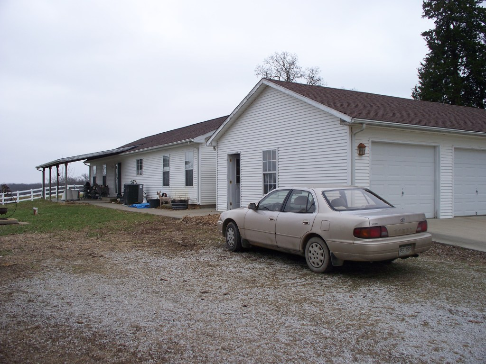<figcaption>My second car: a 1995 Toyota Camry</figcaption></figure>
    
-   <figure>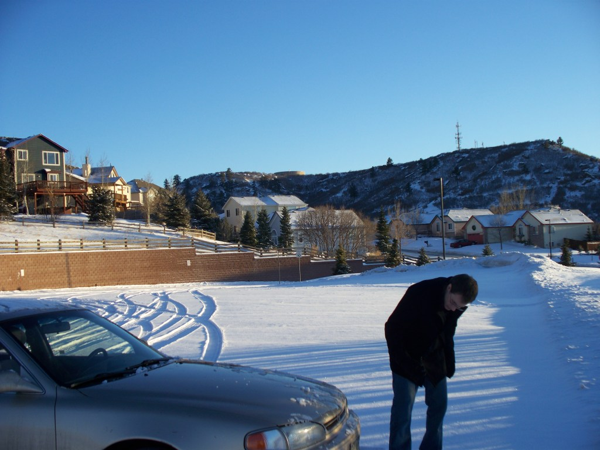<figcaption>Inspecting my second car: a 1995 Toyota Camry</figcaption></figure>
    
-   <figure><figcaption>Yawning with my future wife in my second car: a 1995 Toyota Camry</figcaption></figure>
    

My second car was a 1995 Toyota Camry. After the accident with the LandCruiser, I borrowed a spare car from the parents of another friend of mine: a 1998 Toyota Camry. I liked the car so much that I decided I wanted to get a Camry myself. The one I ended up finding was three years older and the previous model, but I really liked the car anyway. It was remarkably reliable and its four-cylinder engine was very effecient. As a broke college student, I noticed a huge difference in the cost of gas compared to the LandCruiser.

I only had this car for a couple of years, but those years were significant and connected to great memories. It was the car I owned when I first met the woman who became my wife and it’s one that she still claims has been her favorite of all cars. I took numerous road trips with it across the United States including to Yellowstone and to visit my grandparents’ farm in Missouri.

My sister inherited this car when I was done with it, then her husband drove it for a while, then his younger sister drove it for a few years and I don’t know what happened to it after that. I do know, however, that there were never any problems with it. It was the most reliable car I have ever owned.

My Third Car: a 1998 Ford Explorer Sport
----------------------------------------

-   <figure>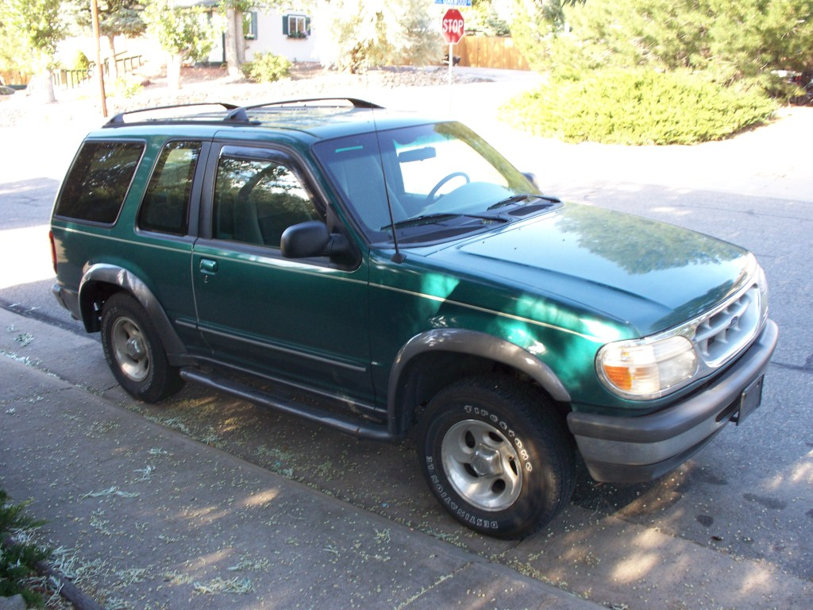<figcaption>My third car: a 1998 Ford Explorer Sport</figcaption></figure>
    
-   <figure>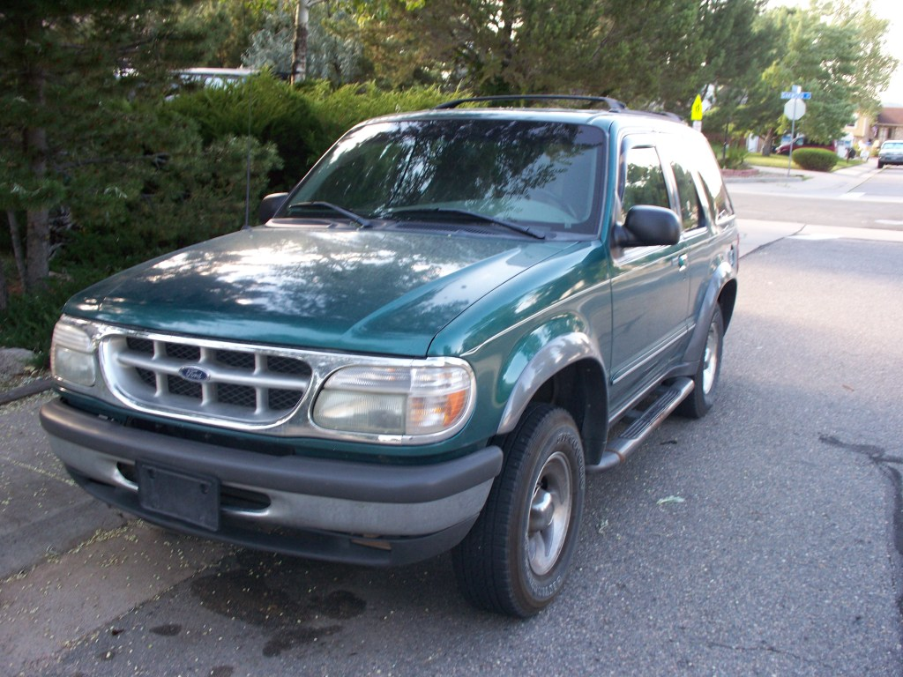<figcaption>My third car: a 1998 Ford Explorer Sport</figcaption></figure>
    
-   <figure>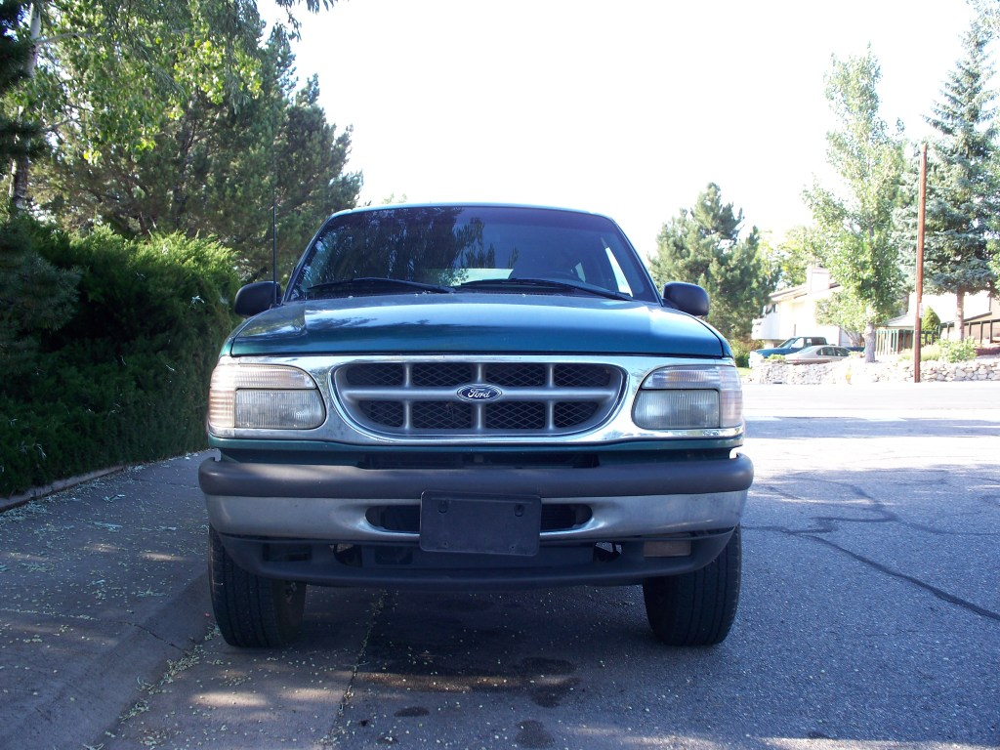<figcaption>My third car: a 1998 Ford Explorer Sport</figcaption></figure>
    
-   <figure>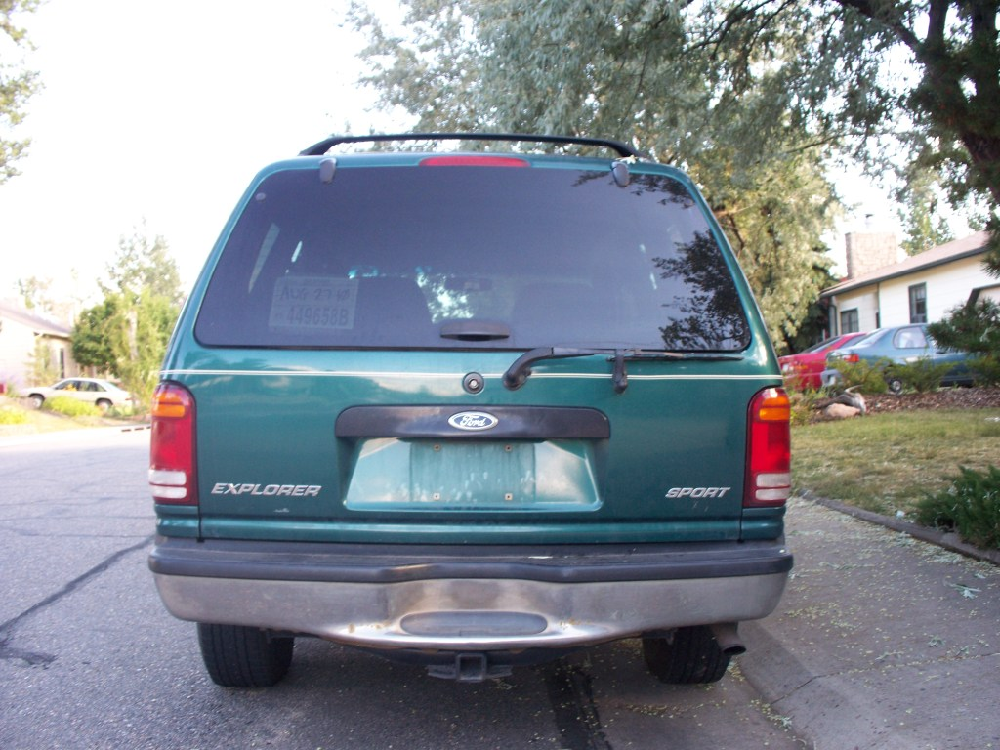<figcaption>My third car: a 1998 Ford Explorer Sport</figcaption></figure>
    
-   <figure>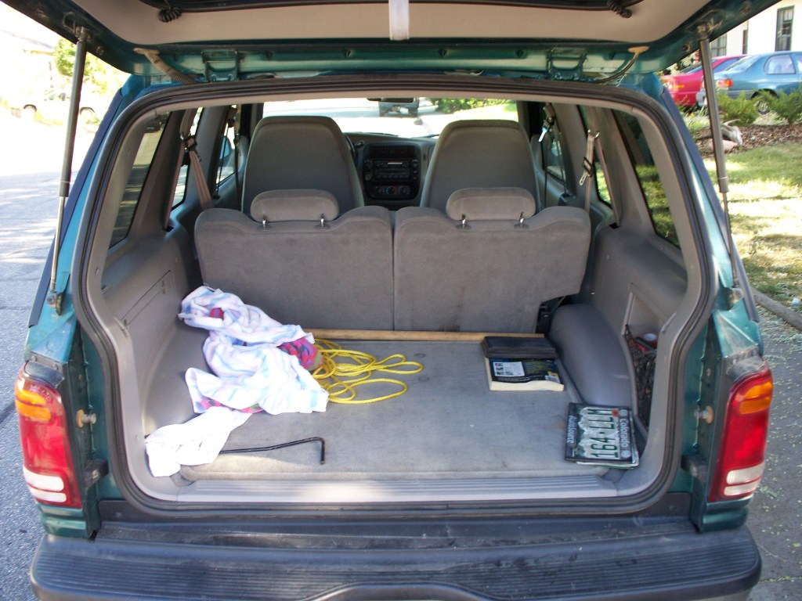<figcaption>My third car: a 1998 Ford Explorer Sport</figcaption></figure>
    

Shortly before moving to Germany, one of my good friends gave my sister his old 1998 Ford Explorer Sport. It was her first car and she hated it. As such, I offered to trade her for the Camry because the idea of owning another SUV was very appealing. I loved the Camry, but I missed the ability to go off-roading which ultimately led me to trade it.

The Explorer was the car I had for the shortest amount of time. By the time I got it, I already knew that I would be moving to Germany and that my time with it was limited. I ended up going off-roading a few times with it, but was disappointed with its performance compared to the LandCruiser. I guess most vehicles are doomed to fail when you cut your teeth with an off-roading legend like the LandCruiser. In any case though, I still enjoyed being able to do it again.

When I moved to Germany, my sister’s husband ended up driving the Explorer. He drove it until he slid off the road in Wyoming during a snow storm and crashed it into a fence post, effectively totaling it. By the time that happened, I was already living in Germany and never saw it again.

My Fourth Car: a 1994 BMW 3-Series Sedan
----------------------------------------

-   <figure>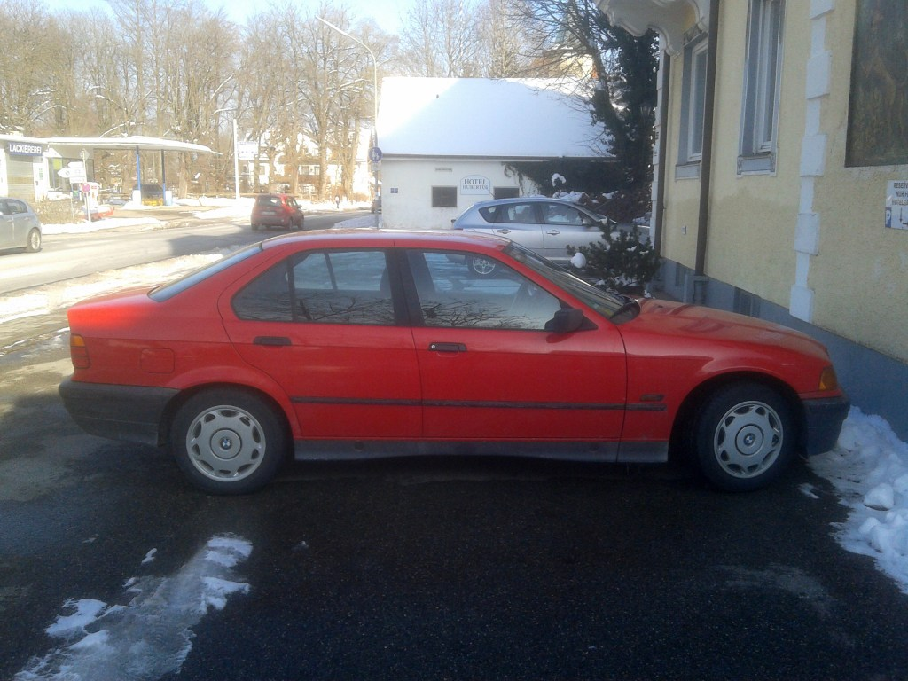<figcaption>My fourth car: a 1994 BMW 3-Series Sedan</figcaption></figure>
    
-   <figure>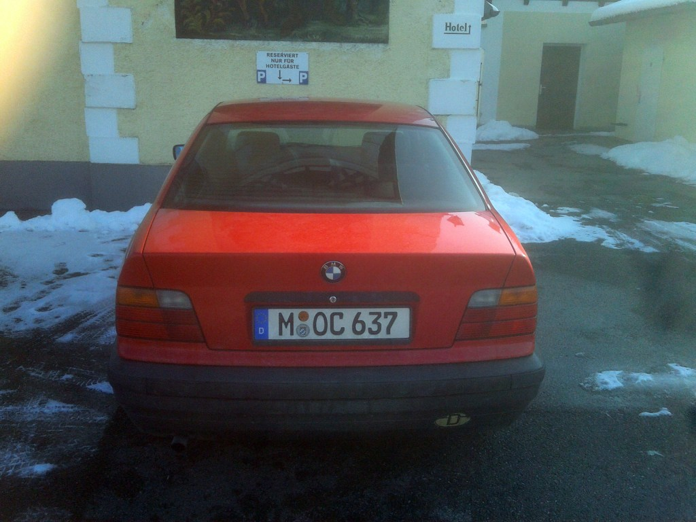<figcaption>My fourth car: a 1994 BMW 3-Series Sedan</figcaption></figure>
    
-   <figure>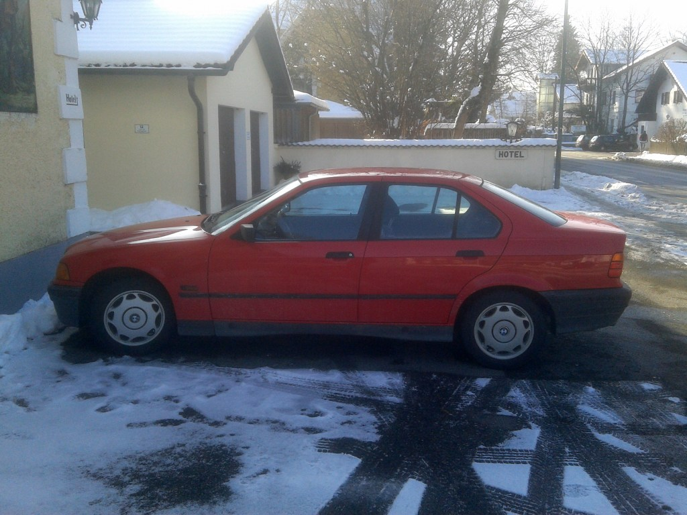<figcaption>My fourth car: a 1994 BMW 3-Series Sedan</figcaption></figure>
    
-   <figure>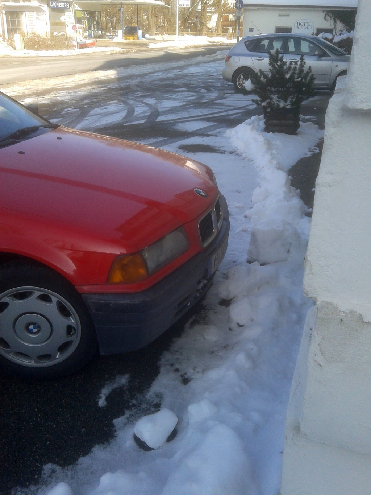<figcaption>My fourth car: a 1994 BMW 3-Series Sedan</figcaption></figure>
    

My fourth car was a 1994 BMW 3-Series Sedan. It was the first car I owned in Germany after a gap of two years not owning any car at all. In that time, I lived a year in Germany, then a year in England, then moved back to Germany. There was no room or money for a car.

My future father-in-law was the one who arranged this BMW for me. He had a friend who was a mechanic who had bought and fixed up this car. I got it for only a few hundred euros which was dirt cheap and a little suspcious, but it turned out to be a somewhat decent car anyway. It only left me stranded twice: once at home and once at work.

Also, the headliner was falling down which is something I lived with for a while before it annoyed me so much that I actually pulled out the entire headliner board and glued new headliner cloth to it. That worked surprisingly well, although I certainly didn’t do a perfect job.

All in all, I did really like this car. It felt solid and drove really well as you would expect from a BMW. The rest of the interior was a little worn, but not too bad considering its age. The bright red color also made it stand out which I enjoyed.

I eventually sold it to a couple of Polish men for €50. Towards the end, it had so many mechanical problems that it just wasn’t worth fixing anymore. When they came to pick it up with a trailer, it clanked, clunked and ground in disturbing ways as they drove it onto the trailer. I was sad to see it go, but glad it was no longer my problem.

My Fifth Car: a 2010 Dodge Caliber
----------------------------------

-   <figure><figcaption>My fifth car: a 2010 Dodge Caliber</figcaption></figure>
    
-   <figure>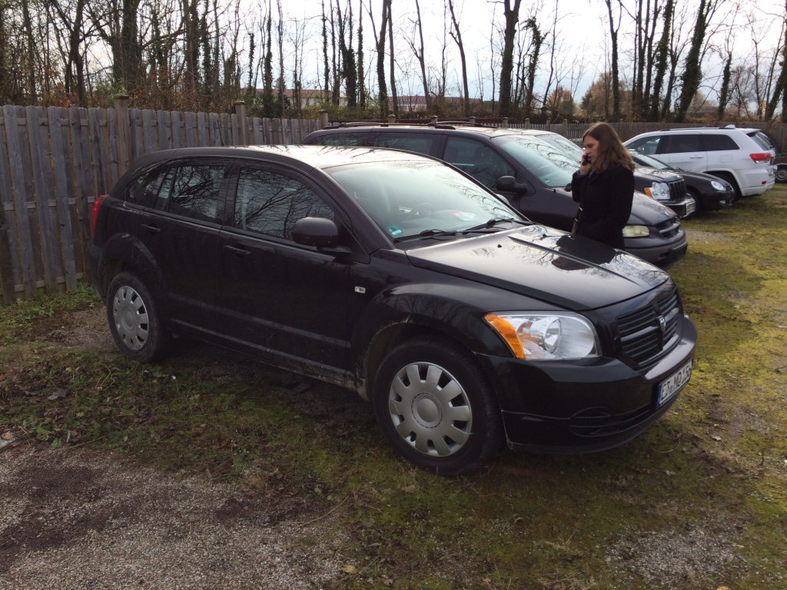<figcaption>My fifth car: a 2010 Dodge Caliber</figcaption></figure>
    
-   <figure>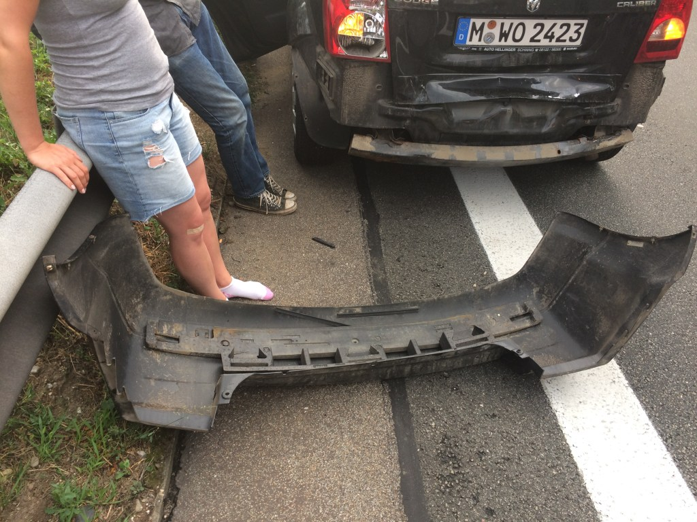<figcaption>The end of my fifth car: a 2010 Dodge Caliber</figcaption></figure>
    

My fifth car was a 2010 Dodge Caliber. This was the first car that my (now) wife and I actively chose and bought together. We bought it when we decided that fixing the BMW just wasn’t worth the money anymore. We got it used from a Dodge/Jeep/Chrysler dealership near the Munich airport. Dodges are fairly rare here in Germany and Calibers are so rare that everytime we passed another person driving one, we would both wave at each other in recognition.

As such, the mechanic we normally took our cars to struggled to work on it and even get parts for it. Fortunately, it didn’t need much work, but there was one instance where it rattled and he had to replace some sort of fitting that he had trouble finding a replacement for.

We decided to get it though because we liked how unique it was. I remember seeing them quite a bit in the US and I always liked the design even though I’ve never been the biggest Dodge fan. So, when I found one with low mileage for sale here in Germany, I jumped at the opportunity.

Despite the cool design, it felt cheap. The manual gear stick was loose and wiggled while driving, the steering was sloppy, and the plastic interior creaked. The car was too old to have any sort of camera systems which meant you had to look through the windows to see where you were going when backing up. Unfortunately, the enormously thick A and C pillars made seeing through the tiny windows a challenge to say the least.

I would say that of all the cars I have owned, this is my favorite in terms of looks, but least favorite overall. (Fortunately,) I only had it for a few months before getting rear-ended by a tailgating Mercedes on the highway on the way back home from my wedding. The collision was hard enough to bend the frame and thus cause it to be totaled (see the picture of the aftermath above).

My Sixth and Current Car: a 2010 Ford Focus Wagon
-------------------------------------------------

-   <figure>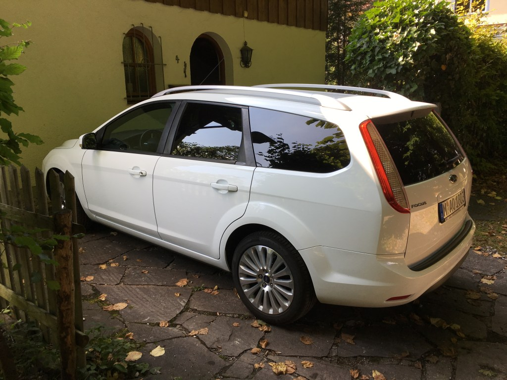<figcaption>My sixth and current car: a 2010 Ford Focus</figcaption></figure>
    
-   <figure>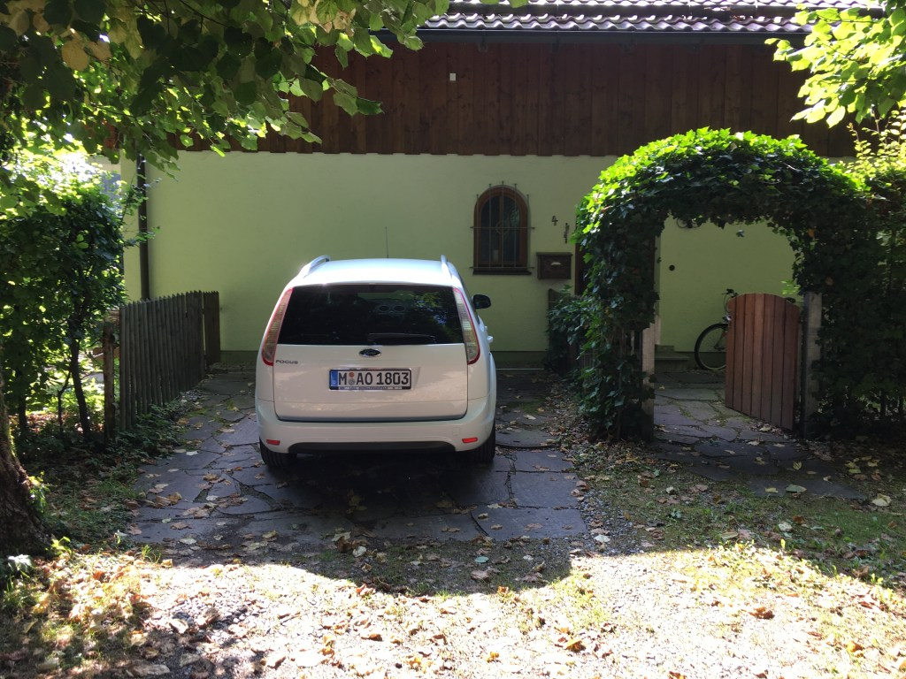<figcaption>My sixth and current car: a 2010 Ford Focus</figcaption></figure>
    

My sixth and current car is a 2010 Ford Focus wagon. It is the second car my wife and I picked out together and we intentionally sought out a Ford Focus wagon since her mom had owned the first generation of Focus wagons and she had always liked it. We chose a 2010 because it was the last model year for this particular generation and was within our price range. We found one with the sports package which includes tinted glass, upgraded seats, a better stereo and, most importantly, more horsepower.

This is the second Ford I’ve owned and I am very happy with it. My mom’s family is a Ford family and I also happened to marry into one. Almost all of my German in-laws drive Fords.

Even though I am very happy with this car, I do have a couple of points of criticism. The first and foremost is just how noisy the car is on the highway. It is so noisy that it is hard to listen to music or have a conversation with someone. It’s also noisy off the highway, but not nearly as bad. The is partially because it feels like the car should have a sixth gear in its manual transmission even though it only has five. Focuses started coming with six gear manual transmissions a year later with the 2011 model year.

Also, the gas mileage isn’t great for how small it is. By American standards, it would be good, but by European standards, it’s pretty terrible. Since gas is incredibly expensive here in Europe, that is a real pain point. We average about 10-11 liters per 100 km (about 23.5 – 21.4 miles per gallon).

Conclusion
----------

As you may have noticed, I have only ever owned used cars. I would love to buy a brand new one some day and I certainly intend to at least once in my life, but it hasn’t been much of a priority. Our next primary car will probably be either a hybrid or fully electic vehicle since we want something that is quieter and more effecient. It may still be a while though as we tend to drive our cars until they’re totaled or aren’t worth fixing anymore. With a car as robust as the Focus has been, it might be a long wait.

That said, our next car may actually be a camping van of some sort since I would really enjoy traveling with one of those. However, it probably wouldn’t be our primary car since we would want something more effecient for day-to-day activities.

Here are a couple of interesting facts about the cars I’ve owned:

-   Three of the six have been totaled, although I was never at fault.
-   Only the Camry and Explorer had automatic transmissions. All of the others have been and are manuals.
-   I still have the keys to the LandCruiser and Explorer.
-   I’ve never had a vehicle with an engine larger than a V6 (the Explorer)
-   The only electronic things in the LandCruiser were the radio, the lights, the fuel pump, the windshield wipers and the windshield washer pump. Everything else was mechanical.

I can’t think of anything else that I haven’t mentioned already, but if I do, I’ll update the list.

Over the years, I have accumulated a lot of cherished memories that are connected to the cars I own. They have always played a big role in my life and will continue to do so because I enjoy them.

*Have you owned any of the same kinds of cars? What cars have you owned and which are your favorites? Let me know in the comments!*