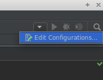
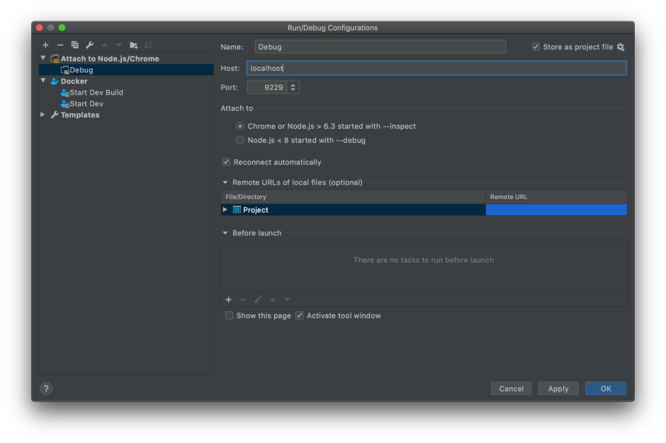

<figure></figure>

*Note: This article was updated on 18 June 2020 for Node >= 12. The previous version was based on Node 6.*

Node.js + Docker + WebStorm is not an unusual setup for Node.js developers, but there is nonetheless surprisingly little information available about how to setup debugging in WebStorm while running a Node.js application locally in a Docker image. Fortunately it is very simple to setup and the benefit of having real debugging is something that will save the developer a lot of headaches and development time.

This tutorial will walk through how to setup general Node.js debugging inside of a Docker container that can be used by any tool that offers debugging. Then we will walk through how to set it up in WebStorm specifically.

### Setting Up Docker and Node.js for Debugging

The first thing we need to do is tell Node.js that we want to run our application in debug mode. This is accomplished by simply adding the `--inspect` flag to the node command as follows:

```bash
node --inspect src/index.js
```

Of course since the application is running in Docker, that will need to be accomplished by adding it to the command in your Dockerfile. We also need to expose the standard debugging port, `9229`, so that our debugging tool can access it. The Dockerfile could look something like this:

```docker
FROM node:14-alpine
EXPOSE 9229
CMD ["node", "--inspect=0.0.0.0:9229", "src/index.js"]
```

If you are using Docker Compose, the configuration looks a little different and should take place in your `docker-compose.yml` file. Here is an example of what it should look like:

```yaml
version: '3.7'
services:
  app:
    build: .
    command: node --inspect=0.0.0.0:9229 src/index.js
    ports:
      - "9229:9229"
```

Now that we have prepared Node.js to run in debug mode within the Docker container and exposed the correct port, we can setup WebStorm to take advantage of it. Other editors and IDEs can most likely be setup in a similar fashion, but check the specific documentation for your editor or IDE for details.

### Setting Up Debugging in WebStorm

<figure><a href="https://i0.wp.com/blog.alexseifert.com/wp-content/uploads/2016/10/webstorm-edit-configurations.png?ssl=1"></a><figcaption>WebStorm Edit Confiigurations</figcaption></figure>

Getting debugging up and running in WebStorm is easy. Essentially, we are going to treat debugging a Node.js application in a Docker container as though we were debugging an application on a remote server.

In order to do this, we are going to add a debug configuration to WebStorm in the “Run/Debug Configurations” window which can be opened by clicking on the arrow in the top right corner of WebStorm, then by clicking on “Edit Configurations…” (see the screenshot on the right). Alternatively, you can go to the “Run” menu and click on “Edit Configurations…”.

Now click on the big, green plus button and choose “Attach to Node.js/Chrome” from the menu that opens. The default settings are exactly what we want, so the only thing you should change is the Name in order to know what it is. I’ve simply named it “Debug”.

<figure><a href="https://blog.alexseifert.com/2016/10/25/debugging-node-js-in-a-docker-container-with-webstorm/webstorm-run-debug-config/"></a><figcaption>WebStorm “Run/Debug Configurations” Window</figcaption></figure>

Once you have given it a name of your choice, click OK to close the window. Now WebStorm is correctly configured to debug a Node.js application in a Docker container and all we have left to do is try it out.

### Running the Debugger in WebStorm

Once the configuration is finished, we can now run the debugger.

First, fire up your Docker container as usual. After it is started, click on the little bug icon in the top right corner of WebStorm or by clicking “Debug ‘Debug’” in the Run menu (the name you chose for your configuration will appear in the single quotation marks). If everything is setup correctly, WebStorm will have connected to your Node.js application via port `9229` and will have started the debug session.

How the debugger works in WebStorm is beyond the scope of this article, but now you can set breakpoints in your code and start debugging as you would as though the application were running locally instead of inside of a Docker container.