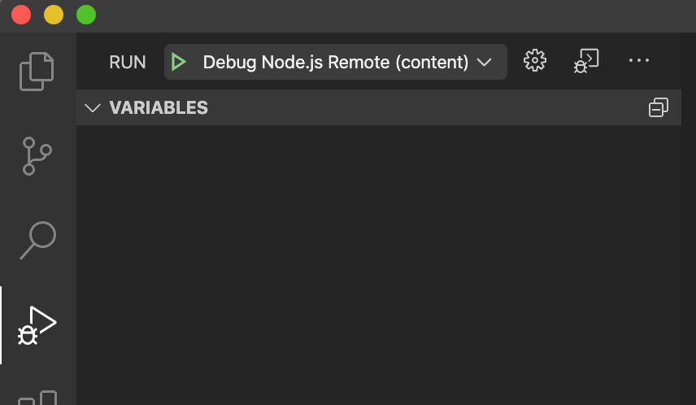

<figure></figure>

**Visual Studio Code is a tool with many talents. Among those is the ability to not just debug Node.js applications, but also to debug them remotely.**

Debugging a Node.js application remotely using Visual Studio Code is a small matter of configuration. Microsoft’s do-all editor makes it easy to create a debug configuration that teams can even commit into their repositories so that all developers can benefit from it.

In order to simulate a remote Node.js application in this article, we are going to run a simple one in Docker. That means the following will also work for applications running in a Docker container. If you are only interested in the configuration for Visual Studio Code, then feel free to scroll down to the “Visual Studio Code Configuration” section below.

The following example project is also available as a [repository on GitHub](https://github.com/Developers-Notebook/debugging-node-remotely-vscode) which may make it easier to understand the structure.

A Simple Node.js Script
-----------------------

The first thing we need to do is to set up a basic Node.js app that we can test with. We won’t program much here because we don’t need to for this example. Instead, we will just include this simple script:

```javascript
const printTest = () => {
    let test = 'test';
    test += ' value';
    console.log(test);
};

setInterval(printTest, 1000);
```

The code doesn’t really do much, but what it allows us to do is to set a breakpoint at line 3 and then step through the code in order to see the difference between test before and after it is assigned ” value”. `setInterval(printTest, 1000)` is the application loop and keeps it running in Docker so we don’t have to restart it every time. That’s enough for our purposes here.

Of course, this code is just representative of any other Node.js code that can be debugged. This would also easily work with TypeScript without any further changes to the code or configuration.

We will then save it as `ourScript.js` and copy it into our Docker container.

Docker Configuration
--------------------

The next thing we need to do is to set up is our Docker environment for testing. In order to do this, we will create a simple `Dockerfile` that looks like this:

```Dockerfile
FROM node:14-alpine
WORKDIR /app
COPY ./ourScript.js .
CMD ["node", "--inspect=0.0.0.0:9229", "./ourScript.js"]
EXPOSE 9229
```

Again, there isn’t anything fancy going on here. There are, however, two important parts of this configuration that will enable us to debug remotely.

These are: `--inspect=0.0.0.0:9229` in `CMD` and `EXPOSE 9229`.

Both of these are critical for debugging a Node.js app/script remotely in Docker. If you want to debug an application on a server, you will most likely just need to use the `--inspect` flag without the IP address.

Visual Studio Code Configuration
--------------------------------

Now that we have our test environment set up and ready to go, we need to configure Visual Studio Code so that the debugger will work remotely.

In order to do this, we need to create a `.vscode` folder in the root of the project and then add a `launch.json` file to the folder. Then we can paste the following into the `launch.json` file:

```json
{
  "version": "0.2.0",
  "configurations": [
    {
      "type": "node",
      "request": "attach",
      "name": "Debug Node.js Remote",
      "protocol": "inspector",
      "port": 9229,
      "address": "localhost",
      "restart": true,
      "localRoot": "${workspaceFolder}",
      "remoteRoot": "/app",
      "cwd": "${workspaceFolder}",
      "skipFiles": [
        "${workspaceFolder}/node_modules/**/*.js"
      ]
    }
  ]
}
```

This configuration isn’t that different from the configuration you would need in order to debug locally. The important parts that make it work remotely are `"port": 9229`, `"address": "localhost"`, `"localRoot": "${workspaceFolder}"` and `remoteRoot": "/app"`.

The first defines the remote port through which Visual Studio Code can connect to the debugger. The second is the TCP/IP address of the process to be debugged. The third is the location of the code locally where the breakpoints will be set. And the fourth defines the location of the code on the remote server.

For more information on the configuration, see [Microsoft’s official documentation](https://code.visualstudio.com/docs/nodejs/nodejs-debugging#_remote-debugging).

Visual Studio Code can also automatically create a `launch.json`, but I find it easier to do it by hand if I already have a pre-defined configuration available as we would need to modify the automatically generated file anyway.

Running Our Test Project
------------------------

Now that we’ve set everything up, we can test it. First of all, we need to build our test Docker image, then run it with the proper configuration so that the debugging port is exposed.

To build it, run the following in the root of your project:

```bash
docker build -t test .
```

After that is finished, we can run it using the following:

```bash
docker run -p 9229:9229 -t test
```

There are a couple of important parts to the run command. The first is the `-p 9229:9229` flag that exposes the debugging port defined above. The second, of course, is the `-t test` flag which uses the tag we defined when building the Docker image.

After running these commands, `test value` should be outputted to the console once every second.

Debugging in Visual Studio Code
-------------------------------

Now that our test project is running, we can set a breakpoint on line 3 of the `ourScript.js` file and throw on the debugger. Fortunately, Visual Studio Code makes this process very easy.

There are multiple ways to start the debugger. You can either simply press `F5` or go to the debugger panel (see image below) and click the “play” button on the top of the panel. Our configuration should show up by default as \`Debug Node.js Remote (content)\`:

<figure><a href="https://blog.alexseifert.com/?attachment_id=3343"></a><figcaption>Visual Studio Code Debugger Panel</figcaption></figure>

Once the debugger is started and the breakpoint is set, Visual Studio Code should switch into debug mode, stop the script we’ve been running at the breakpoint and allow us to step through the code.

Conclusion
----------

Visual Studio Code is a powerful tool for JavaScript developers. It allows for local as well as remote debugging meaning developers can debug on both their local machines as well as on servers or in Docker containers. It also supports debugging for TypeScript with the same configuration.

For the example in this article, we used Docker to mock a remote connection. Of course, it is possible to set this up using an actual remote server as well.

For more information about debugging remotely with Visual Studio Code, see [Microsoft’s official documentation](https://code.visualstudio.com/docs/nodejs/nodejs-debugging#_remote-debugging).

*Do you have any experience with remote debugging in Visual Studio Code? How about in Docker? Do you prefer a different tool altogether? Let us know in the comments below!*

See the full [example project on GitHub](https://github.com/Developers-Notebook/debugging-node-remotely-vscode).