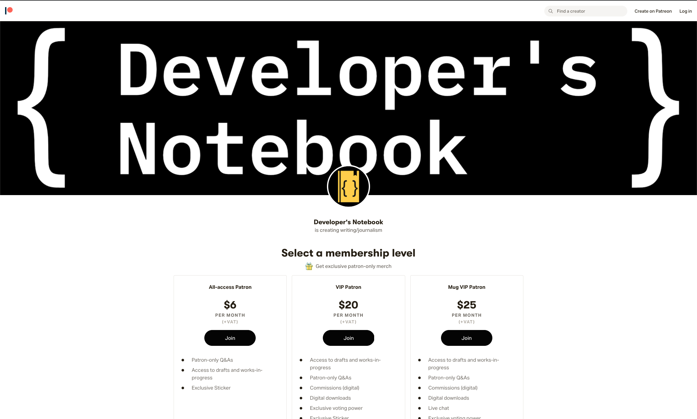
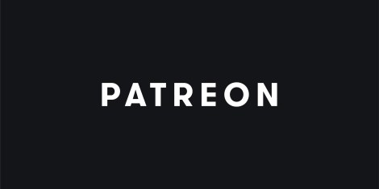

<figure><figcaption>Developer’s Notebook is now on Patreon.</figcaption></figure>

I’m happy to announce that Developer’s Notebook is now on [Patreon](https://www.patreon.com/developersnotebook). If you would like to support this website, then please head on over and take a peek!

As a subscriber, you get the following benefits depending on which tier you subscribe to:

-   Exclusive merchandise including stickers, t-shirts and mugs
-   Commission articles or podcast episodes
-   Live chat with me
-   You can ask me questions that I will answer via an article or podcast
-   Access to polls that will influence upcoming content
-   Access to downloadable PDFs of articles
-   Access to works-in-progress and drafts

For more details, click on the banner below:

<figure></figure>

As always, I appreciate your support for Developer’s Notebook and I am looking forward to reading your questions and commissions as well as to all of the other interactions with subscribers!

If you have any other questions, please don’t hesitate to [contact me](https://www.developers-notebook.com/contact/).