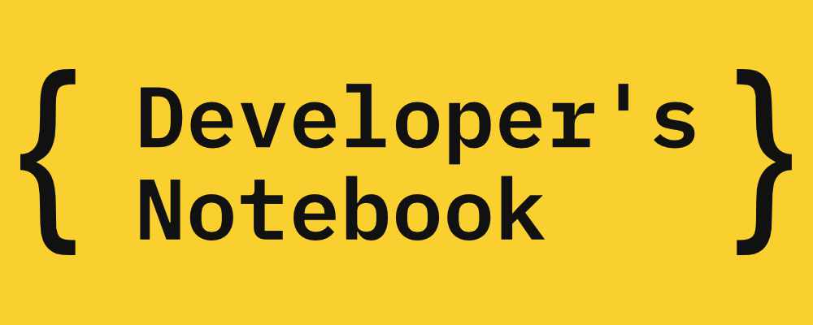

<figure><figcaption>Developer’s Notebook</figcaption></figure>

I am very happy to announce a brand new project of mine called [Developer’s Notebook](https://www.developers-notebook.com/).

The project is going to be a more professional version of Alex’s Notebook that includes articles of interest for developers. Unlike this blog, it will not include personal announcements.

The type of articles is going to be familiar to anyone who has visited Alex’s Notebook before, but they are going to be more detailed and delve deeper into the topics. There will be some overlap, especially at the beginning as I use content from this blog to start off [Developer’s Notebook](https://www.developers-notebook.com/).

Most of the content will be free, but other content will be paid. Since one of my goals is to make myself a bit more independent, I am going to try to build a small business around it. At first, all content will be free, but there might be ads. At some point, I will begin writing detailed articles for purchase and/or add a subscription model.

Originally, I wrote the new project entirely from the ground up using a combination of Markdown files and the [Next.js framework](https://nextjs.org/). The technology stack looked like this:

-   Next.js and React
-   Redux
-   TypeScript
-   Markdown
-   Sass

It was based on an open source project I started that makes it easy to start a blog in exactly this way called [next-static-blog](https://github.com/eiskalteschatten/next-static-blog).

However, I had a list of must-have features I wanted before launch and I felt as though they were taking too long to program myself, so I ended up with another WordPress website which has everything I needed out of the box. I wanted to focus on the content and get started writing articles. Some day in the future, I may resurrect the Next.js project and replace it, but we’ll see.

If you would like to find out more about the technology, take a look at the [About page](https://developers-notebook.com/about).

Otherwise, head on over to [Developer’s Notebook](https://www.developers-notebook.com/) and take a look!