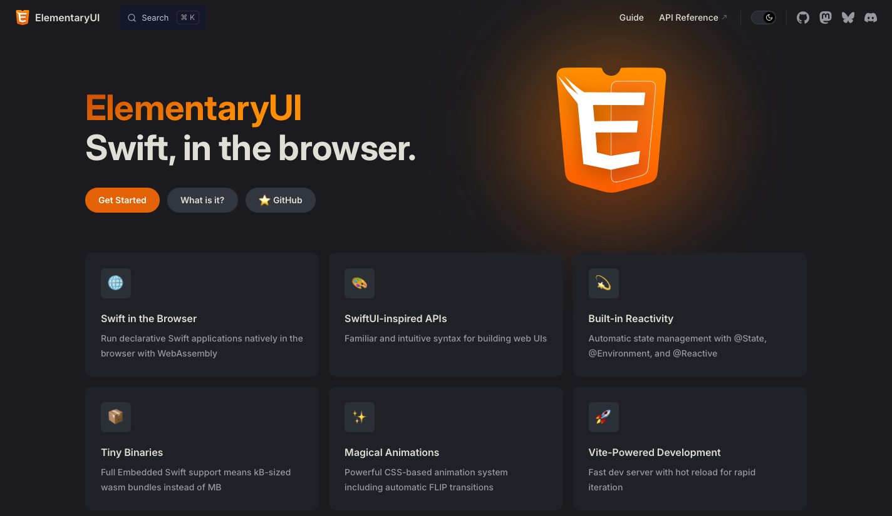

<figure><figcaption>ElementaryUI for Swift</figcaption></figure>

A few days ago, I stumbled upon an interesting new frontend framework for Swift-based web projects. It’s called [ElementaryUI](https://elementary.codes) and allows developers to code their frontend entirely in Swift. You can think of it like the Swift equivalent of [ASP.NET’s Blazor](https://learn.microsoft.com/en-us/aspnet/core/blazor/?view=aspnetcore-10.0) which allows you to write C# for the frontend. Both are compiled to WebAssembly executables with the appropriate JavaScript scaffolding to ensure it works as designed.

The idea is create an interactive frontend similar to how React, Angular and Vue.js work, but without the additional overhead of so much JavaScript and less managing of communication between the frontend and the backend. For example, you can [bind backend data objects to form fields](https://swiftpackageindex.com/elementary-swift/elementary-ui/0.1.3/documentation/elementaryui/binding) and ElementaryUI automatically takes care of the communication between the two.

This reduces a lot of boilerplate code and reduces potential error sources while still allowing for the same level of interactivity as React, Angular or Vue.js offer. Also, since it uses natively complied WebAssembly, it should be more performant for complex web applications that rely primarily on JavaScript to power the frontend.

All elements in ElementaryUI are entirely native Swift, even HTML elements, which also makes IDE (specifically Xcode) support much better. Here is a code example from their homepage so you can see what I mean:

```swift
@View
struct LoveCounter {
    @State var count = 1

    var body: some View {
        p { String(repeating: "❤️", count: count) }

        if count < 10 {
            button { "More Love" }
                .onClick { count += 1 }
        } else {
            p { "Enough love for you!" }
            button { "Less Love" }
                .onClick { count = 1 }
        }
    }
}
```

I haven’t given it a shot yet, but I am excited to when I can find the time. Until now, the only technologies I’ve used for frontend development with a Swift backend are [Vapor’s Leaf](https://docs.vapor.codes/leaf/getting-started/) as well as another one called [Stencil](https://github.com/stencilproject/Stencil) whose syntax is similar to Django, Mustache and Twig. Both are standard templating languages that are rendered on the server and return a static page without any interactivity like ElementaryUI offers.

Links:

-   ElementaryUI Website: [https://elementary.codes](https://elementary.codes)
-   ElementaryUI on GitHub: [https://github.com/elementary-swift/elementary-ui](https://github.com/elementary-swift/elementary-ui)