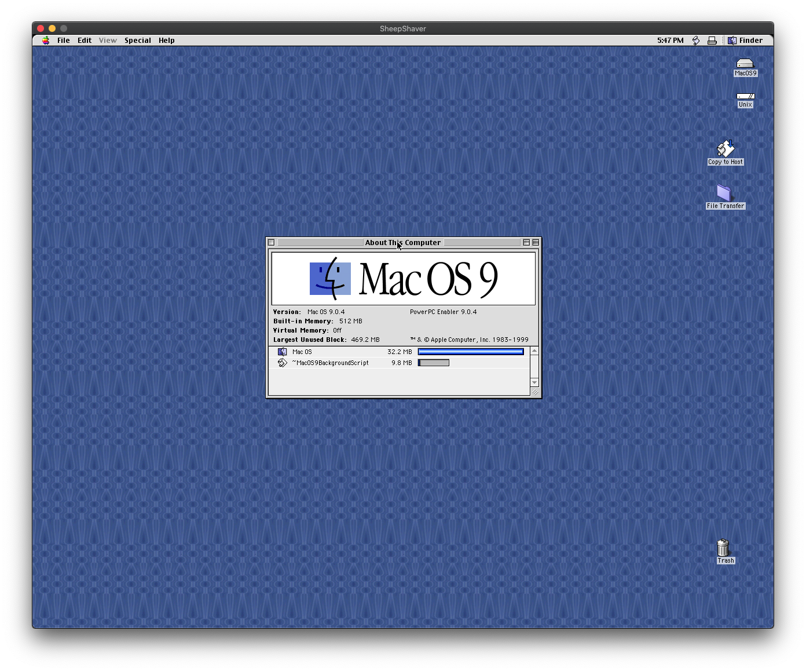
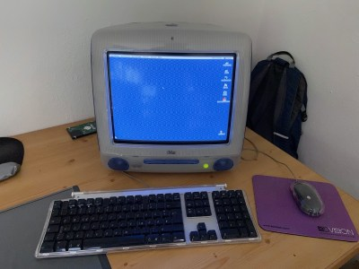

<figure><figcaption>Mac OS 9 on macOS 10.15</figcaption></figure>

For several years now, I have had [an old iMac G3](https://blog.alexseifert.com/2015/05/01/old-imac-g3-and-mac-os-9/) from about 2000 sitting around in one corner of my home office. It works perfectly fine, but I rarely start it up because I really don’t have much of a use for it most days. Occasionally, I play old games or run old software that I still have from 20 years ago, but those occasions are few and far between.

But today boredom and curiosity got the better of me.

I fired up the old iMac and, as usual, it reliably started right up. Compared to my modern MacBook Pro, however, it is obviously noisy, slow and the resolution is terrible. Those are always the first things that strike me whenever I decide to use the iMac, so the thought I had today was: why not try to emulate Mac OS 9 on my MacBook Pro running macOS 10.15 Catalina instead of always having to boot my iMac?

<figure><figcaption>iMac Running Mac OS 9</figcaption></figure>

Emulation cannot, of course, replace the experience of actually using the iMac though since it doesn’t give you the full immersion experience of using an authentically vintage computer. Whenever I sit in frontend of that old CRT screen listening to it hum, I always feel a bit like I did back then when I was in school and using AppleWorks on one of these colorful machines to type up my homework — usually some essay first written by hand.

But I digress. I decided to try to emulate Mac OS 9 on my MacBook Pro so that I wouldn’t always have to start the iMac whenever I felt like playing Age of Empires, Civilization III, the original Tomb Raider or Railroad Tycoon II. Plus, I figured I could really jack up the specs on the emulator which would allow me to play a few more games that my iMac won’t run (it only has 64 MB of RAM). Not to mention I could then also run Photoshop 6 again. (the last version of Photoshop I purchased).

Researching Emulators
---------------------

The first thing I did was to look around online for other people’s experiences with emulating Mac OS 9. The most commonly run emulators for older Macintosh systems are [SheepShaver](https://sheepshaver.cebix.net/) and [Basilisk II](https://basilisk.cebix.net/), both of which I have used before to emulate System 7 just for fun. SheepShaver seemed to be what people were using to emulate Mac OS 9, however, so that is what I went with.

I followed [the instructions on their website](https://www.emaculation.com/doku.php/sheepshaver_mac_os_x_setup) for setting it up which worked well and I was, with a bit more research on other websites, able to use my iMac in order to extract a valid ROM which is required to run an older Macintosh operating system. With the ROM I was able to get SheepShaver running, Next, I needed to install the operating system itself.

Installing the Operating System
-------------------------------

The next piece that was missing though was a Mac OS 9 install disk. My iMac came with one, but it doesn’t work with SheepShaver because it came with Mac OS 9.1. SheepShaver only works up to Mac OS 9.0.4 because it does not emulate the MMU (Memory Management Unit) which was a requirement for Mac OS 9.1 and above.

Instead, I ended up downloading [an image of an install CD](https://macintoshgarden.org/apps/mac-os-install-cd-library) from [Macintosh Garden](https://macintoshgarden.org/) which is an excellent website to download vintage Mac software. I was able to get it to work with the Mac OS 9.0.4 Universal Install image.

Installing Software
-------------------

I now have a bootable, usable Mac OS 9 instance on my modern MacBook Pro. It runs with 512 MB of RAM and has 4 GB of hard drive space. I was able to install most of my old games and software on it, although I did run into an issue with getting macOS 10.15 to mount some of the old Apple HFS-formatted CDs so that I could install them. As a work around, I had to use the Disk Copy utility on my old iMac to create .IMG files out of them which I could then transfer to my MacBook via a USB drive (ironcially FAT32-formatted) and then mount into SheepShaver. That was a bit of a hassle, but it worked.

I also browsed [Macintosh Garden](https://macintoshgarden.org/) for a while and found a few new games and other bits of software that looked interesting that I am looking forward to trying out.

An Easier Solution
------------------

I spent most of a day doing what I described above just to stumble upon an easier solution later on that would have saved me a lot of hassle. I will share this solution with you now, but not without saying that I still enjoyed the whole process described above.

The solution is a pre-made instance of SheepShaver running Mac OS 9.0.4 that includes a number of utilities and other pieces of software. The ROM is also included and the whole bundle is packaged into a simple, runnable application for macOS 10.10 and above. That means, all you have to do is download it, unzip it, move it to your Application folder and run it. Mac OS 9 boots right up and you don’t have to do a thing otherwise.

You can find and download this brilliant solution for free on [http://www.columbia.edu/~em36/macos9osx.html](http://www.columbia.edu/~em36/macos9osx.html).

Conclusion
----------

They say no article is complete without a conclusion. Well, mine is this: Mac OS 9 is still fun to use and the fact that I now have a lightning-fast version of it running in an emulator on my modern MacBook is a real treat and convenience factor when I get the itch to play old games.

So now, unless I want the full 20-year-old immersion experience, I no longer have to fire up the old iMac in order to run my old software. Instead, I can conveniently sit with my laptop on the couch and play like it’s 1999.