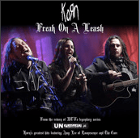

Several weeks ago, Korn unofficially announced the making of a new album through the online blog kept by their singer, Jonathan Davis, called [Butt Sex Crips](http://www.buttsexcrips.com). The new album is supposedly due sometime this summer. Korn’s drummer, David Silveria, will not be featured on this album, as he has decided to take a break from the band for a while. He has not left the band entirely, however, and plans to return to Korn after about a year-long break.

I don’t how many of you watch MTV anymore, with all the reality TV shows and all of the hip-hop they play, but Korn has recently appeared on MTV’s Unplugged program. If you don’t know what this is, it’s basically acoustic versions of their most popular songs. It features a full orchestra, a piano, an acoustic guitar, an acoustic bass, etc. Amy Lee from Evanescence also appears as a guest singer and back-up vocalist for Jonathan.

The only song I have heard so far from the Unplugged program is Freak on a Leash. I can’t say that musically it isn’t good, but I don’t like it. I can appreciate what Korn is doing and the skill it takes to do what they are doing (not to mention Amy Lee’s back-up vocals are amazing), but I still don’t really like it.

Earlier this week, I received an announcement that Korn has released a new single in the iTunes Music Store. This single is Freak on a Leash from MTV’s Unplugged. Now I’ll finally get to my point. I hope the new album that was announced on Jonathan’s blog, [Butt Sex Crips](http://www.buttsexcrips.com), isn’t going to just be an album full of acoustic versions of old Korn classics. That would be quite disappointing for me.

