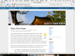
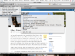

\[digg=http://digg.com/software/Firefox\_3\_Beta\_6\]**Edit:** This review is for Firefox 3 *Beta 1*.

My first impression of Firefox 3 is quite promising. I started it up and the first thing I noticed was how much the default theme for Mac OS X has changed. The default theme had the Mac OS X unified toolbar which is the first time Firefox has had that. I can’t say exactly what it looks like in Leopard (Mac OS X 10.5), as I don’t have Leopard. In Tiger (Mac OS X 10.4), however, it is the standard white unified toolbar. On the ‘Welcome to Firefox!’ page that you first see after upgrading, there is a link to download the prototype for the new default skin. I downloaded it and was pleasantly surprised to find that it turned Firefox into something that looks a lot like Safari in Leopard. It has a very clean interface with icons representing those found in Safari.

   
*(Above: Firefox 3 Beta without (left) and with (right) the prototype for the new Safari-like skin as shown in Tiger)*

The next thing I noticed when I visited Google’s homepage will make Mac users everywhere happy. Form buttons and fields finally now match the standard Mac OS X form buttons and fields. While they have their quirks and are not exactly the same as what most Mac users are used to (for examples, instead of just highlighting, the buttons also depress), they are far better than what Firefox 2 and earlier versions had.

  
*(Above: Firefox 3 Beta sporting new buttons and forms that finally match Mac OS X)*

As I dove further into the program, I found more features added to Firefox 3 other than just the aesthetic changes. Among all of the security fixes and a new version of the Gecko rendering engine that Firefox is based on, there are also new ‘toys’ or features that users can play with. One of the first things I noticed was the new “Places” menu in the bookmarks toolbar. Here you can find things such as your most frequently visited pages, recently starred pages and recently tagged pages. Starred pages and tagged pages are also new features in Firefox 3. Starring a webpage works similarly to starring an e-mail in Google’s Gmail service in that it does nothing more than give the page a mark that will allow it to stand out from the others. It doesn’t necessarily add the page to your bookmarks, but rather allows it to show up in the Starred Pages sections of the Places menu. To “star” a page, just click the new star button at the end of the address bar. Clicking the star button twice will allow you to bookmark it and also tag the page at the same time. Tagged bookmarks allows you to organize your bookmarks in a new way. Unfortunately, the only way to access your pages through tags is again through the Places menu in your bookmarks bar.

  
*(Above: Firefox 3 Beta’s new Places menu in the bookmarks toolbar)*

Another new feature I noticed, although less fun to play with, was the new “Plugins” tab in the Add-ons window. This tab allows users to much more easily manage which plugins the browser has. Plugins differ from extensions in that they add functionality to the browser “under the hood”. They are also generally created by larger companies. An example of a plugin would be Apple’s QuickTime Plugin which allows you to view QuickTime videos in your browser without having to open the separate QuickTime application.

Overall, the beta version is actually very stable. Against recommendations from Mozilla, I have been using it as my standard for a while now and haven’t really run into any major problems. I would say my biggest complaint at this point would be when I try to reorganize my bookmarks. The bookmark management window seems to have gone backwards in functionality as when I try to drag a bookmark to rearrange it, it sometimes works and sometimes doesn’t. When I finally get the bookmark to where I want it, I have to restart Firefox before the changes will be reflected in the actual bookmarks menu. That is extremely irritating and hopefully on the list of things to fix before the final version.

The beta is available in several different languages and is available for Windows, Mac OS X and Linux. If you are interested in trying it, you can find it as a free download on Mozilla’s website here: [http://www.mozilla.com/en-US/firefox/all-beta.html](http://www.mozilla.com/en-US/firefox/all-beta.html)

**Edit:** This review is for Firefox 3 *Beta 1*.