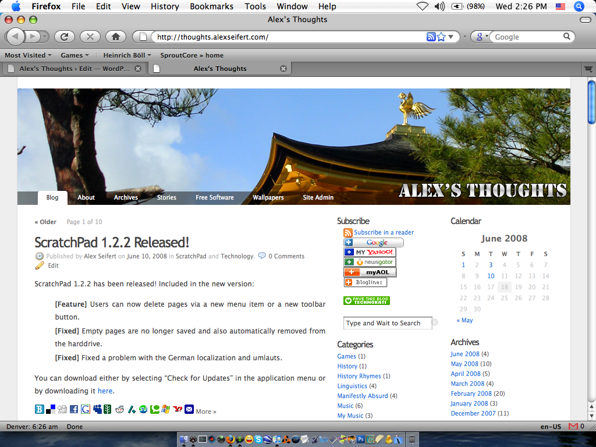

Today I downloaded Firefox 3 for the first time since the first beta. So far I am extremely impressed at its speed. It’s unimaginably faster at rendering images and pages and also at running JavaScript than its predecessor, Firefox 2; especially on my slow old PowerBook G4.

I had a brief stint where I used Safari again for a while because it was so much faster than Firefox 2, but that came to a quick end as Safari just doesn’t offer the features of Firefox. I would have to say that Firefox 3 is even faster than Safari which is quite impressive.

The new version also looks a lot better than the previous version, especially for Mac OS X. The new theme blends in more than the old one.

I recommend downloading it. You can find it for free for Windows, Linux or Mac OS X here: 