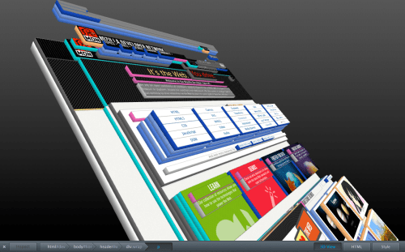

Mozilla has announced several new features for the new Firefox Beta which will eventually become Firefox 11. The first and, in my opinion, the most interesting one is a new approach to make distinguishing elements on a webpage easier using a 3D rendering of the page. They call it ‘Tilt’. It is based off of WebGL technology and renders the website in a three-dementional view with each element layered one on top of the other making it easy to determine parent and child elements in a page. An interesting approach to the traditional indentation which only allowed the developer to see the differences in the code rather than on the page itself. This is a preview of the feature:

A couple of other technical features are [SPDY support](https://hacks.mozilla.org/2012/02/spdy-brings-responsive-and-scalable-transport-to-firefox-11/) as well as a new styles editor which allows developers to edit a page’s CSS files with live updating then save the changes to disk. One of the features I personally am most excited about is a simple thing which is one of my favourite things about Chrome and which is lacking in all other browsers: add-on sync. Not only will we not be able to sync bookmarks and history with Mozilla’s sync service, but now add-ons as well. I am very much looking forward to that feature as it will make managing multiple installations of Firefox across different computers much easier to handle.

See [Mozilla’s blog post](https://blog.mozilla.com/futurereleases/2012/02/03/firefoxbeta11/) for more details about some of the upcoming new features in Firefox 11.