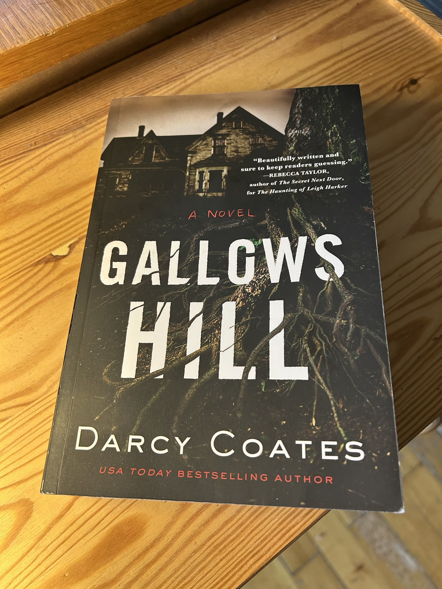

<figure><figcaption>Gallows Hill by Darcy Coates</figcaption></figure>

If there is one modern author of ghost stories I would never hesitate to recommend, it is [Darcy Coates](https://blog.alexseifert.com/story-authors/darcy-coates/). Over the past few years, I have read many of her books and have yet to be disappointed even once — *Gallows Hill* is no exception. It is a haunting tale of multi-generational injustice and intrafamilial strife told with a healthy dose of tension that keeps you turning the pages.

Here is the description of the book from [Goodreads](https://www.goodreads.com/book/show/59746719-gallows-hill):

> The Hull family has owned the Gallows Hill Winery for generations, living and working on the beautiful grounds where they grow their famous grapes. Until the night Mr. and Mrs. Hull settle down for the evening…and are dead by morning.
> 
> When their daughter, Margot, inherits the family business, she wants nothing to do with it. The winery is valued for its unparalleled produce, but it’s built on a field where hundreds of convicts were once hanged, and the locals whisper morbid rumors. They say the ground is cursed.
> 
> It’s been more than a decade since Margot last saw her childhood home. But now that she’s alone in the sprawling, dilapidated building, she begins to believe the curse is more than real―and that she may be the next victim of the house that never rests…
> 
> [Goodreads](https://www.goodreads.com/book/show/59746719-gallows-hill)

As usual, ***there are spoilers below***, so if you haven’t read it and would like to, stop here or continue at your own risk.

Most of my reviews start with what I liked about the book before diving into what I didn’t enjoy as much. For *Gallows Hill*, I’m going to reverse that order, however, because the list of things I didn’t like is short. In fact, there is nothing on it. I can’t think of a single thing I didn’t enjoy about the book, how it played out, how it was paced, how it was written or how it concluded. I quite literally liked everything about it.

Now that we have that out of the way, let’s get into the juicy bits. **This is where the spoilers begin**, so turn around if you don’t want to know what happens.

My favorite part of the book was the premise. The idea that an intergenerational conflict over a business and piece of property can have such dire, long-term consequences for a family and anyone that gets too close is fascinating. Of course, the idea of a curse placed on a person or family as revenge isn’t a new concept at all, but the reasoning behind it and the fact that it was entirely within the family’s control to end the curse at any time is what I find so unique. Of course, you don’t find that out until the end, though.

The premise is this: Gallows Hill estate is a vineyard that has been in Margot’s family for generations. It is internationally renowned for the quality of its wine which is expensive, exquisit and can only be produced in small batches making it extremely valuable. The wine has made the family very wealthy, but its secret is also the family’s undoing.

Margot inherits the estate after her estranged parents pass away, but without any information about it whatsoever. She also has no idea why her parents sent her away as a young child and never tried to get in contact with her again. She doesn’t know anything about the hauntings, the zombies, the curse, the history of the property or her family’s dark secret. When she steps onto the property for the first time, she doesn’t realize she has cursed herself to become trapped on it. Anyone who stays on the land too long becomes bound to it and can only leave for short bursts at a time before they start suffering from extreme, dishabilitating migraines.

Not only are they stuck, but they have to suffer from the dead rising. As the name implies, Gallows Hill was once the location of the town’s gallows before it was purchased by the family and repurposed into a vineyard. When the dead rise, they are out for one thing only: to harm the living. The dead include many of those who were executed on the property but even long-dead family members — even in death, the family is cursed to stay on the land and if their bodies are buried elsewhere as Margot’s parents’ bodies were, they rise and return to the estate.

This has been going on ever since the first generation of Margot’s branch of the family took control of the lucrative vineyard. And I say “took control” intentionally. The family member who originally purchased the land and founded the vineyard had a very jealous brother who ended up murdering him, his wife and his children to take control of the vineyard and wealth. These were subsequently passed down from generation to generation in a direct line all the way until Margot inherited them. The bodies of the murdered family were never found and ever since then, the curse has plagued anyone who stays on the land.

What strikes me about it is that the family just learned to cope with it. They went to lengths to make their house secure, including heathen rituals, lines that trigger alarms within the house when crossed, extra fencing, and other security measures to try to make their home safe from the dead. It feels almost nonchalant, although not for Margot, who has no idea what any of this is.

The long-time foreman of the vineyard who knew Margot’s parents and is also cursed to stay on the land, guides her through it all and what she must do to survive. Bit by bit, he divulges the family secret until she figures out what she must do to try to lift the curse. As it turns out, the missing bodies of the original founder and his family were hidden in the wine kegs which are responsible for producing such a unique and fine wine coveted the world over. Indeed, they were the very ingredient that made the wine so unique which is just as utterly disgusting as it is a fascinating concept for a horror story.

Margot breaks open these kegs with an axe, spilling all of the extremely valuable wine and exposing the corpses. She isn’t sure that it will work, but she feels compelled to try. Fortunately, between giving the bodies a proper burial and going public with the dark history of her family, it seems that the curse has disappeared. The book ends before we know for sure or find out what happens to her and Gallows Hill. However, we can infer that her family’s wealth and reputation are ruined, lawsuits threaten and the vineyard is most likely through. As far as the curse is concerned, we can only assume that the sacrifice will save the day.

The fact that her parents and all of the generations before knew about this and chose not to end the curse by giving the slaughtered family absolution is a wonderful commentary on the power of money and reputation over morals and suffering. They would rather be damned to stay on the property for eternity than give everything up for a wealthy life they can’t fully enjoy since they are trapped on the property.

By sending Margot away as a small child and cutting off contact with her entirely, her parents made an attempt to end the curse. They had hoped that she would be out of range of the curse’s influence and that she any descendants she might have would therefore be spared. Unfortunately, it seems they for got to inform their lawyer that they didn’t want her to inherit the property which is exactly what draws her back to it and into the clutches of the curse anyway.

*Gallows Hill* is certainly a memorable story that left a lasting impression on me and I wouldn’t hesitate to recommend it to anyone who is interested in horror. While it’s more of a zombie story (which I actually rarely read) than a ghost story, I still found that it sucked me in and didn’t let me go — in a way, also trapping me.