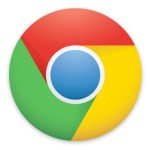

Google Chrome

Despite my [already mentioned disdain towards Chrome](https://blog.alexseifert.com/2012/02/02/why-i-dislike-google-chrome/), I decided to give it a real go and use it for my day-to-day activities which include web development. To really put it to the test with my usual work flow, I setup two different Google Accounts in order to be able to sync my work bookmarks, settings and extensions as well as my personal bookmarks, settings and extensions. Although Chrome is a robust browser and infinitely better than any version of Internet Explorer, there are a number of things which either disturbed me about it or I really enjoyed and, in fact, miss in other browsers. I will take you through what I found to be great about it and what I found to be detrimental to the browsing and web development experience.

For this experiment, I used two test machines: a late 2008 Apple MacBook (the unibody variety) as well as a mid-2012 Apple MacBook Pro. The former is my personal laptop and the latter is my work laptop. Both were running OS X Mountain Lion (10.8 at the beginning, then 10.8.1 after the update was released) and Chrome was always kept up-to-date through its automatic updating system on both machines. The experiment began with Chrome 20 and ended with Chrome 21. I will be making a lot of comparisons to Firefox and Safari on my Mac. No mention will be made of Internet Explorer for two reasons: the first is that I’m using a Mac and there is no Mac version of IE and the second reason is that IE is so far behind absolutely every other modern browser out there that it would be insulting to Chrome to draw any parallels or make any comparisons.

**General Browsing Experience**

One of Chrome’s strengths in my opinion is the general browsing experience. It is ridiculously fast at rendering websites and generally does a very good job with no more issues than any other browser. Chrome is based on the Webkit rendering engine and, while Safari is also based on this engine, Chrome is generally several subversions ahead of Safari because of its rapid release cycle. This means there are a lot of small improvements that make it into Chrome on a much more regular basis and they add up to give the browser a very worthwhile browsing experience. Google’s V8 JavaScript engine is also quite impressive, however, I have noticed that there occasions when its performance is not up to par with Firefox’s or Safari’s engines.

An interesting feature that I really enjoyed about Chrome was its new tab page. All major browsers have the so-called speed dial feature which displays thumbnails of the user’s most visited websites when opening a new tab, but it is the other items that appear on this page in Chrome that are most noteworthy. Unlike other browsers which only allow you to have a bookmarks toolbar all the time or none of the time, Chrome allows you to have it show all the time or simply when you open a new tab by placing at the very top of the new tab page. While this is a small feature in itself, I found that I actually really loved it. Since I have a small 13″ screen, the maximized real estate made the browsing experience far more pleasant while my bookmarks remained easily available whenever I opened a new tab. My other favorite feature was the list of recently opened tabs at the bottom of the page. I constantly used this feature. While Safari and Firefox have similar features, they are buried within the menu system and not as easily or conveniently retrieved.

**Security and Interface**

Security is arguably Chrome’s most touted feature. This is due to many factors, but the key ones are sandboxing and automatic updates. Each tab and each extension runs in its own process which means they are isolated from the rest of the browser. The update process is silent and takes place completely in the background which means users who are not inclined to install updates still receive them and are therefore always have the most up-to-date, secure version of Chrome.

Chrome’s minimalistic interface is also very easy to use, although some parts of it could be significantly improved. I am a person who heavily relies on a large number of bookmarks. This means I am constantly managing them and I need a good manager. Chrome’s bookmark manager is terrible. It often requires you to “reload” it just like any webpage in order for the changes to appear. While that might not seem like a big deal, it is for someone who uses the bookmark manager as an important tool for his workflow. Another important feature of the Chrome’s interface is its tabs. I use a huge number of tabs at once and this is another problem Chrome suffers from. Google has, for some reason or another, completely ignored the issue of too many tabs for the window size. When you have a small screen, as I do, and use a very large number of tabs, they become too small to be identifiable anymore and then eventually simply run out of the window without any way to click on them! How Google could have simply ignored this issue when it is addressed in every other browser is beyond me. The last problem I have with the interface is the downloads bar that pops up at the bottom of the window when downloading. I really dislike this solution for handling downloads. Other than the bookmark manager, tab problem and downloads bar, the interface is straight forward, clean and easy to use.

**Extensions and Synchronization**

Like Firefox, Chrome has a plethora of extensions available to expand its capabilities. I installed several of them for web development purposes as well as out of general curiosity. Generally they were well implemented, but I always had the feeling that they were not as capable at truly expanding the ability of the browser as Firefox’s extensions are. That is quite possibly due to difference between Chrome having a native UI and Firefox having a custom UI built with JavaScript. Chrome’s extension library is certainly far more complete than Safari’s which is terribly limited in scope and the extensions are even more limited in terms of what they can do than Chrome’s are.

Another one of Chrome’s strengths is its ability to sync multiple accounts at once. For people who rely heavily on cloud-based synchronization between computers, Chrome is one of the better packages out there. Not only can you use multiple accounts at once which sync separate bookmarks, tabs, settings, extensions, etc, but the synchronization itself works really wonderfully and reliably. Firefox has a long ways to go to catch up in terms of reliability and Safari’s synchronization ability is limited to bookmarks and tabs through iCloud. Neither come close to the experience of Chrome.

**Web Development Tools**

Chrome ships with Webkit’s standard web development tools. These, however, are enhanced with a few additions that Google has created such as the ability to simulate different resolutions, simulate a touch screen interface as well as change the user agent. Safari 5 and below also included the standard webkit development tools, but beginning with Safari 6, Apple ditched them in favor of web development tools which more closely resemble their other development environments, most notably in Xcode.

Chrome’s development tools are certainly very robust and have some advantages (such as the ability to detach the tools from multiple websites at once), but overall, I found I really prefer the tools available through Firefox. Firefox’s built-in web development tools are maturing rapidly and the Firebug extension is still number one in the field in my opinion. Safari’s new tools are frustrating, although to be fair, I haven’t given them much of a real try yet.

**Conclusion**

A significant part of Chrome that I do not like is the issue of privacy. It is the only major browser which does not have a “Do Not Track Feature”. Google will also, by default, log most of the what you type into Chrome’s Omnibox (their moniker for their address bar) regardless of whether you are just searching or typing in a URL. I know a lot of Chrome fanatics say you can turn these “features” off in the preferences and, while you most certainly can, I still do not trust a browser that has them to begin with. It is just difficult to place my entire web experience in the hands of a browser created by a company whose primary source of income is through a medium I abhor: advertising. Call it a moral issue, but that is one of the primary reasons I still do not want to use it as my primary browser.

I also had a problem with its memory consumption. It consumes an enormous amount of memory when left open for days at a time. Firefox has been bashed for this in the past, but Mozilla has made significant progress in this and is, as far as I’ve been able to tell, the best at memory management. Safari’s memory usage is also terrible, but I rarely leave it open for longer than a few hours at a time.

In the end, I went back to my old setup using Safari for everyday browsing and Firefox for development work. Chrome is certainly a capable browser, but some of the interface issues were just too frustrating to deal with on a daily basis. For the normal user who will probably not notice these problems and have no qualms with (or are ignorant of) the privacy issues, however, Chrome is indeed a very good solution.