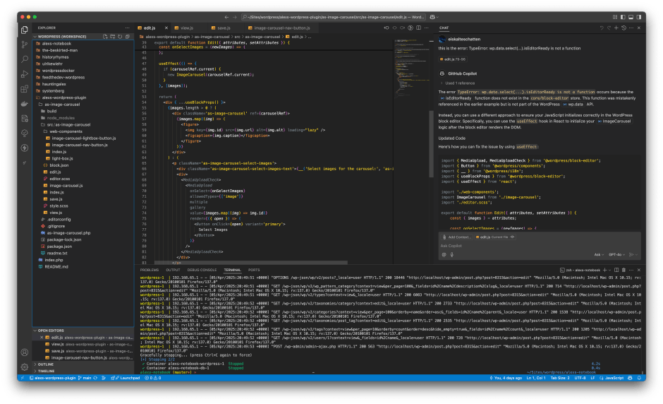
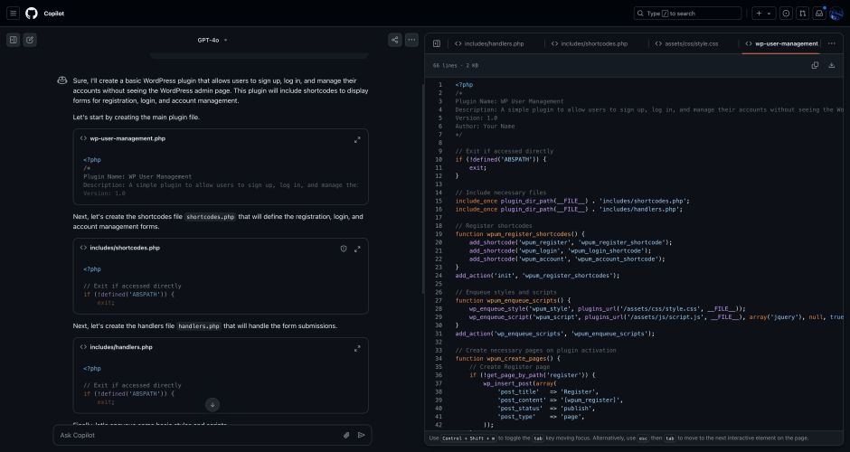

<figure><figcaption>GitHub Copilot</figcaption></figure>

A.I. is quite a controversial topic amongst developers, but do those who use it actually see an increase in productivity while working? In this post, I’m going to talk about my own experience with using A.I. as an aid to development. I’ll specifically be focused on [GitHub Copilot](https://github.com/features/copilot) since that is what I’ve used the most.

*Note: I’m not sponsored by GitHub or anyone else. What follows is my genuine experience and opinion.*

While some developers despise it, there are plenty of others who have embraced it with open arms — and that includes both seasoned as well as new developers. I have to admit that I had misgivings about it at the beginning. I was skeptical that it could be used in any meaningful way and I have to admit, I was a bit afraid that if it *was* useful, it would mean I’d be out of work at some point.

Those fears have since subsided and can be chalked up to not having had the mental capacity to engage with it properly at the time. In fact, now I use it almost daily and have even subscribed to GitHub Copilot Pro.

What I Use It For
-----------------

Before we can talk about productivity, it’s important to put its usage into context. The code and suggestions produced by A.I. are by no means complete and frequently don’t even work properly, if at all. So, you might be wondering why bother using it?

Well, I’ve discovered several usages for it that speed up my workflow despite its shortcomings. One such usage is for writing unit tests. I loathe writing unit tests, so I have Copilot do it for me. They usually aren’t complete and frequently don’t fully work, but using Copilot saves me a ton of time by providing the bulk of the tests that I then just have to go through and clean up. It also does a good job in covering branches (such as if-else statements) which are often tedious to get right.

Otherwise, since I frequently work with APIs and TypeScript, I often need TypeScript interfaces based on the structure of the data returned from the APIs. Copilot does a fantastic job with generating them directly from the data, which saves me a lot of time and the tedium of having to determine each property and its type and then write it all out in an interface.

I’ve also found it’s much more useful to have as an assistant when learning new programming languages, libraries or frameworks than standard documentation. Not only does it help you solve problems that arise which might otherwise take ages to grind through, but it explains the reasoning behind it. Some developers at this point might argue that reading through the documentation leads to a better understanding, but I disagree. The documentation is limited whereas Copilot does not have the same kind of restrictions. It’s been trained not only on the documentation, but also on actual implementations of the technology. I’ve been able to learn more with Copilot’s help than through standard, static documentation.

<figure><figcaption>GitHub Copilot helping debug an error while using a new-to-me API</figcaption></figure>

Of course, Copilot and A.I. in general are not perfect and will often provide you with answers that aren’t entirely correct, but I still find even the wrong answers helpful most of the time because they at least tend to point me in the right direction. That is especially true when trying to debug nasty bugs or syntax errors.

Another way A.I. saves me time is when used as a reference tool for the command line. If I can’t remember what a specific command is or what exactly the syntax is for piping to `sed`, then a quick question to Copilot will help with that. The same goes for regex which is infamously fickle.

Essentially, I’ve found Copilot to be most useful either when the work is tedious or when I’m stuck with a problem that is taking a long time to get through. Despite that, I do have to admit that sometimes it frustrates more than it helps with the latter. I usually notice that fairly quickly, though, and go back to doing it the old-fashioned way.

How I Use It
------------

There are multiple ways to use GitHub Copilot, but I’ve found the two most useful ways for me are through direct editor integration and [github.com](https://github.com/copilot). I use Visual Studio Code which, unsurprisingly, has a robust add-on for Copilot, but there are plugins available for [several different editors and IDEs](https://docs.github.com/en/copilot/managing-copilot/configure-personal-settings/configuring-github-copilot-in-your-environment) including those from JetBrains.

### In My Editor

The Visual Studio Code add-on provides me with two different features that I find very helpful. First of all, it integrates a chat panel so that I can ask questions directly. When doing so, it optionally includes whatever your currently open file is for context which is immensely helpful when trying to find a bug. You can even include multiple files such as TypeScript interface files that will help it give you more accurate advice.

The second feature is context-specific code autocompletion. An example of where that saves me a ton of time typing would be when I have an array with several objects that I need to iterate through and transform. If I start typing the loop code, it will not only auto-complete the loop code, but even more usefully, will auto-complete the entire transformation code if I’ve already defined a target variable with an expected interface. This is particularly useful when dealing with JavaScript’s `reduce()` function for arrays which can be tedious to use.

### On GitHub.com

When I’m not working on a specific project or I need more input than can be comfortably shown in the built-in chat in Visual Studio Code, I turn to the chat on [github.com](https://github.com/copilot). As you can see from the screenshot below, it has a great two-column view with any source files it generates displayed on the right side in tabs. In the example below, I asked Copilot to create an example plugin for WordPress that would allow users to register, log in and manage their account information without using the default WordPress backend interface.

<figure><figcaption>Talking to GitHub Copilot about creating a user management plugin for WordPress</figcaption></figure>

This is a great example of what I use the chat on [github.com](https://github.com/copilot) for: thought experiments and project ideas. I’ve found it’s a great way to get a project off to a good, solid start. It isn’t only the generated code most of the time that helps, but also the ideas it has. For example, it can recommend technologies that I wouldn’t have known about otherwise or even considered using for a project but ultimately, make for a much snugger fit than what I would have originally chosen. And that, of course, brings us right back around to using Copilot in my editor to help me learn the new technology.

Conclusion
----------

As you have probably gathered by now, I’ve gone from skeptic to a pretty big fan of using A.I. to aid development. The key for me was finding the sweet spots as to where to apply it. Using it too much actually *prevents* me from being productive but if I sprinkle it in here and there to accelerate boilerplating, finding syntax errors or other tedious tasks, then it has a very positive impact that can speed up development and make my life as a developer all the more comfortable.

If you haven’t tried it out yet, I can recommend you do so. I pay for the Pro version that’s currently $10 a month, but there is also a free tier. Of course, GitHub Copilot isn’t the only tool available but it’s the one that I’ve found works best for my workflow.

*What do you think about using A.I. to help with development? Have you used it before? What are your experiences with it? Let me know in the comments!*