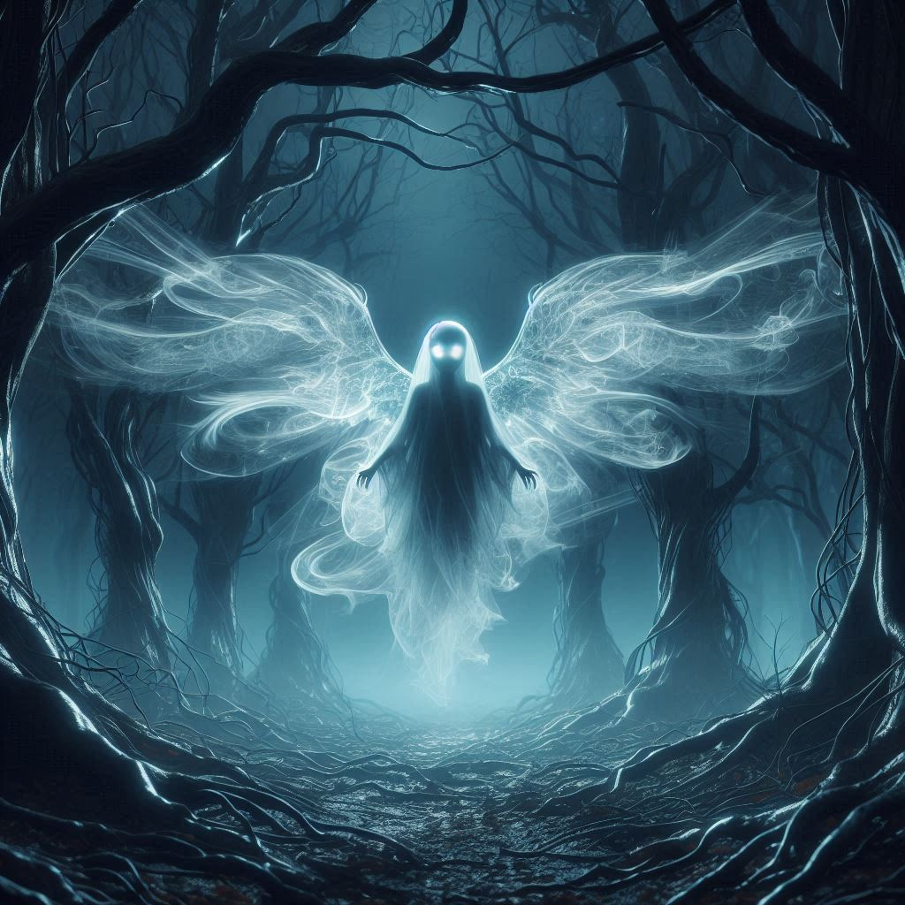

<figure><figcaption>AI-generated image of a haunted soul</figcaption></figure>

I’m excited to announce my newest blog project called [Haunting Alex](https://haunting.alexseifert.com/)! I intend to use this blog to write about my fascination with horror fiction as well as create a sort of archive of my favorite horror stories that are in the public domain.

> Ever since I was a young child, I’ve been fascinated with tales of ghosts, vampires and all sorts of other horror subgenres. In fact, it’s rare that I read any fiction that isn’t a horror story of one kind or another which is why I’ve decided to start this blog.
> 
> This is where I am planning on sharing my thoughts on what I read and what I think stands out about outstanding stories.
> 
> Most of the horror I read involves ghosts and vampires with many of those stories dating back to the nineteenth century when ghost stories were particularly popular and vampire fiction was just starting to gain traction. As such, I also intend to create an archive of some of my favorite short horror stories that are in the public domain.
> 
> [Alex Seifert](https://haunting.alexseifert.com/2024/08/27/starting-haunting-alex/)

If you’re interested in this sort of thing, head on over and [take a look at the blog](https://haunting.alexseifert.com/). It doesn’t have much content yet, but more will be coming soon and regularly!