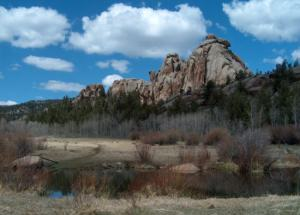

Vedauwoo, Wyoming

It looks like I am going to be going hiking on Sunday provided the weather is nice. I am going to go with Lizz, the same girl [I went out with on Saturday night](http://manifestlyabsurd.wordpress.com/2009/03/01/last-night/). We’re going to go to a place fairly close to Laramie called Vedauwoo which is directly east of Laramie on I-80. I have driven past the area several times on my way between Colorado and Laramie and it looks gorgeous. I know a lot of people go there for rock climbing because of the giant rock formations in the area, but I have never actually been there myself. Hopefully it will be as beautiful as I think it will be. There are a lot of small lakes in the area there as well apparently (I looked on a map provided by the Vedauwoo website). The hiking trails tend to go around the lakes which should be quite nice I think.

I think the nice weather we’ve been having for the past several days has made me anxious to go outside and do something in the mountains, so this is a good way to relieve that. I asked Lizz if she wanted to come along as well because I think it would be fun to have her come with me. She was excited about the idea because she said the weather has made her want to go outside and do something as well, so we’re going to go together. It should be a lot of fun I think. I’m really excited about it. The forecast says the weather will be nice, hopefully it will actually be that way.