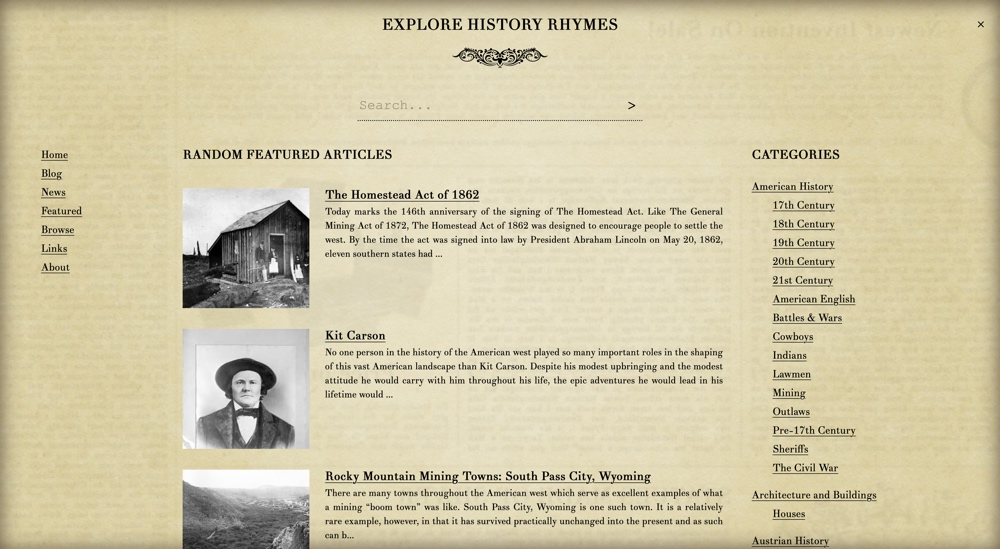
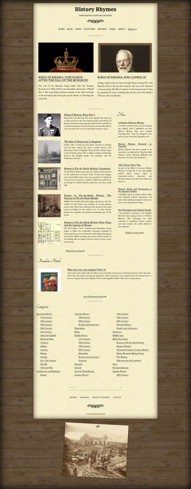

<figure><figcaption>History Rhymes Explore Menu 2020</figcaption></figure>

The latest of my websites to get an update is my history blog, [History Rhymes](https://www.historyrhymes.info). Like the other blogs I run, the website is based on WordPress with a custom theme. The previous theme was two years old, meaning it no longer supported a lot of new WordPress features and the new CSS classes that were introduced with the Gutenberg editor were also not supported.

The design hardly changed at all, but I did clean things up, make the text more legible, made several optimizations for mobile and generally just made it feel and look a bit more modern.

The one new major featured I added, however, is what I’ve called the “Explore” menu. It is a full-page popup that includes the main menu, a search box, a random list of featured articles as well as the blog’s categories. It also serves a dual purpose as on mobile, it is now also the main menu. The goal is to make it easier for visitors to find interesting content since the blog’s catalog of articles is quite large.

Other than the new design, there are also new articles in the works for the blog. I’ve had several ideas and have even managed to recruit some interesting writers to contribute new and exciting content.

<figure><figcaption>History Rhymes 2020</figcaption></figure>

You can visit History Rhymes here: [https://www.historyrhymes.info](https://www.historyrhymes.info).

Feedback and any other commentary is always welcome. You can either post it here in this post or by contacting me either through History Rhymes or on my [contact page](https://www.alexseifert.com/contact).