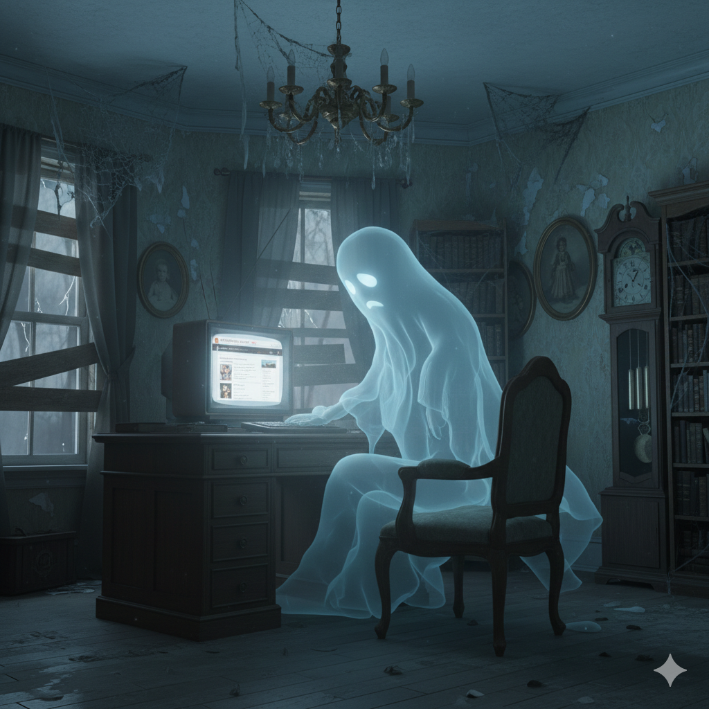

<figure><figcaption>AI-generated image of a ghost reading a website</figcaption></figure>

Here are a couple of interesting links for horror resources:

Story Archives
--------------

-   [The Project Gutenberg](https://www.gutenberg.org/)

Blogs and Personal Websites
---------------------------

-   [Steve Calvert – A Passion for Horror](https://www.steve-calvert.co.uk/)
-   [Moon Mausoleum](https://moonmausoleum.com/)