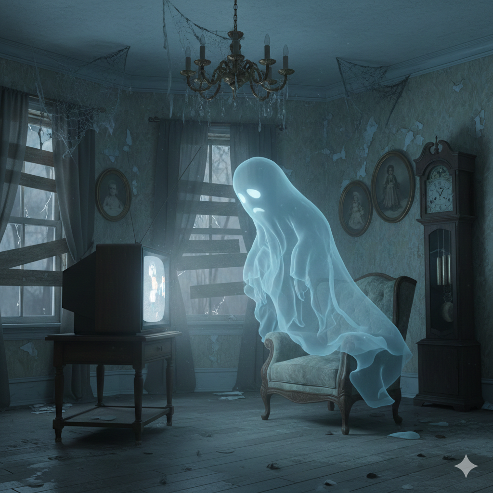

<figure><figcaption>AI-generated image of a ghost watching TV in a haunted house</figcaption></figure>

This is a collection of my favorite YouTube channels about horror and ghost hunting. Interestingly enough, like a lot of my favorite stories, most of them are from the United Kingdom.

Click on the links below to check out the channels.

-   [Ghost Theory](https://www.youtube.com/@GhostTheory)
-   [Adam Mark Explores](https://www.youtube.com/@AdamMark)
-   [Dead City Paranormal](https://www.youtube.com/@DeadCityParanormal)
-   [Bad Cat Paranormal](https://www.youtube.com/@BadCatParanormal)
-   [ParaFear](https://www.youtube.com/@ParaFear24)
-   [Moxleys Paranormal World](https://www.youtube.com/@MoxleysParanormalWorld)
-   [Staffordshire Paranormal Explorers](https://www.youtube.com/@staffordshireparanormal)