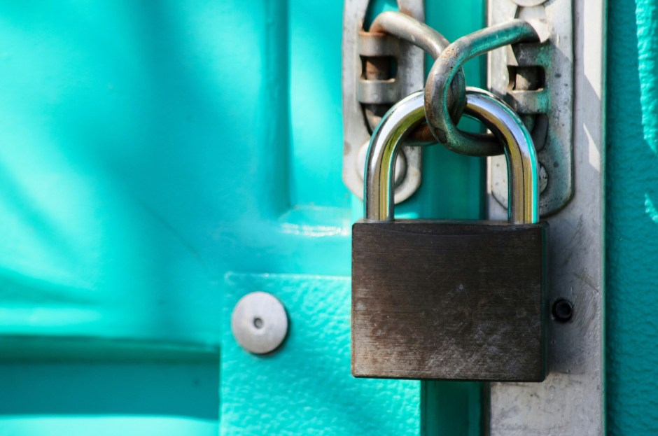

<figure></figure>

[As I recently mentioned](https://blog.alexseifert.com/2015/02/27/another-new-design/) when introducing the new design for my portfolio, it and several other websites of mine now use a secure connection by default. Not only does [my portfolio](https://www.alexseifert.com) take advantage of the increase in security by using HTTPS, but also [History Rhymes](https://www.historyrhymes.info) as well as this blog. For some people it may seem overkill to bother with going through the process of getting a valid certificate, installing it on the server, setting up all of the rewrites from HTTP to HTTPS, making sure all of the content on every webpage is loaded via HTTPS so as to avoid any non-secure content being loaded, etc, but I think it is well worth the trouble and this is why.

**Benefits of HTTPS**

I am an advocate of privacy. I believe we have a right to be protected from snooping eyes and to browse the internet without anyone knowing exactly where we are going or what we are viewing. This is a practice called “sniffing”. While you still may wonder why a secure connection to a simple website such as an online portfolio is necessary, I say it is because every website should be secure by default. A non-secure website transmits its data out in the open and is susceptible to man-in-the-middle attacks and prying eyes who want to track your every move throughout the internet, but a secure website sends its data encrypted making it much more difficult to intercept and “sniff”.

Of course that isn’t the only benefit. In an effort to encourage web developers to adopt HTTPS by default, Google [has announced](http://googlewebmastercentral.blogspot.de/2014/08/https-as-ranking-signal.html) that websites which are encrypted by default will also secure a slightly better ranking in its algorithm for determining a website’s place in search results. Now that I’ve explained why, I’ll explain a bit of how.

**One Way to Implement HTTPS**

This is not going to be a step-by-step guide for setting up HTTPS as every web server is differently configured and every operating system has a different way of getting HTTPS running which makes a step-by-step guide very time-consuming to write. Instead, the aim is to guide the reader in the right direction by offering advice and a few practical tips that can be used for a personal website.

The most prohibitive part of setting up a secure website for most people is the cost of a certificate. In order to have a valid secure connection, you must have a certificate which is installed on the server and registered with one of many different companies that verify its authenticity. Most companies charge quite a lot of money for the service since HTTPS was originally thought only to be useful for online shops or other businesses that could afford to pay a higher price. There is, however, an organization called [StartSSL](https://www.startssl.com) which offers a one-year certificate for any website for free. This is the organization I use and have had absolutely no issues with them. You just have to sign up for an account, verify that you own the website via email, then follow the steps to receive your certificate.

Naturally the process doesn’t end there though. The next step is to install and properly configure it on your web server. As I’ve already mentioned, this process is going to be different for every operating system and server configuration. StartSSL offers step-by-step instructions on how to install it on the most popular web servers and I found them to be quite helpful when installing the certificates on my own server. Otherwise, a quick web search will give you results for many different step-by-step instructions.

Once the certificate is installed on the server, the next step is to modify your website(s) to only use content loaded via HTTPS. This means all images, stylesheets, JavaScript files, etc must be loaded via HTTPS even if they are coming from another website. Sometimes this aspect can be seen as a hurdle, but it is not unsurmountable. Content from most major tech companies such as Google (Youtube), Microsoft, Apple, etc is almost always available via HTTP and HTTPS and while other, smaller websites might not offer a HTTPS connection, images and other files can often just simply be downloaded and uploaded to your own web server and loaded through your own secure connection.

**Conclusion**

Secure websites are unfortunately still relatively time-consuming to setup, but they are extremely important in my opinion. The enhanced security and privacy that your users will enjoy when visiting your website makes the investment in time and effort well worth it. Not only that, but as a web developer or as someone who works with computers (particularly with servers), it shows a certain level of competence that you have not only bothered to go through the pains of setting up your website with HTTPS, but also that you were able to in the first place.