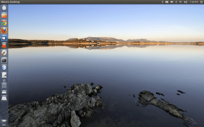
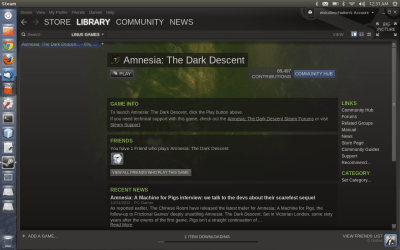

Ubuntu 12.10 on my MacBook

This past weekend I undertook the effort to install Ubuntu 12.10 on my MacBook as a second operating system. It was quite an interesting process and I have to admit, it went much more smoothly than I expected. My MacBook is an old unibody Macbook5,1 (not a MacBook Pro) from late 2008 – the first with the unibody construction before they became the MacBook Pros. I installed Ubuntu alongside of OS X 10.8 and was quite surprised to find out that it works almost faster than OS X does. The installation process was pretty straight forward, but I had a bit of trouble with getting my wireless card to work as well as the graphics drivers from NVIDIA working properly. In the end though I managed and it even took a lot less time than I had expected when I set about to do it.

**How I did it**

This is the part that everyone will probably just skip to (thus warranting its own subheader), so I will begin, keeping it as simple and to-the-point as possible.

Before actually starting, the first thing I did was browse around the internet to see what information I could find about installing Ubuntu on a MacBook from people who had already successfully done it. It was somewhat difficult to find information pertaining to installing Ubuntu 12.10 on the exact model of MacBook I own since it is a bit older, but in the end, I made do with a couple of sites. [The first one](https://ubuntuxtreme.com/howto/how-to-install-ubuntu-12-10-in-macbook-air-2011-mid/) gave step-by-step instructions on how to install Ubuntu 12.10 on a MacBook Air from mid-2011. I used those instructions in combination with information found on Ubuntu’s website about installing an older version of Ubuntu on [the exact model of MacBook I have](https://help.ubuntu.com/community/MacBook5-1/Maverick). Between the two, I was able to install the latest version of Ubuntu on my older MacBook.

What I did was the following. First, I installed [rEFIT](https://refit.sourceforge.net). At first I had a problem getting my MacBook to boot to their interface, but I quickly realized it was because my hard drive was encrypted. So, I let my MacBook sit over night while it decrypted the hard drive. Then I had to uninstall rEFIT entirely and reinstall it. After that it worked perfectly.

The next step was then to create a bootable USB drive with Ubuntu on it. Again, I followed the instructions on [the first site](https://ubuntuxtreme.com/howto/how-to-install-ubuntu-12-10-in-macbook-air-2011-mid/) after downloaded the 64-bit iso from [Ubuntu’s website](https://www.ubuntu.com/download/desktop). I then partitioned my Mac’s hard drive using the built-in Disk Utility app that comes standard with OS X. I gave Ubuntu a 100 GB partition to ensure plenty of space (I have a 1 TB drive). Before I did this, however, **I made sure to backup all of my files** using TimeMachine. While Disk Utility does not need to completely format the drive to create/edit partitions, it is always a good practice to backup your files just in case something goes wrong in the process.

After this, I restarted my Mac with the bootable USB drive plugged in. I held the Option key until I was given a choice to boot from the USB drive. The normal Ubuntu installation process then started and was smart enough to recognize that OS X was already installed. It gave me the option to install Ubuntu alongside of OS X. After choosing this option, all I had to do was choose the new partition I created with Disk Utility and it installed without a single problem.

Right out of the box, Ubuntu worked surprisingly well on my MacBook. The biggest problem I had was that my wireless internet did not work. After a bit of searching, I found the solution on [the second site](https://help.ubuntu.com/community/MacBook5-1/Maverick). Essentially, I had to install the proprietary Broadcom STA drivers, then go into System Settings and tell Ubuntu to use them rather than the default drivers.

I had to repeat the same process for the graphics drivers. At first I chose the wrong drivers which, after a reboot, led me straight to the terminal rather than the Unity interface. From the terminal, I had to uninstall the incorrect drivers, then install the correct drivers using apt-get. After doing that, Ubuntu booted right back up into Unity. While the graphics worked with the default drivers, it was not a smooth as it could have been. After installed the drivers from NVIDIA though, there was a noticeable difference in performance. Unity’s animations were much more smooth and the system’s performance significantly increased.

Other than that, there really wasn’t much I had to do to get Ubuntu running smoothly. The only other thing I did was change a couple of the system settings to be a bit more Mac-like (for example, I changed the trackpad to use two-finger scrolling rather than using the side for scrolling) as well as customize the desktop environment a little bit.

Now that I’ve explained how I did it, I should explain *why* I did it. The answer to this is pretty straightforward: because I wanted to. I really had no practical reason for doing it and while most people may think it’s a waste of time, I rather enjoyed doing it and am very satisfied that I was able to get it to fully run and take advantage of all of the MacBook’s hardware.

**The results**

Since installing it, however, I have run into some practical reasons for having it installed. The first of which is that I was absolutely amazed at how much faster my old MacBook runs with Ubuntu. OS X 10.8 is optimized for faster hardware and is more demanding, but Ubuntu breathes new life into the older hardware. The machine has a 2.4 GHz Intel Duo Core 2 with 8 GB RAM, a 1 TB drive, and a NVIDIA GeForce 9400M with 256 MB dedicated VRAM. By today’s standards that is a slow machine and OS X 10.8 just does not run as smoothly on it as Ubuntu seems to. While I don’t want to replace OS X – after all, that is one of the reasons you buy a Mac, I do think I will be using Ubuntu for some of the more demanding tasks I use my computer for.

And yes, before anyone asks, since I installed Ubuntu, I had to download the Steam Beta:

Steam on Ubuntu

Unfortunately, of all the games I’ve purchased, only *Amnesia: The Dark Descent* was available for Linux. I do hope more come in the future! I would love to be able to play *Civilization V* on Ubuntu. Also, I should note that installing Steam and trying to run *Amnesia* somehow broke Ubuntu. It now only boots into the terminal (again) which is the same problem I ran into before while trying to install my graphics drivers (see above). Time to go do a bit of digging to figure out what exactly is wrong!

**Update:** Last night I managed to fix the problem created by installing Steam. I booted into the terminal, ran an apt-get update/upgrade, then removed the NVIDIA drivers and reinstalled them. That worked perfectly and now I can play my one Linux-compatible Steam game without a problem.