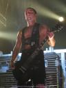

As a lot of you already know, Rammstein’s live DVD, Völkerball, has been released in the US. Following the release, Rammstein guitarist, Paul Landers, did 2 interviews. One by [The Gauntlet](http://www.thegauntlet.com/interviews/307/Rammstein.html) and the other by [Vampirefreaks](http://vampirefreaks.com/content/comment.php?entry=164&t=Rammstein).

In the interviews, Paul talks a little bit about Rammstein’s history and a lot about their future. According to the interviews, Rammstein is back in the studio working hard on their 6th album. They already have some 30 songs written. Paul also talks about Emigrate, the side project of Rammstein’s other guitarst, Richard.

You can find the interviews here:

[The Gauntlet](http://www.thegauntlet.com/interviews/307/Rammstein.html)  
[Vampirefreaks](http://vampirefreaks.com/content/comment.php?entry=164&t=Rammstein)

— Alex