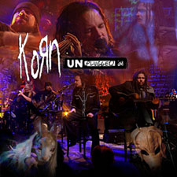

I know I’m a couple of days late on this, but Korn released their “MTV: Unplugged” album on March 7. You can either get it from

[iTunes](http://click.linksynergy.com/fs-bin/stat?id=oiyVbGokg9Q&offerid=78941&type=3&subid=0&tmpid=1826&RD_PARM1=http%253A%252F%252Fphobos.apple.com%252FWebObjects%252FMZStore.woa%252Fwa%252FviewAlbum%253Fi%253D215945677%2526id%253D215945634%2526s%253D143441%2526partnerId%253D30)  
or  
[Amazon.com](http://www.amazon.com/gp/product/B000MGUZRA/102-9090504-4077735?ie=UTF8&tag=eisbrecher-20&linkCode=xm2&camp=1789&creativeASIN=B000MGUZRA)

or if you would prefer another retailer, you can find a list of different retailers where the CD is available here: [http://www.korn.com/audio.aspx](http://www.korn.com/audio.aspx)

[](http://click.linksynergy.com/fs-bin/stat?id=oiyVbGokg9Q&offerid=78941&type=3&subid=0&tmpid=1826&RD_PARM1=http%253A%252F%252Fphobos.apple.com%252FWebObjects%252FMZStore.woa%252Fwa%252FviewAlbum%253Fi%253D215945677%2526id%253D215945634%2526s%253D143441%2526partnerId%253D30)