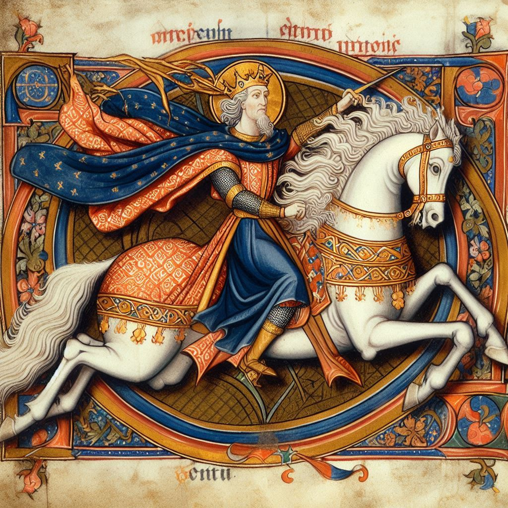

<figure><figcaption>AI-generated image of King Arthur riding a horse above a medieval manuscript</figcaption></figure>

It’s incredible how technology can help us rediscover documents we thought were lost to time. This time, researchers found a lost manuscript about the tales of King Arthur and were able to fully restore a digital version without harming the original. That is especially impressive given that the manuscript had been re-worked into the cover of a book which required the researchers to find a way to scan the text trapped in the book binding.

The [BBC](https://www.bbc.com/future/article/20250324-the-magical-medieval-tale-revealed-by-a-100000-dollar-camera) reports on it:

> An intriguing sequel to the tale of Merlin has sat unseen within the bindings of an Elizabethan deeds register for nearly 400 years. Researchers have finally been able to reveal it with cutting-edge techniques.
> 
> It is the only surviving fragment of a lost medieval manuscript telling the tale of Merlin and the early heroic years of King Arthur’s court.
> 
> \[…\]
> 
> For over 400 years, this fragile remnant of a celebrated medieval story lay undisturbed and unnoticed, repurposed as a book cover by Elizabethans to help protect an archival register of property deeds.
> 
> Now, the 700-year-old fragment of Suite Vulgate du Merlin – an Old French manuscript so rare there are less than 40 surviving copies in the world – has been discovered by an archivist in [Cambridge University Library](https://www.lib.cam.ac.uk/), folded and stitched into the binding of the 16th-Century register.
> 
> Using groundbreaking new technology, researchers at the library were able to digitally capture the most inaccessible parts of the fragile parchment without unfolding or unstitching it. This preserved the manuscript in situ and avoided irreparable damage – while simultaneously allowing the heavily faded fragment to be virtually unfolded, digitally enhanced and read for the first time in centuries.
> 
> [BBC](https://www.bbc.com/future/article/20250324-the-magical-medieval-tale-revealed-by-a-100000-dollar-camera)

And in case you were wondering what the sequel is about, there is a summary of it from the same article:

> In it, the magician becomes a blind harpist who later vanishes into thin air. He will then reappear as a balding child who issues edicts to King Arthur wearing no underwear.
> 
> The shape-shifting Merlin – whose powers apparently stem from being the son of a woman impregnated by the devil – asks to bear Arthur’s standard (a flag bearing his coat of arms) on the battlefield. The king agrees – a good decision it turns out – for Merlin is destined to turn up with a handy secret weapon: a magic, fire-breathing dragon. 
> 
> [BBC](https://www.bbc.com/future/article/20250324-the-magical-medieval-tale-revealed-by-a-100000-dollar-camera)