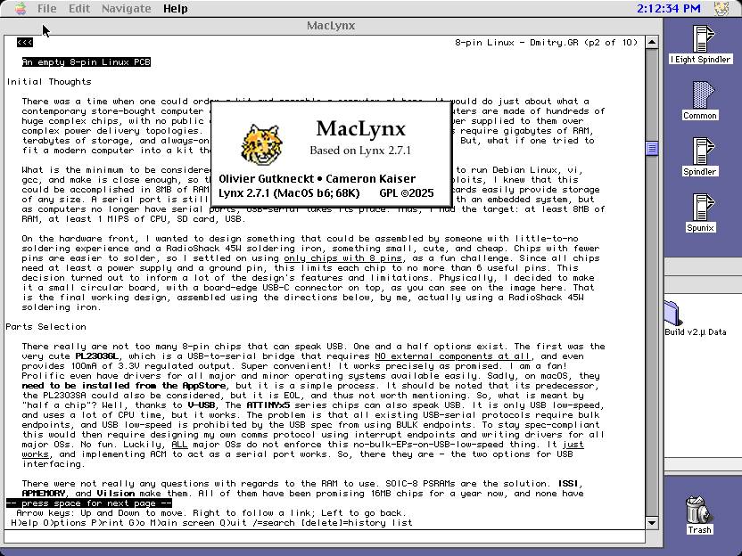

<figure><figcaption>MacLynx</figcaption></figure>

Every once in a while, you run into a project that makes you scratch your head. You have to wonder why someone would work on it, and yet at the same time you have to admire the fact that they *are* working on it and are so passionate about it. That’s how I feel about the project MacLynx.

A new post that recently appeared on the blog [Old Vintage Computing Research](https://oldvcr.blogspot.com/2025/04/maclynx-beta-6-back-to-power-mac.html) discusses this odd, text-based browser project for the classic Mac OS that is still seeing active development. He even calls it a “remarkably narrow niche” which is probably an understatement.

In any case, I love that people are working on things that they feel passionate about no matter how “niche.” Here is an excerpt from the blog post announcing the release of beta 6:

> Time for another MacLynx save point in its slow, measured evolution to become your best choice within the remarkably narrow niche of “classic MacOS text browsers.” Refer to prior articles for more of the history, but MacLynx is a throwback port of the venerable Lynx 2.7.1 to the classic Mac OS last updated in 1997 which I picked up again in 2020. Rather than try to replicate its patches against a more current Lynx which may not even build, I’ve been improving its interface and Mac integration along with the browser core, incorporating later code and patching the old stuff.
> 
> The biggest change in beta 6 is bringing it back to the Power Macintosh with a native PowerPC build, shown here running on my 1.8GHz Power Mac G4 MDD. This is built with a much later version of CodeWarrior (Pro 7.1), the same release used for Classilla and generating better optimized code than the older fat binary, and was an opportunity to simultaneously wring out various incompatibilities. Before the 68000 users howl, the 68K build is still supported!
> 
> However, beta 6 is *not* a fat binary — the two builds are intentionally separate. One reason is so I can use a later CodeWarrior for better code that didn’t have to support 68K, but the main one is to consider different code on Power Macs which may be expensive or infeasible on 68K Macs. The primary use case for this — which may occur as soon as the next beta — is adding a built-in vendored copy of Crypto Ancienne for onboard TLS without a proxy. On all but upper-tier 68040s, setting up the TLS connection takes longer than many servers will wait, but even the lowliest Performa 6100 with a barrel-bottom 60MHz 601 can do so reasonably quickly.
> 
> [Old Vintage Computing Research](https://oldvcr.blogspot.com/2025/04/maclynx-beta-6-back-to-power-mac.html)

The rest of the [blog post](https://oldvcr.blogspot.com/2025/04/maclynx-beta-6-back-to-power-mac.html) goes into much more detail than just the first couple of paragraphs I quoted here. There are also screenshots he posted of the browser and its development, one of which I, um, borrowed above. I can recommend taking a look at it for anyone interested in odd but nonetheless interesting projects.