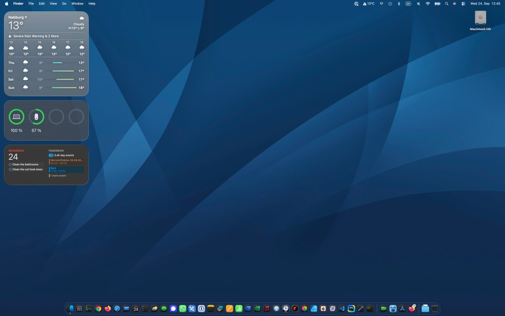
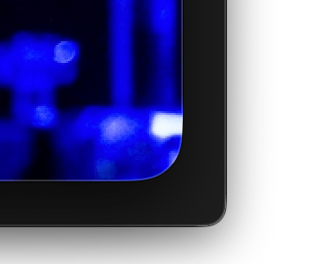
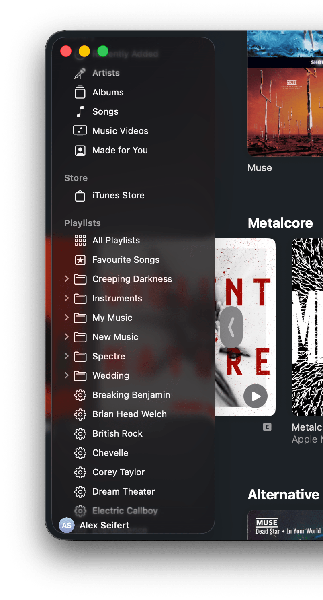
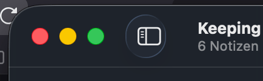
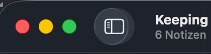

<figure><figcaption>macOS 26 Tahoe running on my 2019 16″ MacBook Pro</figcaption></figure>

When Apple’s newest lineup of operating systems was released to the public in September I didn’t hesitate to install it on all of my Apple devices like I do every year. These devices include an iPhone 14, an iPad Air M2, my personal 16″ 2019 Intel MacBook Pro and a 16″ M2 Pro MacBook Pro I have from my employer.

I have been a Mac user since Mac OS 9 was new and have used every single version of Mac OS since. My first iPhone was an iPhone 4 and my first iPad was the first generation Mini. In essence, I have spent a tremendous amount of my life using Apple’s operating systems. I have been through plenty of technology updates, platform changes and interface redesigns, some of which I have been excited about while others have been less than stellar.

My most hated change in interface was the jump from the lively skeuomorphic design language of iOS 6 to the drab, flat, personality-less design of iOS 7. It felt a little bit like knocking down a grand palace full of baroque frescoes and replacing it with a brutalist Eastern Bloc concrete monolith. My dislike for iOS 7’s new design has a new rival though: Apple’s new “Liquid Glass” redesign.

When I first updated my devices, I disliked the change, but I figured it would be probably be just a matter of getting used to it. Sudden, jarring changes often take their time to get used to even for someone like me who enjoys experimenting with new interfaces. That’s why I waited for so long to write about it. However, after several months of using it daily on all of my devices, I can safely say that my disdain for it has, unfortunately, remained.

I want to like it, I really do. But I just can’t. It’s like the hair on the crown of my head: It just refuses to grow on me.

Interface
---------

Let’s start with the most obvious part of this update: the new “Liquid Glass” interface. It’s awful, really really awful. It feels incomplete, not thought through, and generally amateurish. I mean, we are seriously moving in Microsoft territory here. I don’t know if Apple hired some ex-Microsoft designers, but that’s just how incredibly ugly and inconsistent it is.

### Inconsistencies

Let’s start with the Microsoft-like inconsistencies. We’ll primarily focus on macOS since that is where the most of them are. Applications that have yet to be updated, such as Apple’s own Pages, Numbers and Keynote productivity programs, have the same toolbar styles and window dimensions they had in Sequoia. Effectively, they are unchanged. This may change in with Apple’s upcoming release of Creator Studio, but we will see.

The windows of those apps have corners whose radii are much smaller and the toolbars are still legible. It’s part of why I still enjoy using them, however, it provides for a somewhat jarring experience if you are used to Apple’s normally consistent UI experiences. If you’re a Windows user, you’re probably wondering what all the hubbub is about since it’s par for the course on Windows, but Apple users are used to better.

<figure><figcaption>Pages on macOS Tahoe</figcaption></figure>

Both iOS and iPadOS have similar inconsistencies with applications that haven’t been updated. It is unfortunate, but also not as unexpected on these platforms as applications have consistently been more inconsistent than on the Mac. Take Google’s suite of apps: They all look like they belong on Android rather than an Apple platform.

When Apple first showed off Liquid Glass, they showed all sorts of pretty effects and animations, then praised it as being a new generation of OSes that was supposed to introduce much more cross-platform UI consistency. That also hasn’t happened. In some aspects, maybe, but I have yet to see any sort of actual Liquid Glass effects on macOS, for example. Sure, there is some transparency with gradients fading into nothing making toolbars nearly unusable, but where are the animations that are present on iOS and iPadOS? You’d think that with the Mac being the more powerful platform, there would be more of them, but that isn’t the case. They are simply missing.

Where that is most prominent for me is in toolbar buttons. Once you manage to actually find the toolbar button you’re looking for and click on it, the amazing, fantastic, liquid glass effect is… the sudden appearance of a gray circle under the icon. How… underwhelming. Mac OS X 10.0 Public Preview 1 from over 25 years ago had better, more hardware-intensive effects. Heck, Mac OS 8 introduced the Platinum theme with 3D effects to the Mac over 30 years ago. On iOS and iPadOS, however, pressing buttons actually feels like its namesake. The buttons feel more “liquid” like they should. Where is that effect on macOS?

### Ugliness Abound – Mac Edition

Aside from the inconsistencies, Apple’s latest updates introduce a gamut of sheer ugliness I honestly would never thought Apple capable of. Let’s start with two of the aforementioned issues: rounded corners and toolbars.

macOS has had rounded corners since the first version of Mac OS X and it has become a hallmark of its interface. I have no problem with rounded corners and rather enjoy how less harsh they make the windows, however, Tahoe’s rounded corners are obscene. They are *massive*. And honestly, they make the whole operating system feel far less refined. It’s a little bit like going from a finely tailored suit to baggy jeans you’re constantly hitching up so as not to moon the people behind you. One gives a serious, professional appearance while the other just looks sloppy.

Not only that, but the larger radii mean they take up more space and reduce content visibility — something that Apple has claimed to focus on with Liquid Glass. This space effectively becomes unusable dead space for the user. Most of the Macs Apple sells are MacBooks and the majority of those have 13″ or 14″ screens, or the smallest screens currently offered. So why Apple would choose to waste precious screen real estate by using absurdly large window corners is beyond me.

<figure><figcaption>New window corner radii (blue) vs old window corner radii (dark gray) on macOS Tahoe</figcaption></figure>

I read somewhere that Apple wanted the radii of the rounded window corners to more closely match the physical corners of the MacBooks, but if it was really so important to them, I feel like they should have reduced the radii of the MacBook corners rather than waste interface space. I just don’t understand that. Users with large monitors probably won’t notice much of a difference, but when using small screens, every pixel counts.

Now, let’s move on to the toolbars. Since Aqua, macOS has had clearly delineated areas for content and toolbars. At some point, they introduced some degree of transparency when content was scrolled under the toolbar in applications like Safari, but they still had their own, clearly defined backgrounds that remained opaque enough to be obvious. In this case, it was more of a fun effect.

Tahoe changed that, though. Instead, toolbars now float in the ether. There is a small gradient underneath them, but otherwise, there is no clear area where they reside. Instead, they’re just kind of… wherever they are. The worst offender of this is Preview. I use dark mode and whenever I open a document with a light background, the toolbar becomes difficult to use because the contrast of the overwhelmingly bright background with the small, horribly marked toolbar buttons makes them difficult to see. Maybe it would be fine if I were twenty years younger and didn’t need glasses, but, well, I’m not and I do.

<figure><figcaption>The horrible toolbar in Preview on macOS Tahoe</figcaption></figure>

I mention Preview here, but other first-party applications such as Safari or Finder thankfully don’t use these “floating” toolbars. I’m grateful for that as they’re a terrible idea, but it also just further proves the lack of consistency even within Apple’s own applications.

And you know that new toggle that Apple introduced in 26.1 to reduce transparency? Yeah, it doesn’t do anything. I have yet to find anywhere where it actually noticeably reduces transparency. I’ve tested it across multiple applications and I don’t notice a difference. I had high hopes because I really would like much less transparency, but so far, it’s a useless feature that Apple added to say they have it. Microsoft anyone?

Also, have I mentioned the toolbar buttons and what happens when you click on them? Oh yeah, I did. They’re horrible.

Now, let’s move on to another UI element that sacrifices precious screen space in the name of ugliness: the new sidebars. Apple, just why?! Did they really need to be moved so far from the left edge of the window at the expense of the actual content? What is with that terrible one-pixel border that just adds useless noise to the design? Not only do they look ridiculous, but practically speaking, users now have several pixels less space for what they actually want to use the window for.

<figure><figcaption>An ugly sidebar in macOS Tahoe</figcaption></figure>

I know Apple is trying to go for a “floating sidebar” aesthetic, but it just doesn’t work. The only actual application I know of that takes advantage of this is Apple Music when you browse for music and can horizontally scroll through album covers (see the screenshot above). They appear to slide underneath the sidebar. Otherwise, this floating sidebar effect is curiously absent which makes the space sacrifice untenable. And of course, it’s yet another example of inconsistency in the UI. If the feature is there and designed, why don’t at least more first-party applications take advantage of it? I can imagine it’s because other design teams within Apple have categorically rejected this terrible idea.

### Icon Issues

Tahoe’s icons are terrible. Most haven’t changed much since Big Sur and I didn’t like them either. I’m not the first one to comment on the lifelessness within Apple’s new first-party icons and I probably won’t be the last. They are flat and utterly devoid of personality… reminiscent of the changes brought to iOS by iOS 7. In my opinion, Apple was at the height of its icon design in era of Mac OS X 10.5 Leopard and iOS 6. The icons were beautifully rendered 3D images that gave each application a unique look and feel before a user even opened them. They were easy to distinguish and masterworks of art. With version 26, the icons are flat and use a similar palette of colors depriving them of anything unique and fun.

Icons have always been “squircles” on iOS and iPadOS which makes more sense for touchscreen interfaces, but now, they’re all squricles on macOS too. This has also been the case since macOS Big Sur and I didn’t like it then, either. However, with Tahoe, Apple now forces applications to use it. If an application’s icon doesn’t fully conform to squircleness, it gets put into squircle jail. It feels a little bit like someone living in a covenant-controlled neighborhood who wants to have a flock of nine plastic, hot pink flamingos adorning their front yard but the homeowner association only allows a maximum of three, neutrally colored lawn gnomes. The uniqueness is gone in favor of conformity.

<figure><figcaption>The icons in my dock on Mac OS X 10.7 Lion — a fine example of great icon design (if you ignore Photoshop’s unimaginative blue square)</figcaption></figure>

Then there are the monochrome icons that Tahoe introduced into menus. There has rightfully been a lot of commentary on the topic. My own thoughts can’t beat one of the most [scathing and well-researched articles on them](https://tonsky.me/blog/tahoe-icons/), so I won’t go into much detail about it here. Suffice it to say that while I don’t mind icons in menus, I very much dislike the way Apple has done them. They are inconsistent and often nonsensical. I recommend you read the article linked above because its author goes into a lot of detail about it with lots of screenshots.

The interface and icon design is the first point of contact that users have with their systems. If they are ugly, difficult to use or even dysfunctional, it makes it a massively unpleasant experience to use your device. Of course, that is only part of the story. Performance, stability and reliability also play a crucial role.

Performance and Bugs
--------------------

Tahoe lags behind in performance while it excels in the number of bugs it has compared to its predecessor. It rendered my personal 2019 MacBook Pro practically unusuable, forcing me to downgrade to Sequoia. While I understand that my MacBook is the last generation of Intel MacBooks and has always suffered from thermal throttling issues, the difference between Sequoia and Tahoe is enormous. *Everything* lags (even typing!) despite Tahoe officially supporting the MacBook.

While we’re still complaining about the Mac, there are also a number of interface bugs. For example, toolbar buttons are not always entirely round and when you hover over them or press them, the magic circle that should be a liquid glass effect is correctly positioned while the outline is not:

<figure><figcaption>Broken toolbar button in macOS Tahoe</figcaption></figure>

<figure><figcaption>Broken toolbar button in macOS Tahoe</figcaption></figure>

Now, It’s time to move away from the Mac. Ever since installing iOS 26 on my iPhone 14, I’ve had issues with unlocking it. There is a serious lag of about 2-4 seconds regardless of whether I use FaceID or my code. In that time, it displays my wallpaper and absolutely nothing else. If I restart the phone, the lag goes away, then starts creeping back as I use it.

For a while, FaceID also seemed to work less reliably, but it appears that the issue was fixed in iOS 26.1 or 26.2.

Now, let’s move onto the iPad. I have this weird, stubborn issue with Safari where, under conditions I have yet to consistently reproduce, it loses some, but not all, open tabs. I open Safari and several random tabs are gone. Oh, and the tab order has changed entirely for whatever reason. I rarely have more than about ten tabs open at a time, so it certainly isn’t the amount of tabs. If I want to reopen a tab, I have to dig through my history to find it which is not only irritating, but I also don’t always remember what I had open.

Originally, I suspected this might be an iCloud syncing issue, but it occurs even if I turn off syncing for Safari on my iPad. Since I use my iPad for consuming a lot of content online via RSS feeds, losing open tabs is enormously frustrating. For now, I’ve been forced to use an alternative browser (Firefox) on my iPad. The issue has persisted since version 26.0 and is still a problem.

While the interface design of Apple’s latest operating systems is ugly at best and its performance and reliability are questionable, there are, believe it or not, some good aspects to them.

Good Aspects
------------

I have to admit that I struggled a little bit to compile a list of improvements over Sequoia. I didn’t want to be entirely negative here, but unfortunately, Apple didn’t give me much positive material to work with. Nonetheless, I managed to find a few things I think are better in the new versions.

One of the biggest changes I enjoy is the fact that the Preview, Journal and Phone apps are now all available on macOS, iOS and iPadOS. I especially missed Preview on the iPad and Journal on the Mac. I dislike typing on my phone, so I never really used Journal before it came to the Mac and it always felt like there should be a native, dedicated app for PDFs, images, etc for the iPad.

This next point might be a little controversial because I know some people feel quite strongly about this, but I do really like the new app launcher on the Mac. It replaced the old fullscreen LaunchPad which I had never found particularly useful. I never liked the fact that it was fullscreen and call me pedantic, but having to manually take care of holes in the grid of apps by dragging and dropping them around always drove me nuts. It also generally just feels more at home connected to the Spotlight search eliminating a redundancy.

And speaking of things in the Spotlight search box, the new clipboard manager on the Mac is also very useful. I have to admit that I don’t use it as much as I thought I would (which is probably a matter of habit and still being used to not having it), but when I do think of it, it is extremely useful to have natively built into the OS.

Another convenience feature I like is the automatic insertion of 2FA (two factor authentication) codes from text messages and emails in all browsers on the Mac. Previously, that was only possible if you used Safari, but now it works in all browsers which really saves a lot of time and makes 2FA just a little bit less of a hassle.

The last item on my list is for developers. It is the inclusion of a rich text editor component in SwiftUI. The fact that there hadn’t been one had always felt like a glaring oversight considering so many apps need to offer a rich text editing experience. It was always possible to [add one by creating a custom struct](https://github.com/eiskalteschatten/ScratchPad/blob/main/ScratchPad/Notes/RichTextEditor.swift) that extends `NSViewRepresentable`, but it is much easier to implement and maintain when there is direct, native SwiftUI support for it.

Conclusion
----------

I’ve been working on this post since version 26 was released to the general public last September. My list of complaints was significantly longer when I first started putting it together, but 26.1 and 26.2 have taken care of several complaints I had — especially in the bugs department. That gives me hope that Apple will continue to resolve some of the issues as the complaints continue to mount.

What I am less optimistic about is the interface design and usability. I doubt we’ll see many significant changes to it until at least version 27 which would make sense in that, for better or worse, it’s the hallmark of version 26. However, I do hope that Apple learns from it and the 27 series of operating systems will be significantly better — perhaps even up to the standards set by Apple in the years gone by.