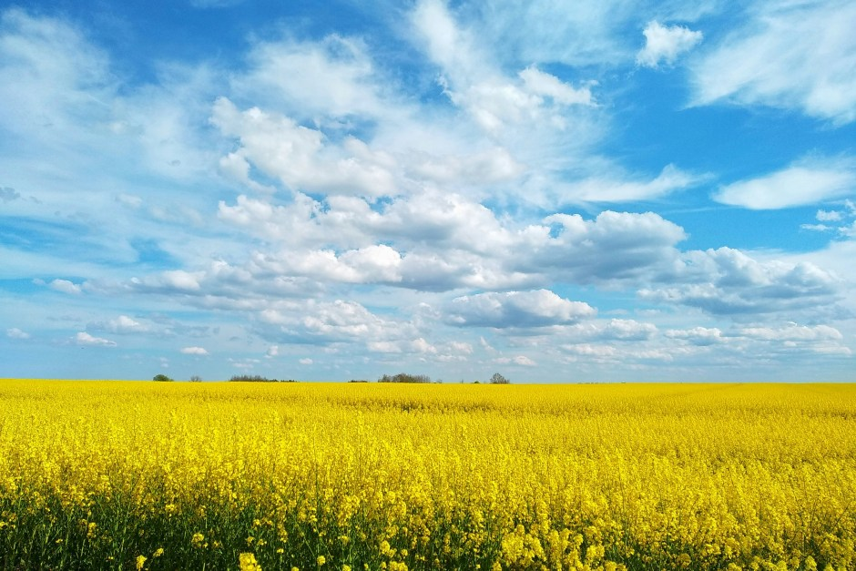

<figure><figcaption>A random photo with a blue sky</figcaption></figure>

This is just a short post to say that I now have accounts on [Mastodon](https://mastodon.social/@alexseifert) and [Bluesky](https://bsky.app/profile/alex-seifert.bsky.social). I don’t use social media much but if you are on those platforms and want to follow me, you will automatically receive updates when I post on my [blogs](https://blog.alexseifert.com/other-blogs/). I created them basically as a way for people to follow all of my blogs at once since I’ve connected all of them to those accounts. Each time I publish a post on any of my blogs, those accounts will automatically be updated.