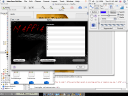
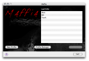
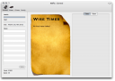
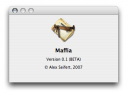

\[digg=http://digg.com/programming/Me\_a\_Programmer\_I\_don\_t\_think\_so\]I think it would only be reasonable for me to begin by saying that although I have played around with Xcode, I am not a professional software developer, I’m only a hobbyist. Now that I’ve gotten the truth out there, let’s begin.

I have dabbled in programming since the time before I was even a Mac user. I’ve never actually written an entire application, but I have started a-plenty and have certainly abandoned just as many. Since the days of Mac OS 10.1 and when Xcode was still called Project Builder, I have been half-way programming applications. My most recent attempt at a program is a small little game I called Maffia. If you couldn’t guess, the application is a mafia role playing game that’s entirely text based. It’s text based because I don’t really have any desire to put forth the effort into figuring out how to make a fully graphical game.

I always seem to do the same thing when trying to write a program. I begin by creating enough of the interface to give me a good start. Then I start connecting the interface elements to code that actually makes them useful. I start with the simple ones and work my way up. Since I tend to love design and graphics, I also create most of the art work, icons, etc for the program, giving it a lovely look and feel.

*(Above: Maffia in Interface Builder)*

The problem is when the coding gets tricky or when I run into my first major bug in the project. I could sit down and design user interfaces all day long, design the program’s flow and even create artwork for the program, but I can’t seem to stay focused on the technical coding bit. I tend to lose interest at this point and I move on to something else for a while before coming up with another idea for a new program (which will probably have the same fate as the previous attempt).

*(Above: Maffia in Xcode)*

Now, I know what you’re thinking. You’re probably thinking that I am a quitter. Well, this would in fact make me one. Just to clarify though, I am not normally a quitter. But if something loses my interest (as in this case), I move on to other things. I guess that just means I’m not a programmer.

What a useless entry. Here are some more screen shots of Maffia as far as it’s gotten:

*(Above: The application icon for Maffia)*

*

*

*(Above: The first window you see when you open Maffia)*

*

*

*(Above: The main game window, minus a few icons)*

*

*

*(Above: Maffia’s about box including the application icon)  
*