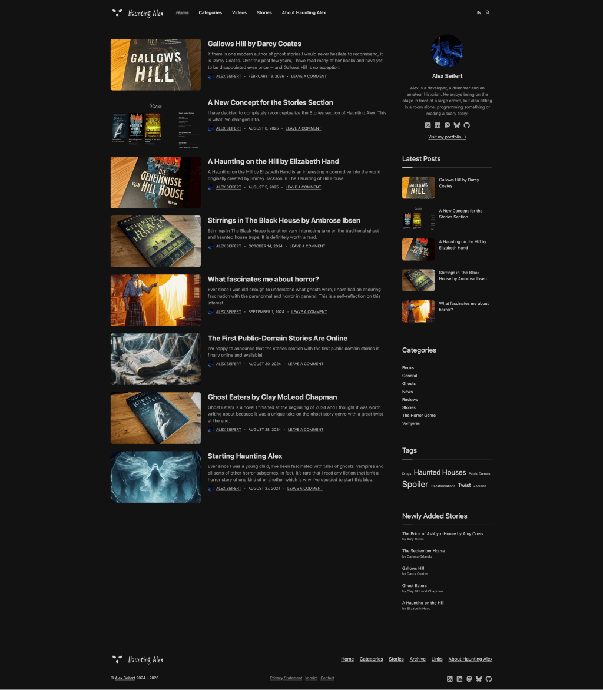

<figure><figcaption>Screenshot of Haunting Alex</figcaption></figure>

I finally bit the bullet and moved my blog, Haunting Alex, to this one. It’s something I’ve been kicking around doing for a while as you’ll know if you’ve read any of my earlier update posts.

I set up redirects so that the old links to the posts will still work. That said, I didn’t move all of the pages or the stories section because it was a lot of work to maintain and was actually a hurdle to writing book reviews since it required me to find extra images, links and book information. It was tedious to maintain. Without it, I can more freely write book reviews which I’m looking forward to.

You can find all of the imported posts in the [Horror section](https://blog.alexseifert.com/category/horror/) and all of my book reviews in the [Books section](https://blog.alexseifert.com/category/books/).