<figure><a href="https://blog.alexseifert.com/red-dead-redemption-2-29_03_2025-14_03_04-large/">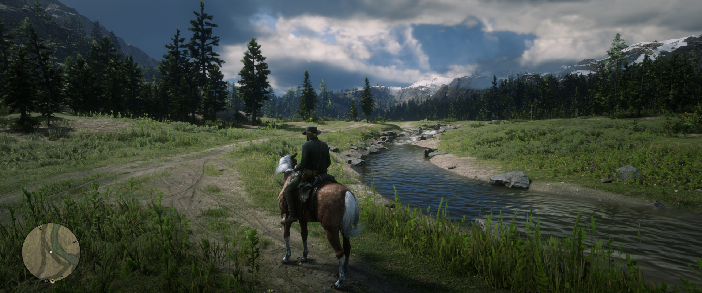</a><figcaption>Red Dead Redemption II: A river in a mountain glade</figcaption></figure>

As a lifelong nerd, I’ve played my fair share of video games throughout the decades. However, what I always found missing was a good Western game. Of course, there have been several popular Western games, among which the (in)famous Oregon Trail is one of the most well-known, but I was missing a truly open-world experience with excellent graphics and close attention to historical detail.

Enter Red Dead Redemption II from Rockstar. This game is *exactly* what I’ve been looking for throughout the years and checks all of the boxes of what I’ve wanted for so long. I’m quite the [history nerd](https://www.alexseifert.com/hobbies/history/), especially when it comes to the Wild West, and so I craved an immersive, at least somewhat historically accurate environment where I could experience what I’ve read in many history books over the years as closely as I possibly can myself. This game provides exactly that level of experience.

In this post, I’m going to share what makes the game so special for me and generally talk about my experiences with it. This isn’t really a review, but rather just a personal ode to one of the best games ever created. I’ve also included a bunch of screenshots I took in the game of some of my favorite locations. Taking them gave me a great excuse to ride around the map and revisit them. I even got my two-year-old son involved who knows Red Dead Redemption II simply as “The Horse Game.”

Story
-----

I’ll start with a little blurb about the storyline. I won’t give any of it away, so don’t worry. **There are no spoilers here.** Although the game takes place in a fully open world where the player can ride around the map at will, there is actually a fairly complex storyline that keeps the player engaged and interested in what is going to happen next.

The main character, Arthur Morgan, is endearing and I know I’ve found myself quite attached to playing him. Rockstar did a great job making the gang of criminals he runs around with feel like family and one finds oneself wondering what they’re up to while riding around the other end of the map despite knowing that these non-playable-characters (NPCs) cease to exist when you’re not there.

As the story progresses, the gang migrates its camp to various places throughout the map, but my absolute favorite is the second campsite which reminds me of one of my own favorite campsites in the Rocky Mountains of Colorado where I grew up. In the screenshots below, the camp has already moved on, so it is empty, but while the gang was there, it was full of tents, wagons, horses, chickens and people:

-   <figure>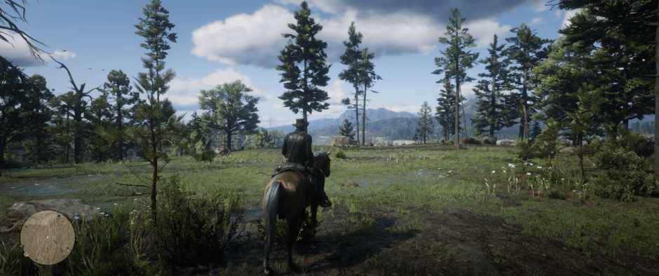<figcaption>Red Dead Redemption II: The campsite on Citadel Rock</figcaption></figure>
    
-   <figure>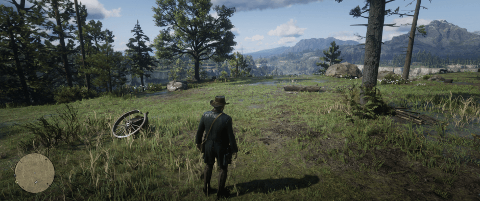<figcaption>Red Dead Redemption II: The campsite on Citadel Rock</figcaption></figure>
    
-   <figure>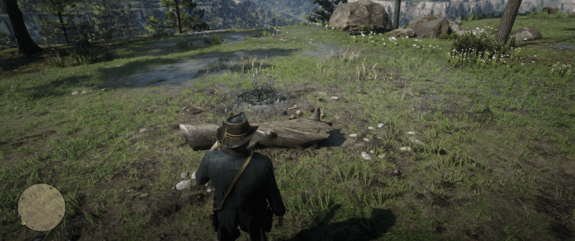<figcaption>Red Dead Redemption II: The camp fire at the campsite on Citadel Rock</figcaption></figure>
    
-   <figure>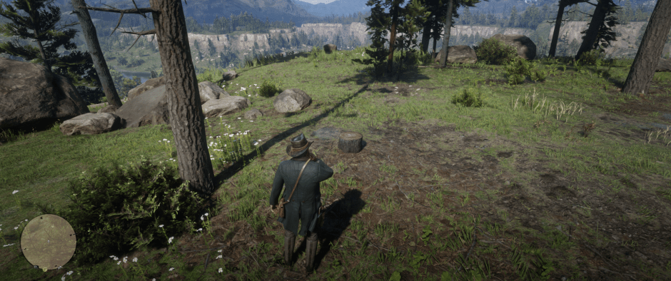<figcaption>Red Dead Redemption II: The chopping block at the campsite on Citadel Rock</figcaption></figure>
    
-   <figure>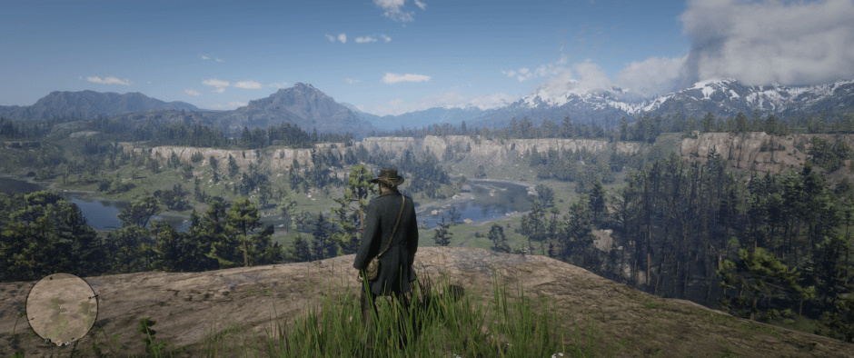<figcaption>Red Dead Redemption II: The view from the campsite on Citadel Rock</figcaption></figure>
    
-   <figure>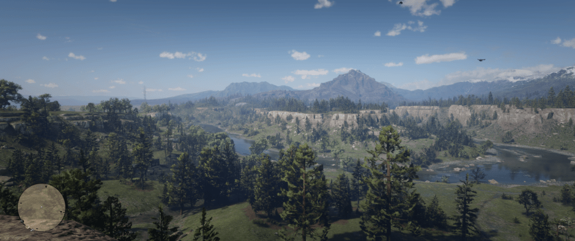<figcaption>Red Dead Redemption II: The view from the campsite on Citadel Rock</figcaption></figure>
    
-   <figure>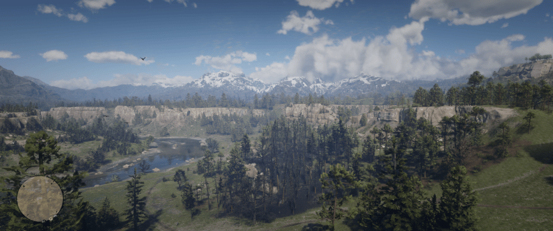<figcaption>Red Dead Redemption II: The view from the campsite on Citadel Rock</figcaption></figure>
    
-   <figure>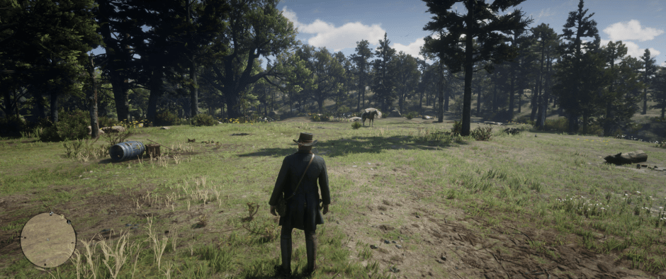<figcaption>Red Dead Redemption II: The campsite on Citadel Rock</figcaption></figure>
    
-   <figure><figcaption>Red Dead Redemption II: The entrance to the campsite on Citadel Rock</figcaption></figure>
    

What is it that I like about Red Dead Redemption II?
----------------------------------------------------

This game has managed to find a special home in my heart in a way that no other video game has ever achieved except for [Super Mario World](https://en.wikipedia.org/wiki/Super_Mario_World) for the Super Nintendo and [Sonic the Hedgehog 3](https://en.wikipedia.org/wiki/Sonic_the_Hedgehog_3) for the Sega Genesis. All three evoke a sense of nostalgia and, in a way, a calm, relaxed state of mind that is difficult for me to otherwise obtain.

The reason for that is that they are connected to some of my fondest memories as a child. The latter two were video games I loved playing growing up. What makes them so special to me compared to other games I played at the time is that we didn’t have either game at home despite having a Sega Genesis. Instead, I had to visit family or friends and play the games with them. The social connection is what made the games so special for me.

Red Dead Redemption II is obviously a little different in that it wasn’t around in the ’90s. Nonetheless, when I get an opportunity to ride around on horseback and take in the views of the old American West, I feel a very strong sense of nostalgia.

Having grown up at the base of the Colorado Rocky Mountains in the United States, I spent a lot of time in the mountains. We usually went hiking, camping, skiing, shooting, off-roading, or just for a drive. My grandparents also had some property with a stationary trailer we would visit at least once a month. I was absolutely gutted when they sold it around the turn of the millennium because it was my favorite place in the world.

So, what does all of this have to do with Red Dead Redemption? Well, the sights and sounds in the game are powerful reminders of those memories for me. Riding through the virtual mountains takes me back to some of the best times of my life that are otherwise unachievable for me in Germany. Several specific areas of the map bear a strong resemblance to some of my favorite areas of the Rocky Mountains which means I like to visit them in the game, especially if I’m feeling homesick as an expat.

Here are a few screenshots of some of those seemingly random places:

-   <figure>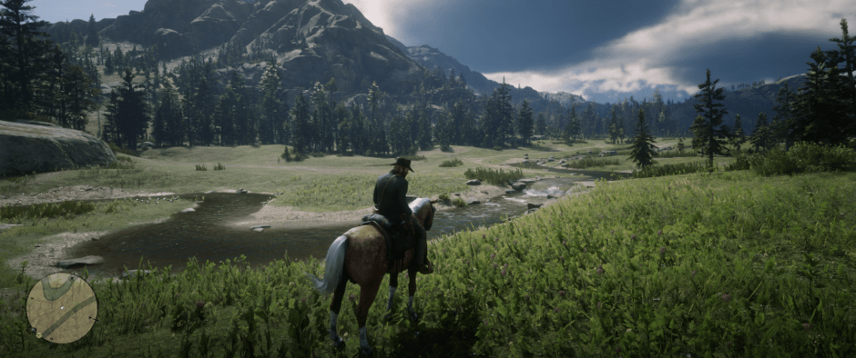<figcaption>Red Dead Redemption II: A river in a mountain glade</figcaption></figure>
    
-   <figure><figcaption>Red Dead Redemption II: A river in a mountain glade</figcaption></figure>
    
-   <figure>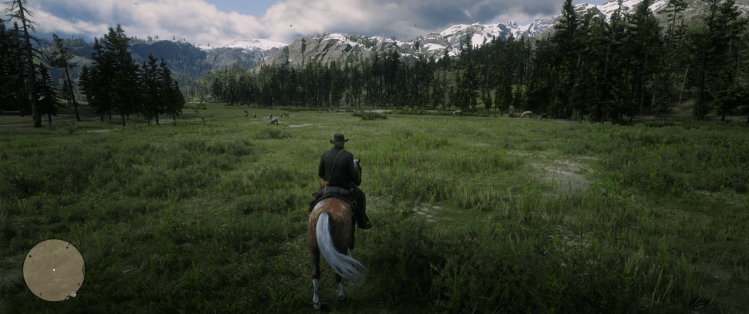<figcaption>Red Dead Redemption II: A herd of elk in a mountain glade</figcaption></figure>
    
-   <figure>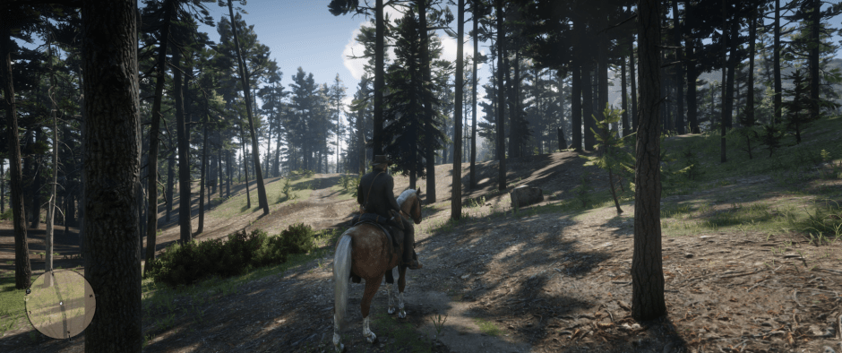<figcaption>Red Dead Redemption II: The woods in the mountains</figcaption></figure>
    
-   <figure>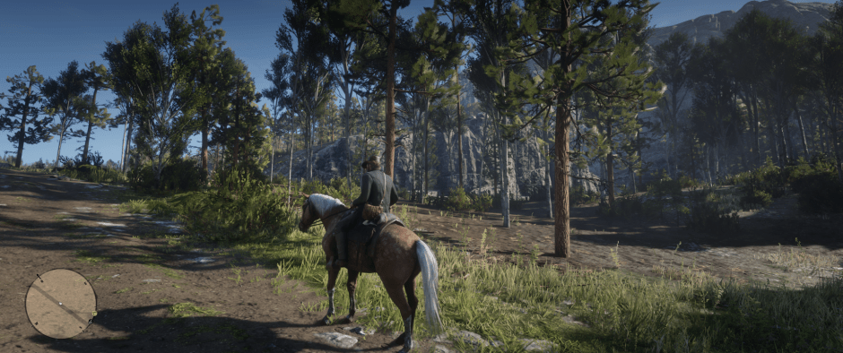<figcaption>Red Dead Redemption II: In the mountains</figcaption></figure>
    
-   <figure>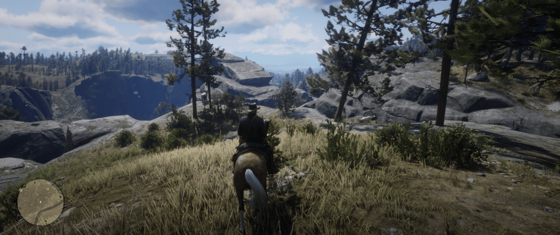<figcaption>Red Dead Redemption II: A bull elk in the mountains</figcaption></figure>
    
-   <figure>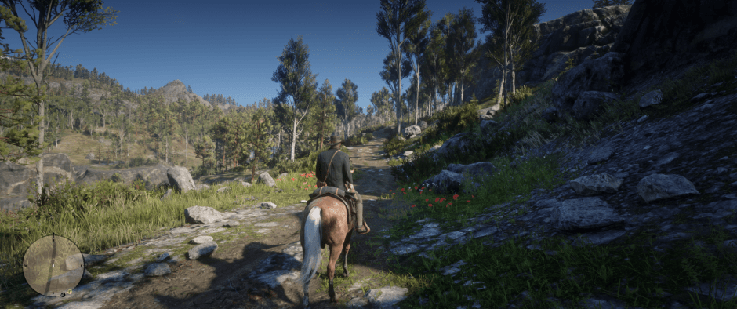<figcaption>Red Dead Redemption II: On the way into the mountains</figcaption></figure>
    
-   <figure>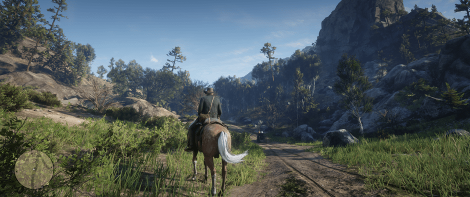<figcaption>Red Dead Redemption II: On the way into the mountains</figcaption></figure>
    
-   <figure>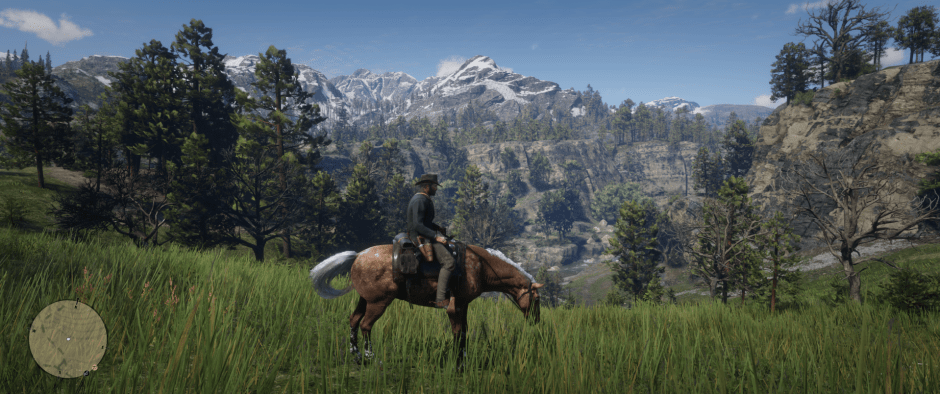<figcaption>Red Dead Redemption II: In the mountains</figcaption></figure>
    
-   <figure><figcaption>Red Dead Redemption II: In the mountains</figcaption></figure>
    
-   <figure>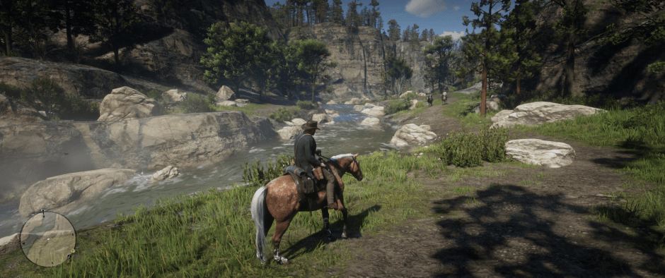<figcaption>Red Dead Redemption II: In the mountains</figcaption></figure>
    

I also went to university in Wyoming — a state known for its nature and especially famous for Yellowstone National Park. While the University of Wyoming is in the opposite corner of the state from Yellowstone, the hot springs and gysers in Red Dead Redemption still remind me of the time I lived there and of the great times I had.

Here are a couple of screenshots of them:

-   <figure>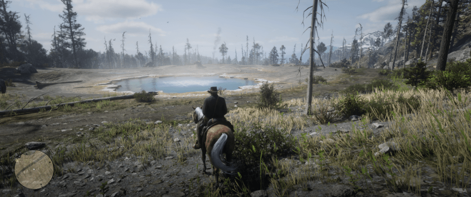<figcaption>Red Dead Redemption II: In the mountains at the hot springs</figcaption></figure>
    
-   <figure>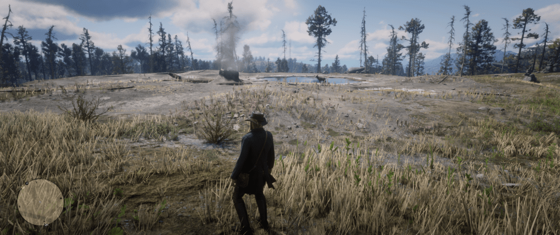<figcaption>Red Dead Redemption II: In the mountains at the hot springs</figcaption></figure>
    

There are, of course, lots of other areas of the game, such as those that resemble the Southern states of the US, but I don’t tend to spend a lot of time there unless I’m playing the story, which tells you where you need to be.

A New PC
--------

Believe it or not, I liked the game so much that I built a custom gaming PC just to be able to play it. I’ve been a Mac user since [Mac OS 9](https://blog.alexseifert.com/2024/09/15/my-collection-of-mac-os-screenshots/) was new, which means I didn’t have a system that supported it. Of course, there was always the option to buy a PlayStation or an Xbox, but I was interested in [having a real Windows PC again](https://blog.alexseifert.com/2024/03/08/how-windows-11-has-convinced-a-skeptic/) for the first time in years alongside my Mac, so I decided to go with that.

Originally, I played the game on Google’s Stadia since it was the only online service that offered it. That meant I could play it on my Mac without any issue. However, we all know how reliable Google is with its services and, true to their calling, they shut it down. I had already beat the game and couldn’t export my saved game, which meant I had to start again after purchasing the game on Steam on my new PC.

That sounds horrible, but really, it isn’t a bad thing. I’ve had the opportunity to play the game very differently than the first time, which means it’s almost like a different game altogether. There are so many “side quests” and ways of playing the game that you could probably beat it twenty different times and have entirely different experiences.

What about Red Dead Redemption I?
---------------------------------

Believe it or not, I can’t say much about the first game in the series as I’ve hardly played it at all. That isn’t due to a lack of interest, but rather because I didn’t have the ability to play it for quite some time. It’s significantly older than the second game and I didn’t have a system that could run it.

That all changed this past Christmas. Not only did Rockstar release a remastered PC version at the end of last year, but I also got a Nintendo Switch and was gifted Red Dead Redemption I for it. Since then, I’ve stuck about 20 hours into it, but I haven’t developed the same relationship that I did with the second in the series.

I can imagine that has to do with the fact that I’ve been playing the second one for much longer and that the first one exclusively takes place in the desert south, which I can’t relate to in the same way I can to the mountainous scenery of the second one.

More Memories
-------------

Below, I’ve compiled a series of screenshots related to specific spots in the game that remind me of places I used to frequent in Colorado. I will explain what makes them so significant to me and why I like visiting them in the game.

The first on the list is the small town of Valentine, which is a cow town on the edge of the mountains surrounded by a landscape that reminds me of where I grew up. The town itself is typical of old western towns in that it has a main street with a few false-fronted wooden buildings and a few smaller side streets.

Riding down the main street, I can picture how it would look today with cars parked at an angle on either side. Such a town would have grown significantly in the intervening century and a half since the time when the game takes place, but many of the buildings would have remained and not changed very much. I can think of several such mountain towns in the real world.

-   <figure>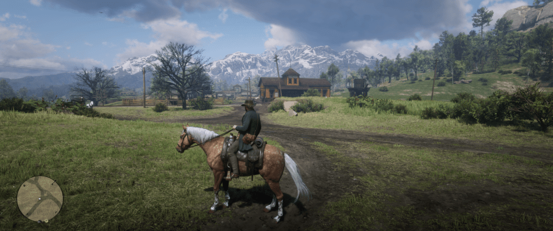<figcaption>Red Dead Redemption II: The town of Valentine</figcaption></figure>
    
-   <figure>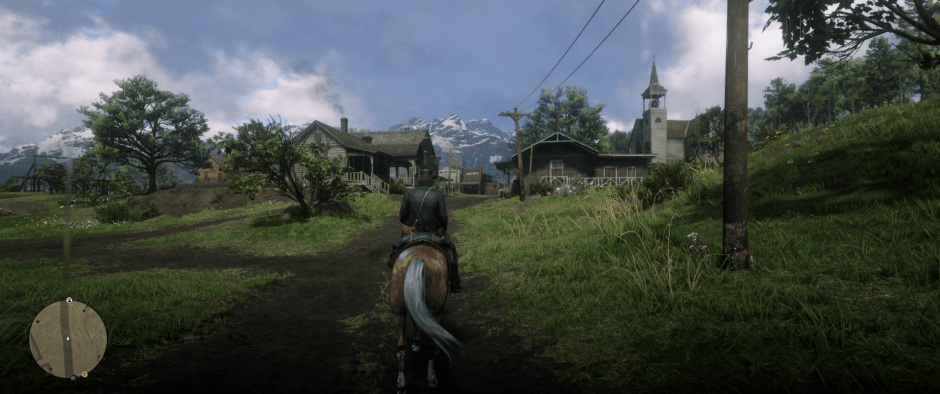<figcaption>Red Dead Redemption II: The town of Valentine</figcaption></figure>
    
-   <figure>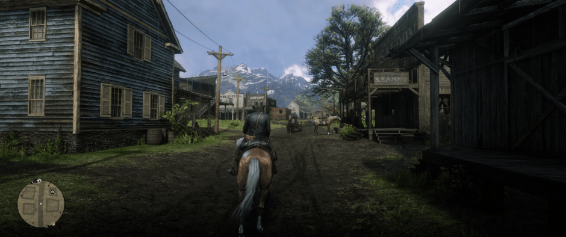<figcaption>Red Dead Redemption II: The town of Valentine</figcaption></figure>
    
-   <figure>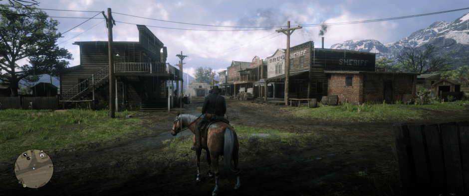<figcaption>Red Dead Redemption II: Downtown Valentine</figcaption></figure>
    
-   <figure><figcaption>Red Dead Redemption II: Downtown Valentine</figcaption></figure>
    
-   <figure>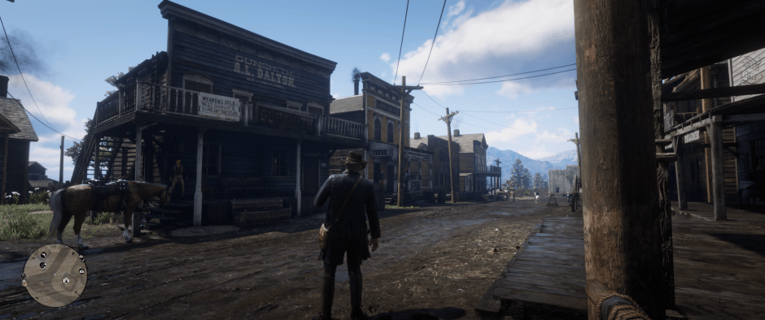<figcaption>Red Dead Redemption II: Downtown Valentine</figcaption></figure>
    
-   <figure>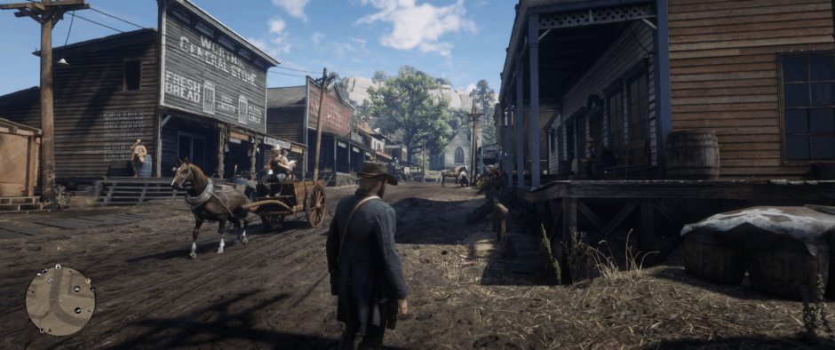<figcaption>Red Dead Redemption II: Downtown Valentine</figcaption></figure>
    
-   <figure>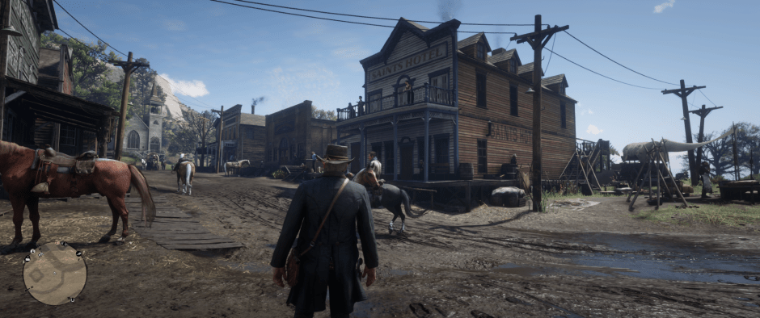<figcaption>Red Dead Redemption II: Downtown Valentine</figcaption></figure>
    
-   <figure>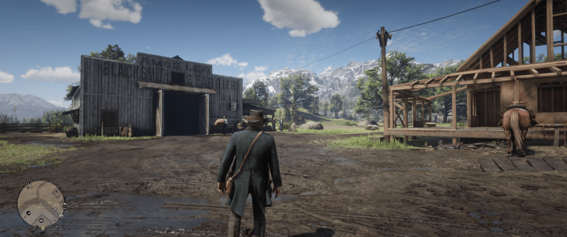<figcaption>Red Dead Redemption II: The stables in Valentine</figcaption></figure>
    
-   <figure>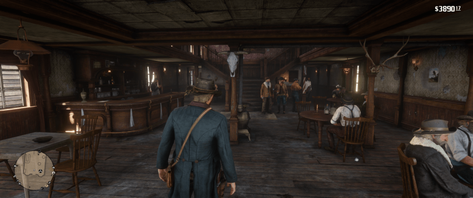<figcaption>Red Dead Redemption II: The saloon in Valentine</figcaption></figure>
    

The next town on the list is the small mountain town of Strawberry. It is much smaller than Valentine and crammed into a tiny valley wedged between large rock formations with its primary purpose being the water mill that operates on the small river that runs through the center of it.

This town reminds me very specifically of the mountain town of Estes Park in Colorado. While Estes Park is larger and isn’t situated in such crammed quarters, the atmosphere of the town, as well as the water mill, remind me of it.

Aside from Estes Park, the general style of architecture can be found in many small, real-life mountain towns in the Rocky Mountains. I honestly can’t say whether those embellishments are period-accurate for the game, but they do succeed in generating a real mountain town feeling, nonetheless.

-   <figure>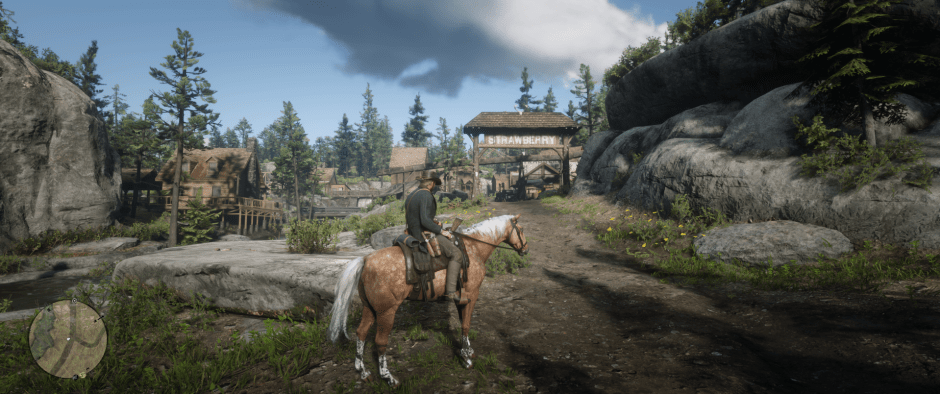<figcaption>Red Dead Redemption II: The mountain town of Strawberry</figcaption></figure>
    
-   <figure>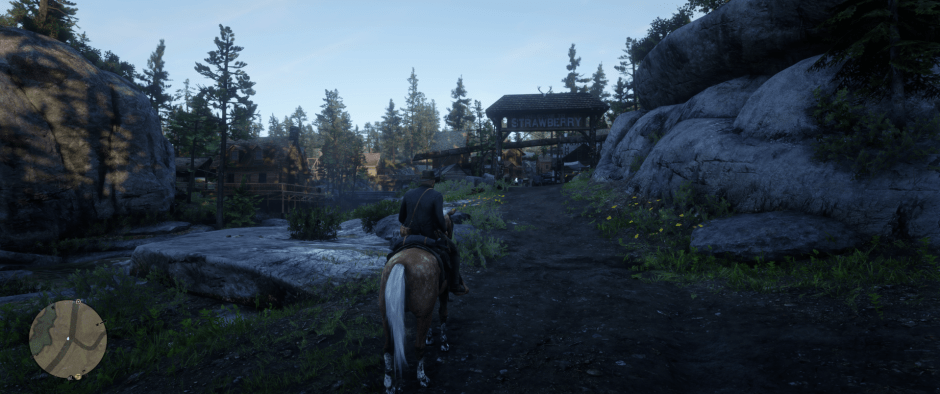<figcaption>Red Dead Redemption II: The mountain town of Strawberry</figcaption></figure>
    
-   <figure>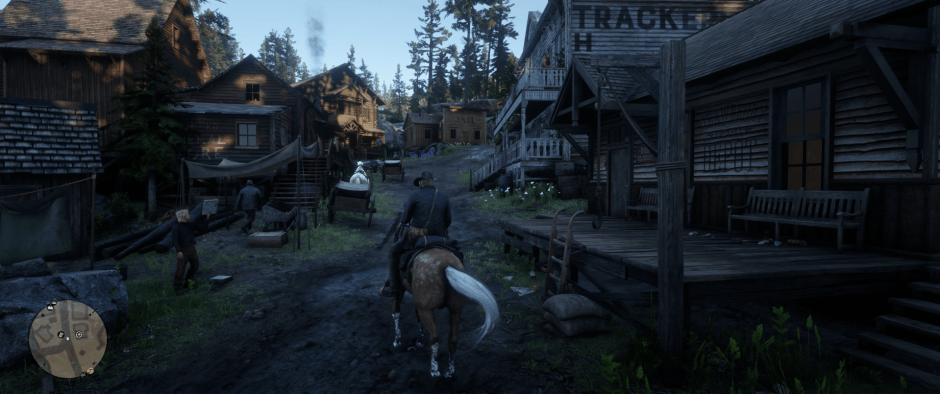<figcaption>Red Dead Redemption II: The mountain town of Strawberry</figcaption></figure>
    
-   <figure>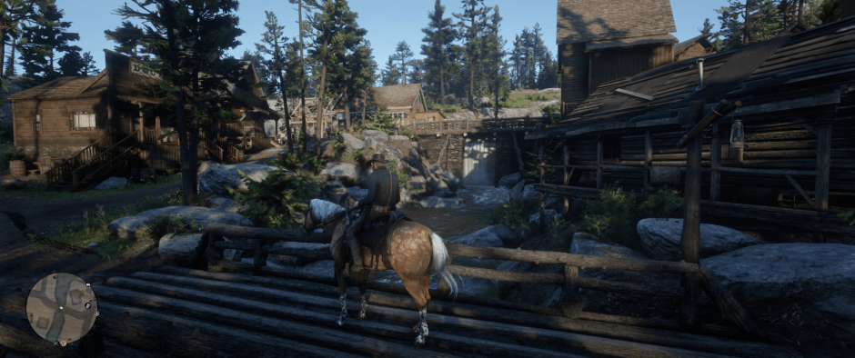<figcaption>Red Dead Redemption II: The waterfall in the mountain town of Strawberry</figcaption></figure>
    
-   <figure>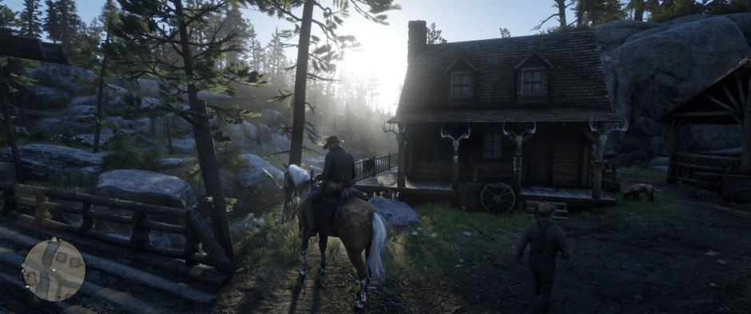<figcaption>Red Dead Redemption II: A house in the mountain town of Strawberry</figcaption></figure>
    
-   <figure>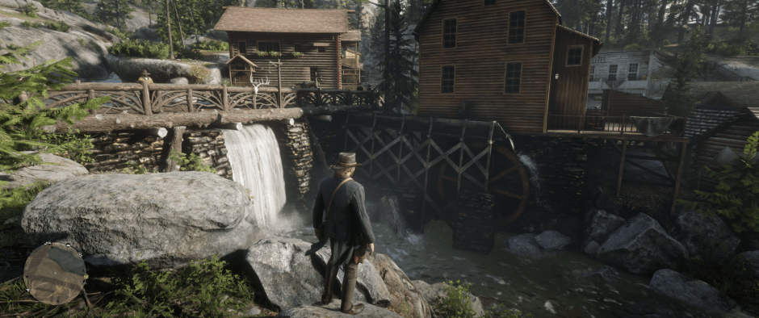<figcaption>Red Dead Redemption II: A water mill in the mountain town of Strawberry</figcaption></figure>
    
-   <figure>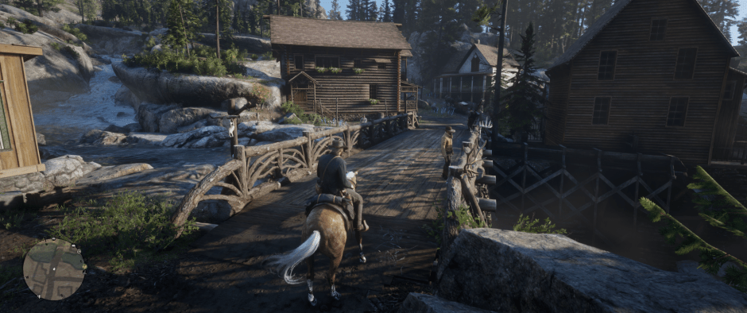<figcaption>Red Dead Redemption II: A bridge in the mountain town of Strawberry</figcaption></figure>
    
-   <figure>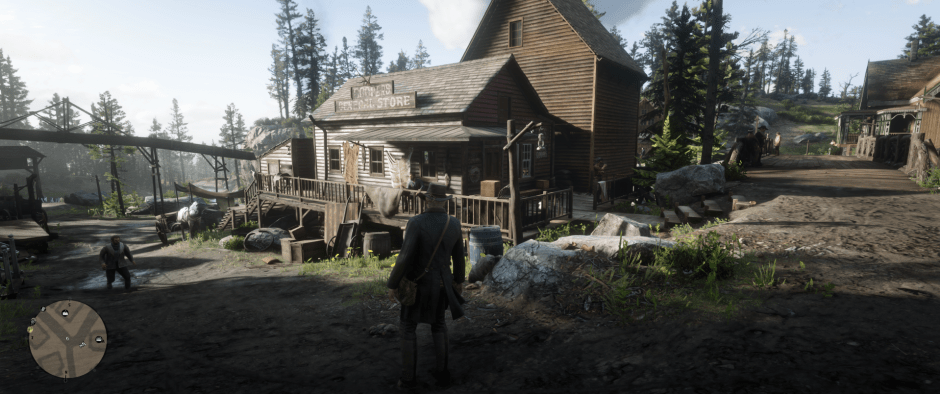<figcaption>Red Dead Redemption II: The general store in the mountain town of Strawberry</figcaption></figure>
    
-   <figure>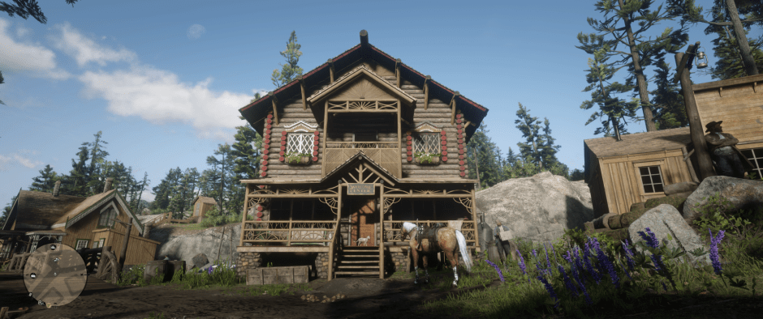<figcaption>Red Dead Redemption II: The lodge in the mountain town of Strawberry</figcaption></figure>
    

The last stop on this tour is Emerald Ranch. As the name would imply, it is a large ranch that is situated at the base of the mountains not far from Valentine. While it is quite a bit greener than most places in Colorado, the open, rolling hills are certainly similar. There are even buffalo.

-   <figure>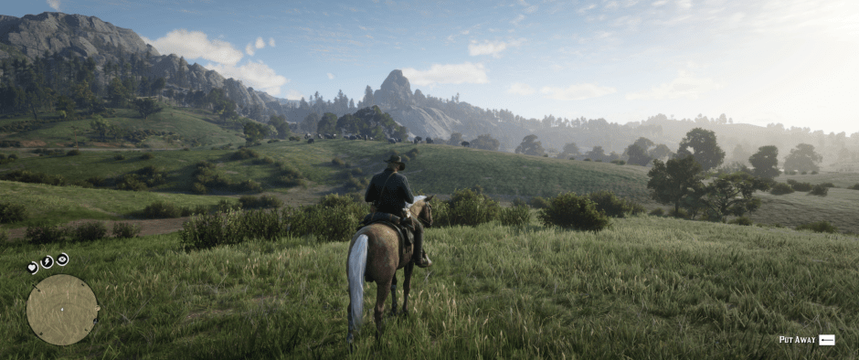<figcaption>Red Dead Redemption II: Emerald Ranch with buffalo</figcaption></figure>
    
-   <figure>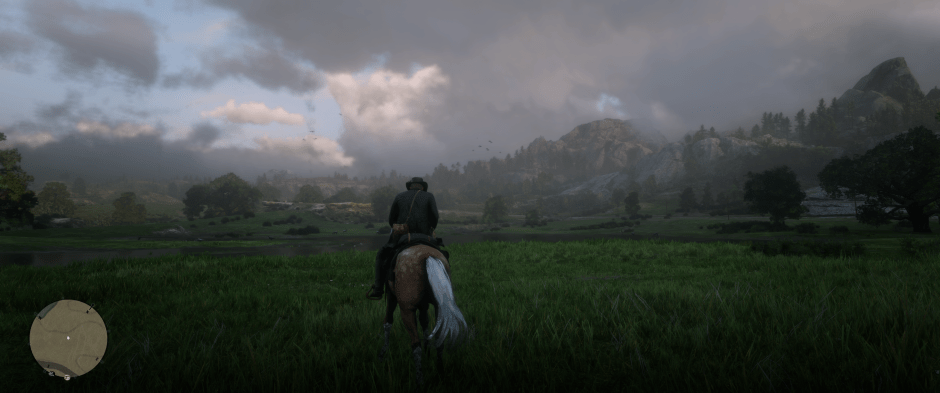<figcaption>Red Dead Redemption II: Emerald Ranch with a storm brewing</figcaption></figure>
    
-   <figure>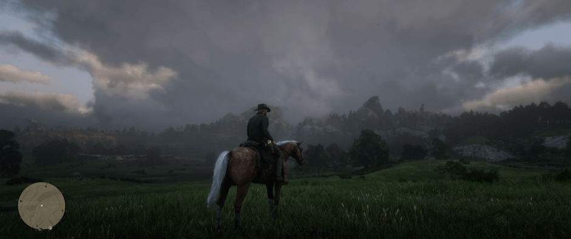<figcaption>Red Dead Redemption II: Emerald Ranch with a storm brewing</figcaption></figure>
    
-   <figure>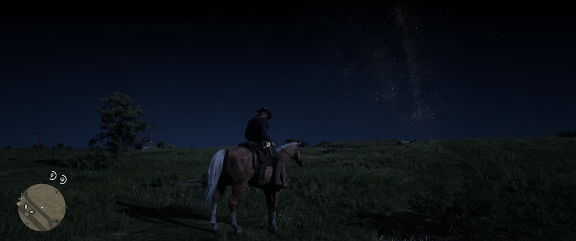<figcaption>Red Dead Redemption II: Emerald Ranch</figcaption></figure>
    
-   <figure>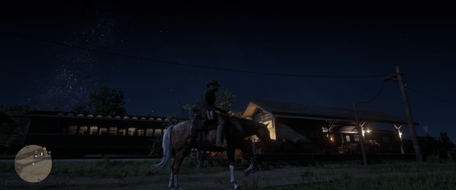<figcaption>Red Dead Redemption II: Emerald Ranch</figcaption></figure>
    

Conclusion
----------

Red Dead Redemption II has become quite an important game for me. It reminds me of where I grew up and of several specific memories from my childhood that I value dearly. As such, it is a place for me to retreat when I am feeling overwhelmed, homesick, tired or stressed. Riding through or near the mountains on horseback with very few people and lots of familiar nature has an incredibly therapeutic effect on me.

It may sound boring to just ride through the game, but it helps me center myself. If I do get bored, I just simply go back to the story and play the missions there. As of writing this, I currently find myself in the southern city of Saint Denis, which is strongly based on New Orleans, Louisiana. It’s an interesting contrast to the nature found elsewhere in the game, but it’s harder for me to relate to, and therefore, I don’t really spend any time there other than for the story.

<figure><a href="https://blog.alexseifert.com/?attachment_id=8212">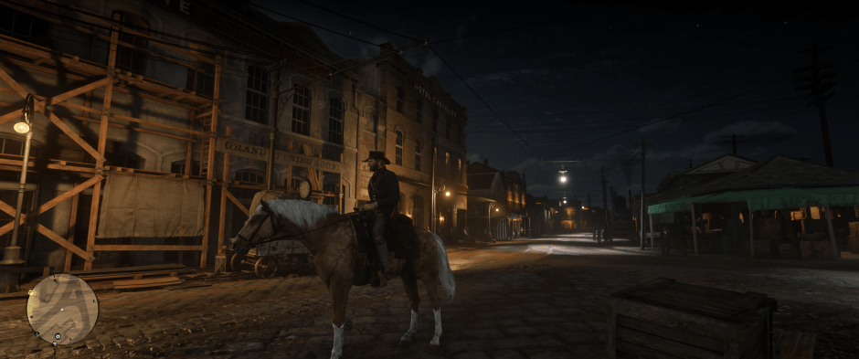</a><figcaption>Red Dead Redemption II: Saint Denis</figcaption></figure>

*Have you played Red Dead Redemption II? What about the first one? What do you think about them? Do you have any games that are meaningful to you? Let me know in the comments!*