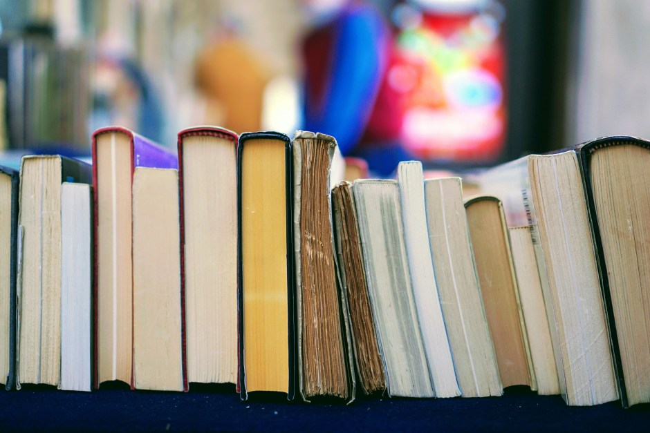

<figure></figure>

With the new year ushered in over a month ago, it’s time to recap my favorite books I read in 2024. This is a tradition I started in [2022](https://blog.alexseifert.com/2023/01/09/my-favorite-books-from-2022/) and continued in [2023](https://blog.alexseifert.com/2023/12/18/my-favorite-books-from-2023/) which gives me the opportunity to relive some my favorite stories.

*Note: I am not sponsored in any way and what follows is my genuine opinion.*

*Ghost Eaters* by Clay McLeod Chapman
-------------------------------------

This book was certainly one of my favorites. In fact, it was the first [book I reviewed](https://haunting.alexseifert.com/2024/08/28/ghost-eaters-by-clay-mcleod-chapman/) on my blog about ghost stories, [Haunting Alex](https://haunting.alexseifert.com), so check out that post for a much more in-depth review than here. I will warn you though, there are spoilers there.

The book covers a range of topics from drug addiction to social pressure and leaves the reader pondering about its ending. Despite the title, it isn’t a classic ghost story, but it does feature ghosts in a way that leaves a haunting impression on the reader that makes him or her question whether the ghosts were real or just a metaphor. It’s a brilliantly written book that engages you and I can highly recommend it.

*The Last of What I Am* by Abigail Cutter
-----------------------------------------

While *The Last of What I Am* is technically a ghost story since its protagonist is a ghost, it’s not the scary type. In fact, the whole premise of the story is for the ghost, who was a Confederate soldier in the American Civil War to tell his story about his life and experiences as a soldier in the war. It is an excellent read that sets the reader in a vivid painting of the American South before, during and after the Civil War. I can highly recommend it to anyone interested in history or the American Civil War.

*The Haunting of Leigh Harker* by Darcy Coates
----------------------------------------------

This masterpiece of a ghost story by Darcy Coates is the only “real” ghost story on this list. It is a haunting tale about a woman who wakes up and finds her house haunted. The atmosphere is surreal and the twist in the plot makes the novel extremely memorable. I can’t give away much more without spoiling the story, so you will just have to check it out if you are interested. Of all the ghost stories I’ve read recently, this is my favorite and I can only highly recommend it.

*The Invisible Life of Addie LaRue* by V.E. Schwab
--------------------------------------------------

*The Invisible Life of Addie LaRue* feels like it’s destined to become a modern-day classic. The story is about a French woman who makes a deal with the darkness to live forever but loses the ability to be remembered by other people. It is compelling, complex and leads the reader to contemplate his or her own life and the decisions we all make on a daily basis. It also shows just how important social contacts are to the human experience and what can happen to someone who loses them all with no ability to make new ones.

*Carmilla* by Sheridan Le Fanu
------------------------------

*Carmilla* is the only true classic on this list. First published 1872, it was the vampire story that inspired Bram Stoker to write *Dracula*. The story isn’t very long and I would call it a novelette rather than a novel, but it is still excellent and worth reading if you like vampire stories. Sheridan Le Fanu is an excellent author and, since we’re already talking about him, I can also recommend his full-length gothic novel, *Uncle Silas*, which I read a few years ago.

Conclusion
----------

Well, that concludes this year’s list. As usual, I did read more books than appeared here, but while many of them were good, they were not among my favorites. I can only recommend you take a look at the books on this list if you enjoy darker stories.

*What were your favorite books from 2024? Have you read any on this list? Let me know in the comments below!*