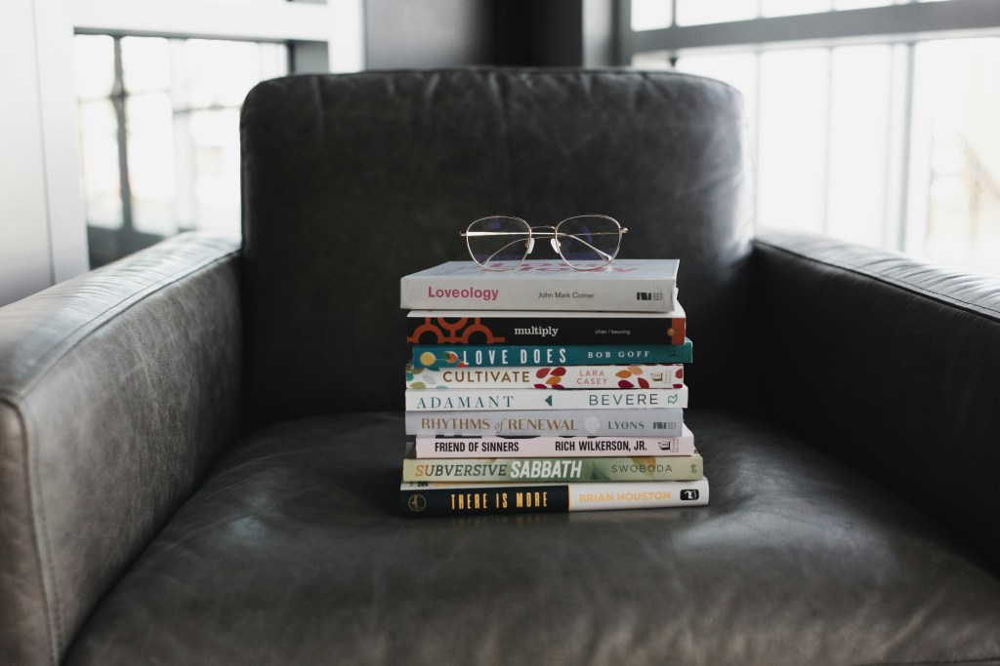

<figure></figure>

It’s that time of the year again when I take a look back at what I’ve read throughout the past year and highlight some of my favorite books. I read more than usual in 2025 which was a wonderful experience and, for the first time, I read a number of eBooks on a Kindle rather than just paper books. I have mixed feelings about it, but that deserves its own post.

Since there are so many wonderful titles to choose from that I read in 2025, it was hard to narrow it down to this short list. As such, these books are *really* my favorites from the year and not just the books I liked more than others.

*Note: I am not sponsored in any way and what follows is my genuine opinion. Also, there are **no spoilers** below, so it’s safe to continue if you haven’t read any of these stories.*

*A Haunting on the Hill* by Elizabeth Hand
------------------------------------------

For anyone who has ever read the classic haunted house book, *[The Haunting of Hill House](https://www.goodreads.com/book/show/89717.The_Haunting_of_Hill_House)* by Shirley Jackson, this is a highly recommended read. It shares the same world and even the same house, but in an entirely different set of circumstances with an entirely different set of people. It can be read without having read Jackson’s masterpiece.

The story follows a group of friends who rent the house to practice a play that the main protagonist has written. As the story progresses, the true nature of the house slowly reveals itself until the fascinating climax is reached. I won’t say more than that because you’ll just have to read it yourself to find out what that is.

Of all the books on this list, *A Haunting on the Hill* is the only one I wrote about on my horror blog, [Haunting Alex](https://haunting.alexseifert.com/2025/08/05/a-haunting-on-the-hill-by-elizabeth-hand/). That isn’t because I don’t want to want to write about the others, but rather just due to a lack of time. I have a more comprehensive review of the book there, including spoilers.

*The September House* by Carissa Orlando
----------------------------------------

*The September House* is an interesting new take on the classic haunted house story. The hauntings are more or less predictable because they happen every September and the protagonist, Margaret, has decided not to worry about it even though the walls drip with blood and the ghosts of previous inhabitants appear. Of course, it wouldn’t be a good story if she was allowed to just live in harmony with the ghosts. One in particular isn’t very nice, especially when Margaret’s daughter comes to visit.

*Gallows Hill* by Darcy Coates
------------------------------

Any book by Darcy Coates is going to be good in my opinion. I have read most of her books and have yet to regret even one. *Gallows Hill* joins the ranks of excellent reads by her. After inheriting a property called Gallow Hills from her estranged parents, Margot discovers that all isn’t well there. The land is sick and the house is dangerous. The dead don’t stay dead and they aren’t particularly nice. I can’t say much more without giving too much away.

*The Haunting of Velkwood* by Gwendolyn Kiste
---------------------------------------------

Despite the title, this isn’t a traditional haunted house book. You could argue it’s not even really a ghost story. Nonetheless, it is an excellent and creative story.

The Velkwood neighborhood has disappeared behind an inpenetrable veil that only three former residents of the neighborhood can penetrate. One is driven crazy after having entered it and come back out while the others refuse to do so. That is, until one of them, Talitha, finds herself in financial direstraights and is offered money to enter by a researcher. The goal is to discover what’s beyond the veil, what happened, why it happened and, more importantly, if there is anything anyone can do to save the neighborhood.

*Diavola* by Jennifer Thorne
----------------------------

*Diavola* is a great ghost story that leaves you thinking about it for quite a while even after you’ve finished reading the book. Its characters are highly relatable, especially when it comes to interfamilial conflict. It also reminded me of my honeymoon in Tuscany which made it all the more relatable for me.

The story follows a family of Americans who rent an Tuscan villa for a family reunion and vacation together. The villa isn’t as innocent as it looks, however, and nor are the local villagers. There is danger lurking there and it might just threaten to follow the family home…

*The House of Long Shadows* by Ambrose Ibsen
--------------------------------------------

I have yet to encounter a story by Ambrose Ibsen that ends well. It’s actually rather refreshing since most stories tend to have a happy ending. *The House of Long Shadows* falls into this category. When a famous YouTuber, Kevin, buys a house in Detroit that hasn’t been lived in for nearly thirty years, he intends to make a video series about the renovations he plans to do, then flip it. Unfortunately, he encounters more than he expected in the house and things don’t quite go to plan.

Conclusion
----------

Like with most years, my favorite books this year are all horror. There isn’t another genre quite like it, except maybe dark fantasy which I also enjoy reading.

On average, I read about 2-3 books a month this year which was more than my usual 1-2 books. That wasn’t because they were shorter, but rather because I just felt like reading more. I enjoyed it thoroughly and hopefully, I’ll be able to keep up the pace well into 2026!

*What were your favorite books from 2025? Have you read any on this list? Let me know in the comments below!*