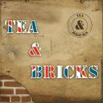

I got my bass last Tuesday and it didn’t even take a week before I formed a band. Of course, I’m playing bass this time around instead of drums since I don’t have my bass here. I actually am finding I kind of like bass better because you’re much more involved in the actual song writing process than with drums where you’re there mainly to provide a beat.

We’re called Tea & Bricks. We spent all weekend playing and working on our first song together. It’s an original song. We have the instruments written and can play the whole thing all the way through. The singer and guitarist (who is also American actually) will be writing the lyrics this week. We’ll be practicing throughout the week and hopefully we’ll be doing some recording next weekend. I actually think we’re ready to record now, but more practice can’t hurt.

Our sound isn’t actually as heavy as you might expect from me (for those of you that know the rock music project I’ve been doing). Instead, it’s more alternative and kind of reminds me of a band called Kasabian.

Tonight I did the artwork for the band. I made an album cover and a logo for it. This is the album cover and the logo is the circular part in the top right area of the image. You can click on it to make it bigger.

I will post the song online and will let you know here where you can listen to the song once it’s done. I’m very excited about this project.