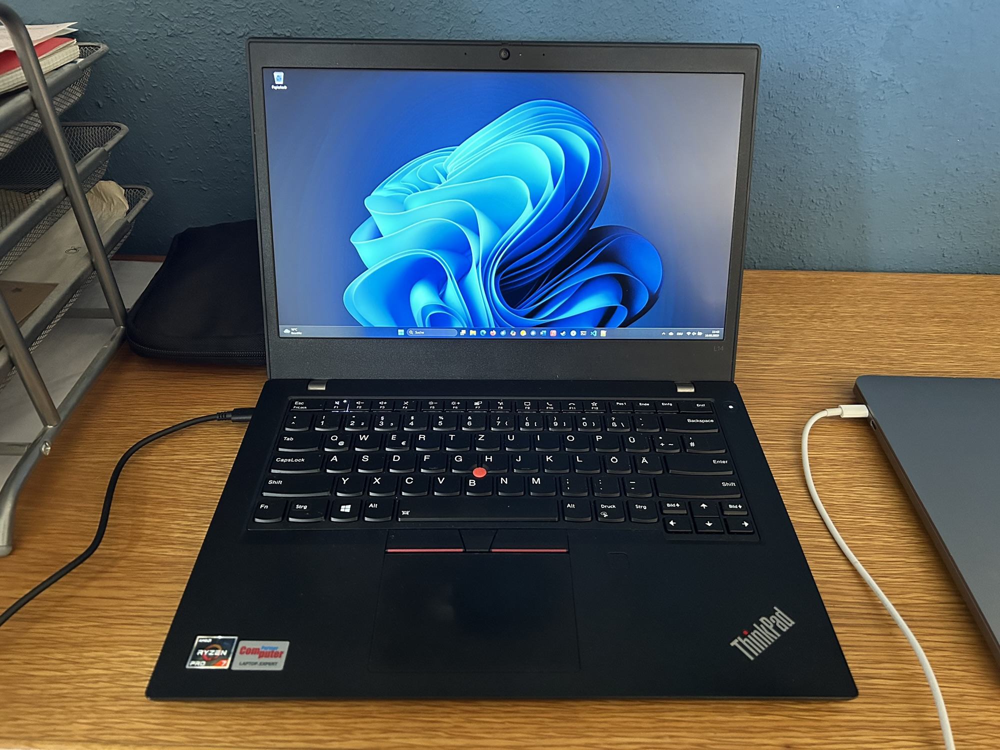
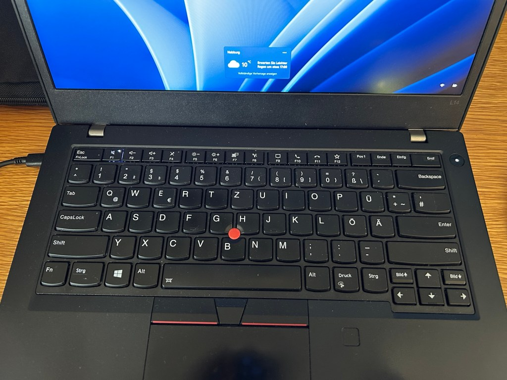
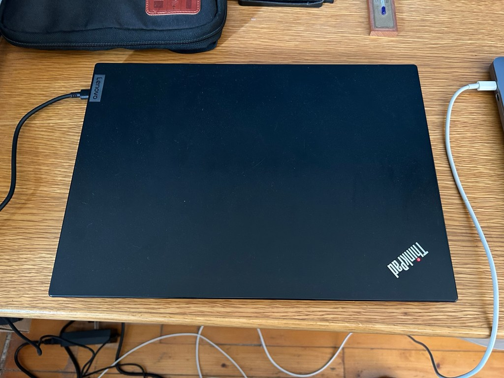
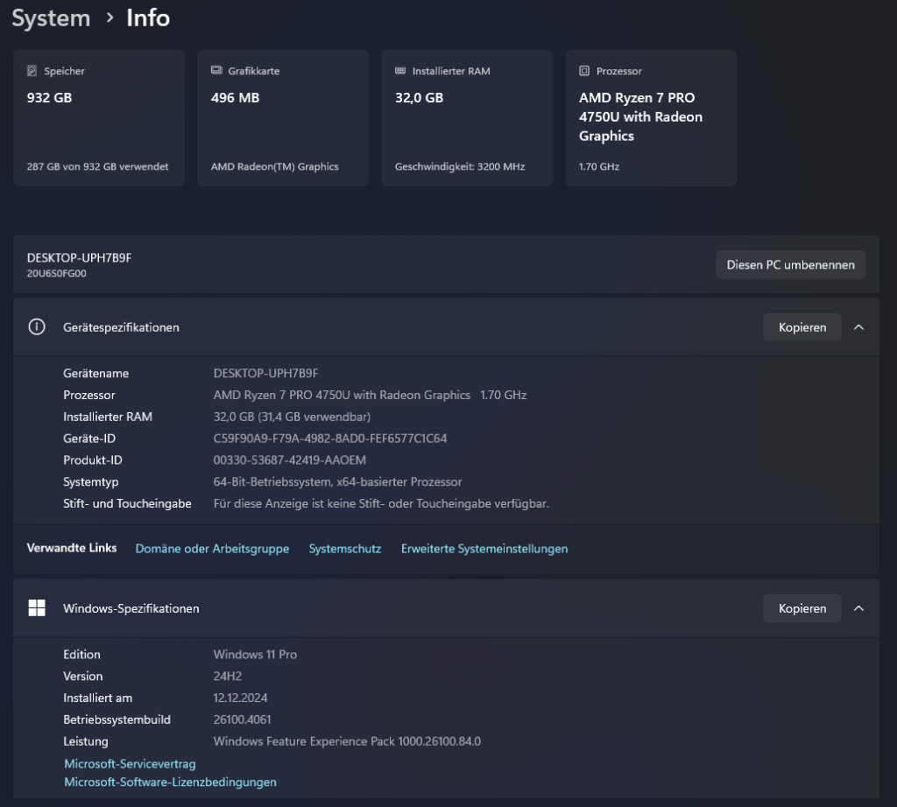

<figure><figcaption>My New ThinkPad with Windows 11</figcaption></figure>

A couple of months ago, I got a new-to-me ThinkPad L14. Even though I’m a huge fan of Mac, I’ve always liked ThinkPads going all the way back to when IBM made them. I’ve found them to be more aesthetically pleasing than other PC laptops and it has always seemed to me that their build quality is better than most others. I still believe Apple makes the most robust laptops (other than perhaps the specially built [Panasonic ToughBook](https://eu.connect.panasonic.com/gb/en/toughbook)), but as far as plastic PCs go, the ThinkPad is one of the best.

But I’ve never actually owned one which is why I decided to get one. Someone I know happened to be getting rid of this one, so I volunteered to take it off his hands. I most certainly didn’t need it, but I also don’t regret getting it.

For being such a small laptop, it packs a surprising punch. In fact, it feels more responsive and has better specs than my slightly newer 2019 16″ MacBook Pro. These are the specs:

-   AMD Ryzen 7 PRO 4750U processor coming in at 4.10 GHz
-   AMD Radeon Graphics
-   32 GB of RAM
-   1 TB SSD

It is currently running Windows 11 Pro, but I am planning on installing either openSUSE or Ubuntu on it ([I can’t make up my mind](https://mastodon.social/@alexseifert/114519155031469900)) and dual boot. I’ll probably use Linux for most things, but since the laptop is capable enough to run Red Dead Redemption II and Cyberpunk 2077 (just barely), I will also keep Windows on it to run those two games if I am traveling.

The only oddity is the keyboard. Those eagle-eyed readers will have already noticed that it has a German keyboard but with an American-style, horizontal enter key. That is because the keyboard is actually Polish with black stickers on top of the keys to make it visually a German keyboard. The unfortunate side effect of that is that the keyboard backlighting doesn’t shine through it. It’s weird but the person that gave it to me got it significantly cheaper in Poland than in Germany and then added the stickers himself.

I don’t have much else to say about it really. The trackpad is terrible compared to the one found on the MacBook and the red nipple is weird to use. They both somehow work, but I would need an external mouse to really use the laptop for anything serious.

I still don’t know what exactly I’m going to do with it other than use it as a portable gaming device for the two games mentioned above, but I’m nerdy enough to be happy to have it nonetheless.

-   <figure><figcaption>My New ThinkPad with Windows 11</figcaption></figure>
    
-   <figure><figcaption>The ThinkPad’s keyboard with stickers</figcaption></figure>
    
-   <figure><figcaption>My New ThinkPad</figcaption></figure>
    
-   <figure><figcaption>The ThinkPad’s Specs</figcaption></figure>