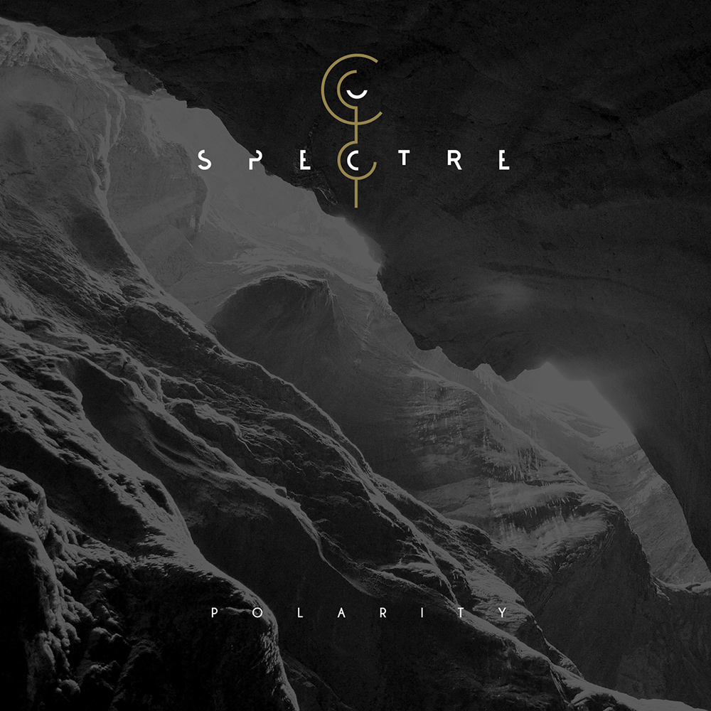

<figure><figcaption>Polarity by Spectre</figcaption></figure>

I am happy to announce that my newest band, Spectre, has released its first album named “Polarity.” It is the result of about two years of songwriting as well as several months of recording and production. [The official release post](https://www.spectre-band.com/polarity-released/) has more details about it.

The album is available on [iTunes](https://itunes.apple.com/de/album/polarity/1404939599) as well as [Spotify](https://open.spotify.com/album/60sOcXOXPfWG60Qp67FQza) and we have uploaded one of our songs to YouTube:

<figure>
<iframe loading="lazy" class="youtube-player" width="640" height="360" src="https://www.youtube.com/embed/tJ8krv5iTgw?version=3&amp;rel=1&amp;showsearch=0&amp;showinfo=1&amp;iv_load_policy=1&amp;fs=1&amp;hl=en-US&amp;autohide=2&amp;wmode=transparent" allowfullscreen="true" style="border:0;" sandbox="allow-scripts allow-same-origin allow-popups allow-presentation allow-popups-to-escape-sandbox"></iframe>
</figure>

For more information about the band, see our [official website](https://www.spectre-band.com/) or our [Facebook page](https://www.facebook.com/Spectre-474952572693126/).