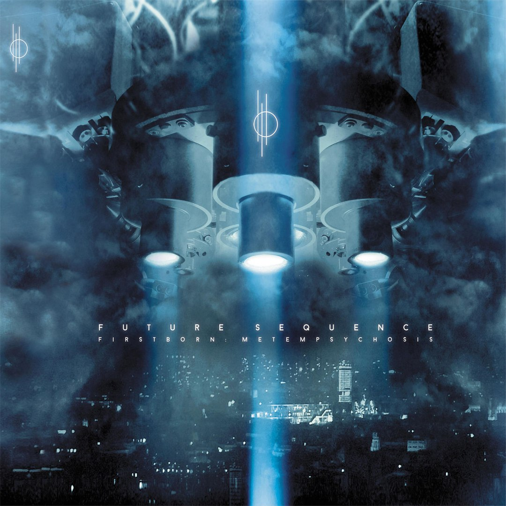

<figure><figcaption>Firstborn: Metempsychosis by Future Sequence</figcaption></figure>

A couple of months ago, I joined a band called [Future Sequence](https://www.future-sequence.com) on the bass. The band is a Munich, Germany-based metal band whose first album, “Firstborn: Metempsychosis”, is already [available on iTunes](https://itunes.apple.com/de/album/firstborn-metempsychosis/id1237328929), Spotify and a number of other stores.

Today I released [our new website](https://www.future-sequence.com) which I created using WordPress with a custom theme.

<figure></figure>