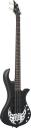

So I ordered a new bass guitar. I’ve played bass for quite a while, but when I decided to come to Germany for a while, it meant that I had to leave it and my drum set behind in the US. I’ve been missing both quite a lot, so I decided to go ahead and order a new bass to play while I’m here. Unfortunately, I can’t really have a drumset in my apartment, as it’s quite small and a drumset would be extremely noisy and obnoxious for the neighbors. Personally, I don’t want to be THAT guy.

The bass that I ordered is about as cheap as they come. I have a very nice 4-string bass by Traben back in the US (see the picture below), but since I’m only going to be here in Germany temporarily and only want something to practice with, I decided to buy a cheap one.

I ended up actually buying a starter kit because it comes with all the basic stuff including a cheap practice amp. I know most people will laugh at that, but it seemed liked an financially smart decision. The bass itself is a 4 string bass from some unknown manufacturer (as scary as that is) and the amp is a very cheap 40-watt practice amp. The picture below is what was on the website.

The only thing that I expect from it is it to last until I got back to the US next July. Other than that, I really don’t have an expectations. I’m just mostly excited to be able to actually play an instrument regularly again.