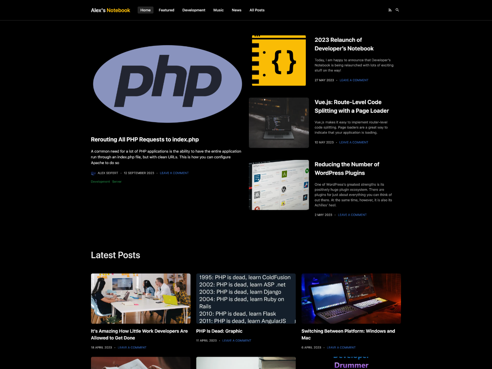

<figure></figure>

Alex’s Notebook received a new design today which is based on the WordPress theme for [Developer’s Notebook](https://www.developers-notebook.com/). When I created the new theme for Developer’s Notebook, I worked hard on modernizing it to optimally work with the latest version of WordPress.

I also just so happen to really like the way the design turned out. Therefore, I decided to copy it for Alex’s Notebook and tweak a few things to make it fit in better with [my portfolio](https://www.alexseifert.com) website.

The screenshot above is the dark mode which is activated when your device is set to dark mode. Otherwise, there is also a light mode that isn’t pictured.

That’s really all there is to say about it. It’s cleaner, more streamlined, more mobile-friendly and also more colorful. I hope you enjoy it!