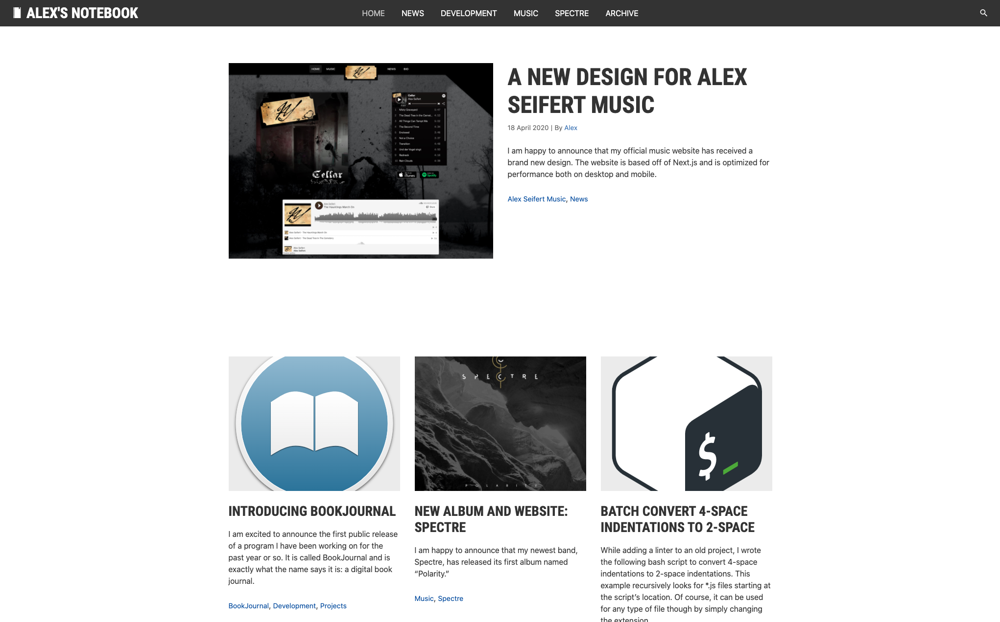

<figure><figcaption>Alex’s Notebook 3.0</figcaption></figure>

I have been taking advantage of the additional time I’ve had at home during the coronavirus pandemic to redesign and rewrite a bunch of my websites using newer technologies. I just relaunched [the website](https://www.alexseifertmusic.com) for my personal music project and now it’s my blog’s turn.

Version 3.0 of my blog was released this morning. It is still based on WordPress, but the new theme is much cleaner and uses the latest versions of technologies such as jQuery and Bootstrap. I also spent a lot of time optimizing my custom theme’s code so that it should be faster.

There are still several more ideas I had for the website and I will update it bit by bit.