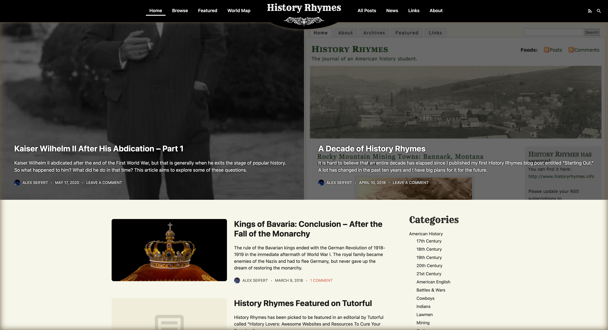
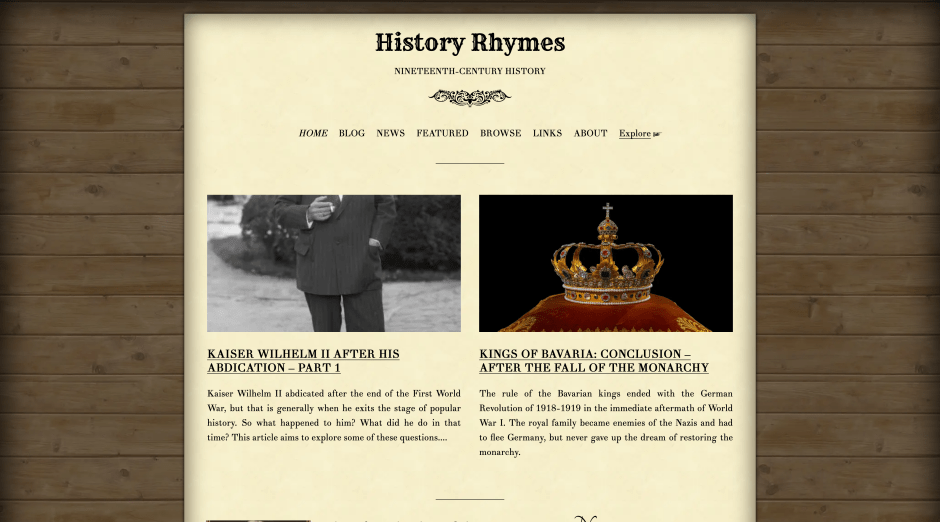

<figure><figcaption>History Rhymes in Light Mode</figcaption></figure>

[History Rhymes](https://www.historyrhymes.info) is a history blog I have written for on and off since 2008. It originally started as a blog about the history of the old American West, but expanded until it generally became a blog about nineteenth-century history.

Yesterday, I just released the first new design in about ten years. The last design was the latest of a long line of iterations of the original design which was very western-looking. It looked great for its time in my opinion, but times have changed and so it was time to start with a fresh design that has little to do with the old style.

The new design is very mobile-friendly, much easier to read and should load much more quickly. It also allows me to do a lot more with the website since I have plans to expand it from a simply blog to a much larger history website. An example of that is the new [World Map](https://www.historyrhymes.info/map/) page.

It also now features a dark mode for users who have their device in dark mode:

<figure><figcaption>History Rhymes in Dark Mode</figcaption></figure>

And for comparison, the design looked like this:

<figure><figcaption>History Rhymes Old Design</figcaption></figure>

It had its own charms looking like a piece of yellowed paper tacked to a wooden wall, but that sort of skeuomorphic design is no longer modern which made the website look old… and not in a good way. The font was also Didot which mimics the old typeset used in printing in the nineteenth century. That was a neat idea at the time to really give a nineteenth-century flair but was hard to read, so I abandoned that idea.

In any case, you can view the blog at [https://www.historyrhymes.info](https://www.historyrhymes.info). If you have any feedback, I’d be glad to hear it via the [contact page](https://www.historyrhymes.info/about/contact/) or as a comment here.