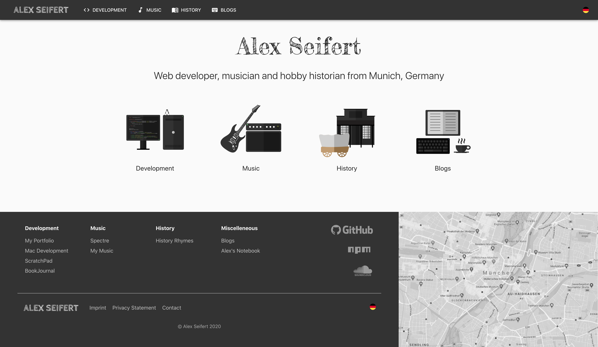

<figure><figcaption>AlexSeifert.com 2020</figcaption></figure>

As I mentioned in [my last post](https://blog.alexseifert.com/2020/04/25/new-design-for-alexs-notebook/), I have been taking advantage of the break that has been forced upon us by the coronavirus to update my websites. The latest update is my portfolio website:

[English](https://www.alexseifert.com)  
[German](https://www.alexseifert.de)

The old website had an Express backend written in TypeScript using the [Nunjucks](https://mozilla.github.io/nunjucks/) templating engine to power the frontend. I rewrote the website entirely using the [Next.js Framework](https://nextjs.org/) and TypeScript. The website feels more fluid since it uses React, but the pages are pre-rendered on the server making them indexable by Google and other search engines.

In terms of design, I have integrated some elements of Google’s Material Design concept using the [Material UI](https://material-ui.com/) framework while keeping some of the design elements from my old website to retain the overall look and feel of the website while updating its design.