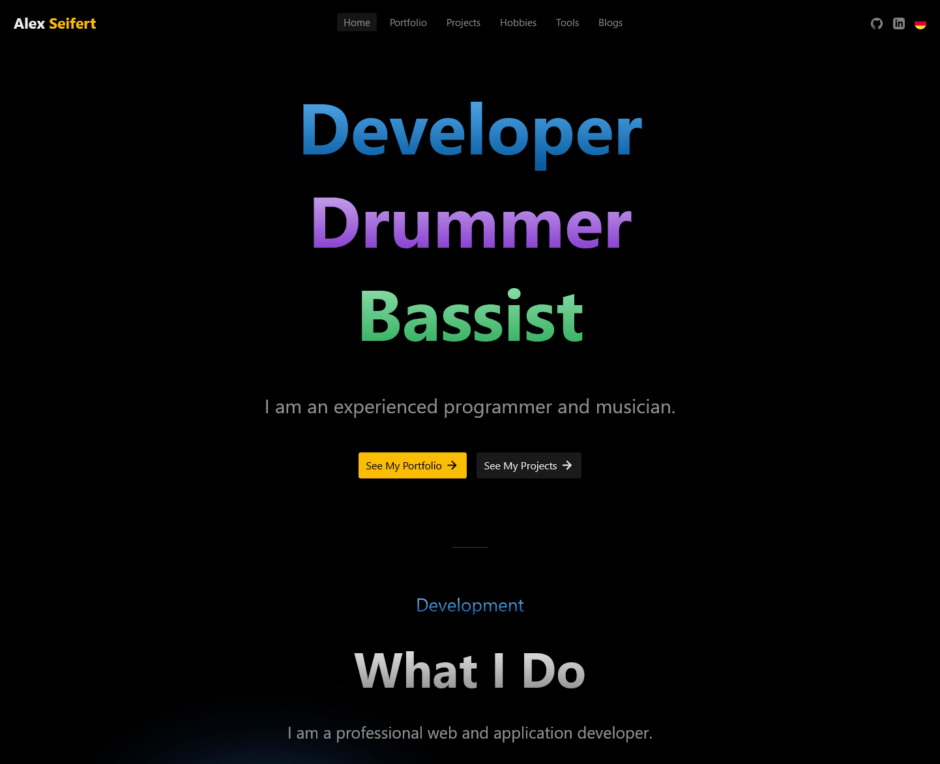
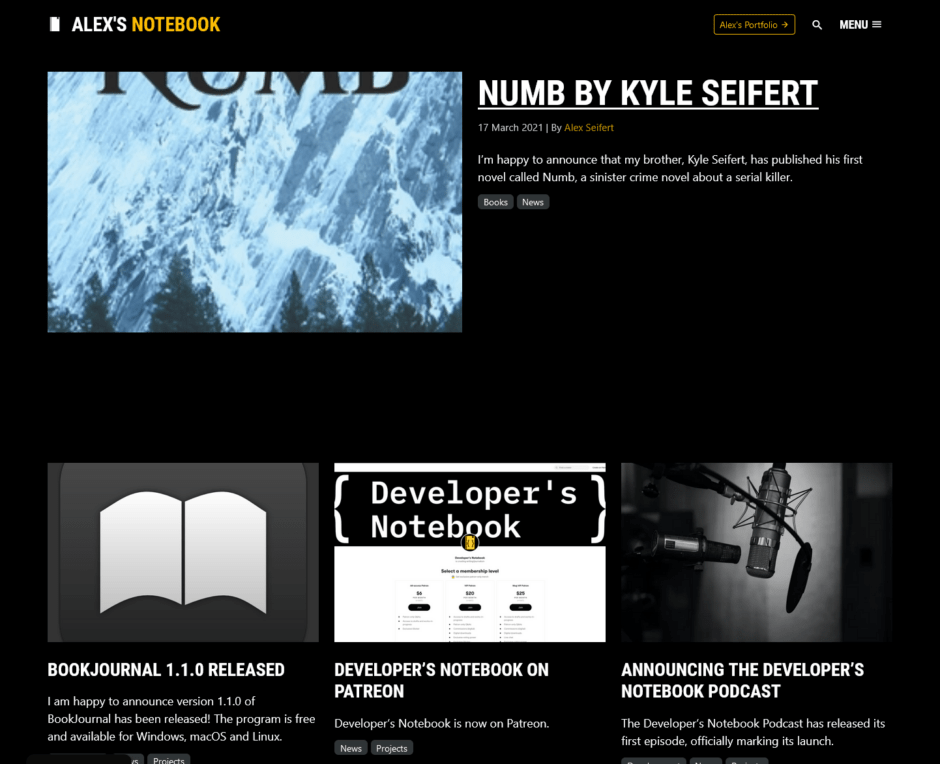

It’s been a number of years since I last updated my website and blog, so it was past time that I do major rewrite. I re-conceptualized both websites so that they support both light and dark modes, feel more modern and are more enjoyable to use. The colors are bolder and there is a lot more color in general.

Here are a couple of screenshots from the websites in dark mode:

<figure></figure>

<figure></figure>

The designs are simple and clean and make use of the latest technologies. My portfolio uses the React-based web framework [Next.js](https://nextjs.org/) so that it feels snappy and interactive whereas my blog is still WordPress-based and therefore has a classic-style frontend taking its design cues from my portfolio.