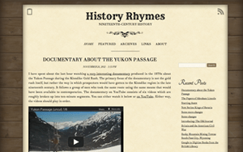
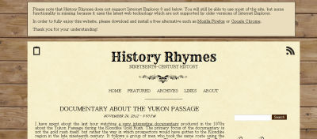

New design for History Rhymes

[As I talked about recently](https://blog.alexseifert.com/2012/11/24/trying-to-find-the-right-wordpress-theme/), I have been on a quest to redesign my history blog, [History Rhymes](https://www.historyrhymes.info). Trying to find just the right WordPress theme though is an extremely excruciating process and so I simply decided to make my own. The result can be seen in the small screenshot above or on [the site itself](https://www.historyrhymes.info).

There are a couple of interesting things I want to note, however. First all, I decided not to support Internet Explorer 8 and below. These browsers are a real headache for any web developer and so I chose to simply not support them. I use many of the latest css tricks such as box-shadow, @font-face, transform: rotate(), etc which are simply non-existent in older version of Internet Explorer. In IE 9, they are marginally supported, so I decided to go ahead and support it. Most of the site’s functionality will work in older versions of IE, but it will just not look nearly as good. In order to notify the user, I display a warning at the top of the page when they visit the site in IE 8 or lower which tells them that the site doesn’t support IE 8 or below and it recommends they upgrade to the latest version of Firefox or Chrome. I don’t mention upgrading IE because I figure most users using IE 8 will be using Windows XP and therefore can’t upgrade to IE 9. See the screenshot below to see the message in action.

History Rhymes in Internet Explorer 8

All in all, the new design has gone smoothly. I created basically 100% of the graphics myself as well as the design which is based off of a sandbox theme I found for WordPress and was therefore extremely easy to modify. One last neat feature of the new design is the old photos. I have an extensive collection of old photographs which I decided to share on the blog. At the very bottom, it randomly displays one of these photos every time you load the page. I really like this and I think it will be something my readers will enjoy as well. Now it’s time to get back to generating actual content for the blog!